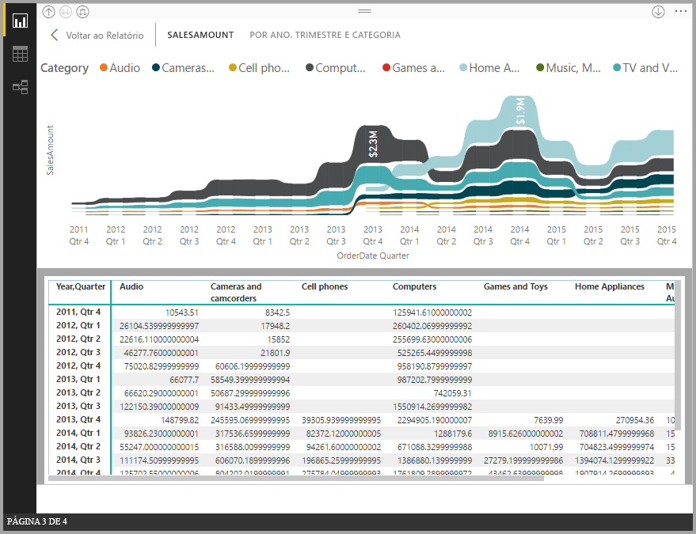
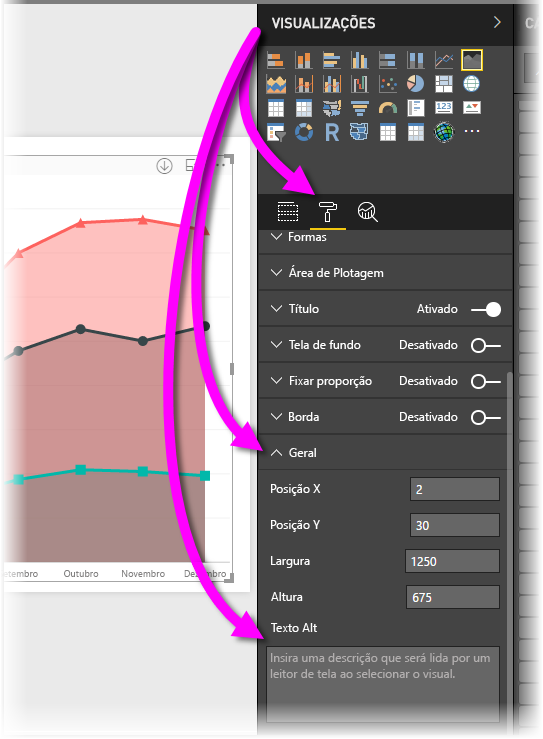

# Acessibilidade dos relatórios do Power BI Desktop
O **Power BI Desktop** tem recursos que permitem que pessoas com deficiências consumam e interajam mais facilmente com relatórios do **Power BI Desktop**. Esses recursos incluem a capacidade de consumir um relatório usando o teclado ou um leitor de tela, usar a tabulação para focar em vários objetos em uma página e o uso cuidadoso de marcadores nas visualizações.

> [!NOTE]
> Esses recursos de acessibilidade estão disponíveis com a versão de junho de 2017 do **Power BI Desktop** e com versões posteriores. Funcionalidades de acessibilidade adicionais também estão planejadas para versões futuras.
> 
> 

## Consumir um relatório do Power BI Desktop com um leitor de tela ou um teclado
A partir da versão de setembro de 2017 do **Power BI Desktop**, você pode pressionar a tecla **?** para mostrar uma janela que descreve os atalhos de teclado de acessibilidade disponíveis no **Power BI Desktop**.

Com os aprimoramentos de acessibilidade, você pode consumir um relatório do **Power BI Desktop** usando um teclado ou um leitor de tela com as seguintes técnicas:

Você pode alternar o foco entre as guias de páginas do relatório ou entre objetos em uma determinada página do relatório usando **Ctrl+F6**.

* Quando o foco estiver nas *guias de páginas do relatório*, use as teclas *Tab* ou de *Seta* para mover o foco de uma página de relatório para a próxima. O título da página do relatório e se ele está selecionada, é lida pelo leitor de tela. Para carregar a página do relatório que está em foco, use a tecla *Enter* ou *Espaço*.
* Quando o foco estiver em uma *página de relatório* carregada, use a tecla *Tab* para alternar o foco para cada objeto em uma página, o que inclui todas as caixas de texto, imagens, formas e gráficos. O leitor de tela lê o tipo do objeto e uma descrição desse objeto que é fornecida pelo autor. 

Pressione **Alt+Shift+F10** para mover o foco para o menu de um visual.

Pressione **Alt+Shift+F11** para apresentar uma versão acessível da janela *Ver dados*.

Essas adições de acessibilidade foram criadas para permitir aos usuários consumir por completo os relatórios do **Power BI Desktop** usando a navegação de teclado e o leitor de tela.

## Dicas para criar relatórios acessíveis
As dicas a seguir podem ajudá-lo a criar relatórios do **Power BI Desktop** que são mais acessíveis.

* Para visuais de **Linha**, **Área** e **Combinação**, bem como para visuais de **Dispersão** e de **Bolha**, ative os marcadores e use uma *Forma de marcador* diferente para cada linha.
  
  * Para ativar os *Marcadores*, selecione a seção **Formato** no painel **Visualizações**, expanda a seção **Formas** e, em seguida, role para baixo até encontrar a tecla de alternância **Marcadores** e posicione-a em *Ativado*.
  * Em seguida, selecione o nome de cada linha (ou área, se estiver usando um gráfico de **Área**) na caixa suspensa na seção **Formas**. Abaixo da lista suspensa, você pode ajustar vários aspectos do marcador usado para a linha selecionada, incluindo seu tamanho, cor e forma.
  
  
  
  * Usar uma *Forma de marcador* diferente para cada linha torna mais fácil para os consumidores do relatório diferenciar as linhas (ou áreas) umas das outras.
* Como um lembrete do marcador anterior, não confie na cor para transmitir informações. O uso de formas em linhas (marcadores, conforme descrito nos marcadores anteriores) é útil.
* Selecione um *tema* que tenha alto contraste e que seja amigável para pessoas daltônicas na Galeria de temas e importe-o usando o recurso de versão prévia [**Temas**](desktop-report-themes.md).
* Para cada objeto em um relatório, forneça um *Texto Alt*. Isso garante que os consumidores de seu relatório entendam o que você está tentando comunicar com um visual, mesmo que eles não possam ver o visual, imagem, forma ou caixa de texto. Você pode fornecer um *Texto Alt* para qualquer objeto em um relatório do **Power BI Desktop** selecionando o objeto (como um visual, forma e assim por diante) e, no painel **Visualizações**, selecionando a seção **Formato**, expandindo **Geral** e rolando para baixo e preenchendo a caixa de texto **Texto Alt**.
  
  
* Verifique se os relatórios têm contraste suficiente entre o texto e as cores da tela de fundo.
* Use fontes e tamanhos de texto que podem ser facilmente lidos. Um tamanho de texto pequeno, ou fontes que podem ser difíceis de serem lidas, não serão úteis para acessibilidade.
* Inclua um título, rótulos de eixo e rótulos de dados em todos os visuais.

## Considerações e limitações
Há alguns problemas conhecidos e algumas limitações com os recursos de acessibilidade, descritos na seguinte lista:

* Há suporte para o JAWS em relatórios que são exibidos no **serviço do Power BI**, incluindo os relatórios inseridos. O JAWS também tem suporte no **Power BI Desktop**, no entanto, você deve abrir o leitor de tela antes de abrir qualquer arquivo do **Power BI Desktop**, em ordem de leitura de tela para que ele funcione corretamente.

## Próximas etapas
* [Usar Temas de Relatório no Power BI Desktop (Versão prévia)](desktop-report-themes.md)

