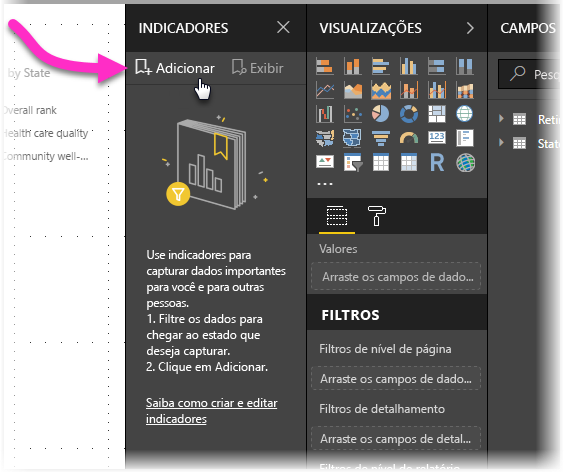
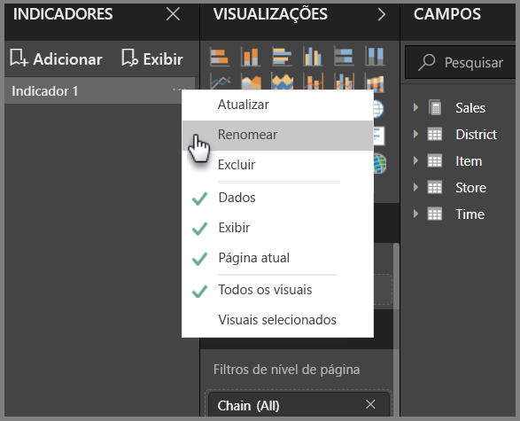
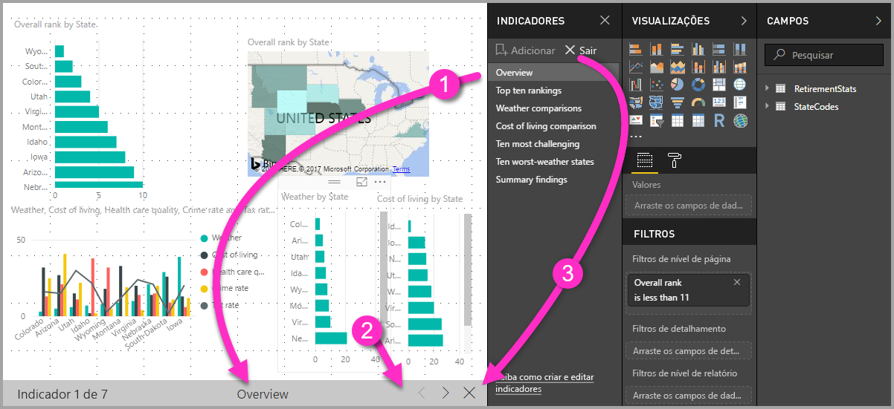
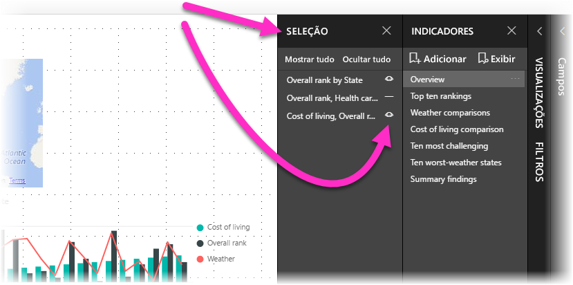
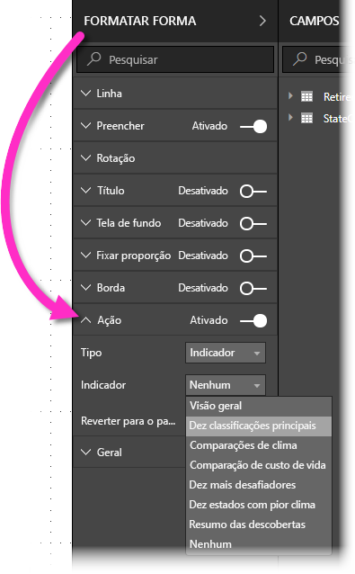
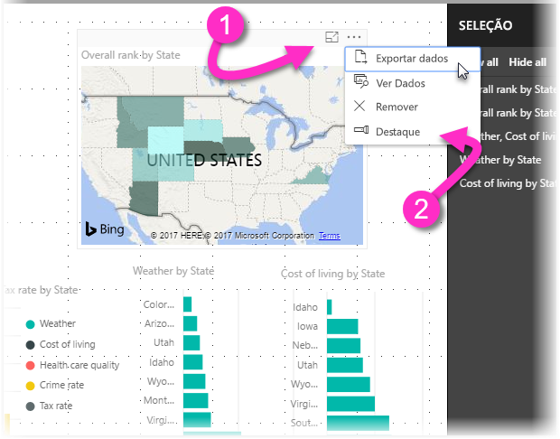
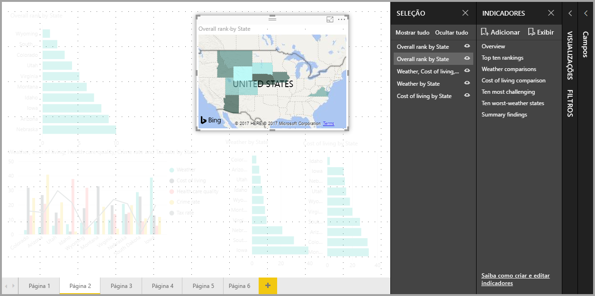
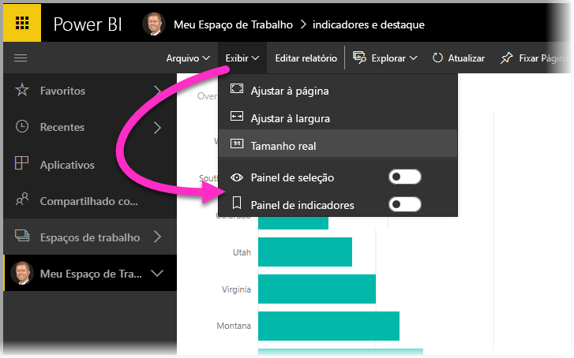

# Usar indicadores para compartilhar insights e criar histórias no Power BI 
Os **indicadores** no Power BI ajudam você a capturar a exibição de uma página de relatório atualmente configurada, incluindo a filtragem e o estado dos visuais e, posteriormente, voltar a esse estado, apenas selecionando esse indicador salvo. 

Você também pode criar uma coleção de indicadores, organizá-los na ordem desejada e, posteriormente, percorrer cada indicador em uma apresentação para realçar uma série de insights ou a história que você deseja contar com seus relatórios e visuais. 

Há muitos usos para indicadores. Você pode usá-los para acompanhar seu próprio progresso na criação de relatórios (indicadores são fáceis de adicionar, excluir e renomear) e, além disso, pode criar indicadores para criar uma apresentação de PowerPoint que percorre os indicadores em ordem, contando assim uma história com o seu relatório. Pode haver outros usos também, com base em como você acha que os indicadores podem ser melhor utilizados.

### Habilitar a versão prévia dos indicadores (versões anteriores a março de 2018)
Após a versão de março de 2018 do Power BI Desktop, os indicadores foram disponibilizados ao público. 

Sempre sugerimos que você atualize para a versão mais recente. Mas se a sua versão do Power BI Desktop é anterior a essa versão, você pode experimentar o recurso **indicadores** disponível desde a versão de **outubro de 2017** do **Power BI Desktop** e, para relatórios habilitados com indicador, também pode experimentar o **serviço do Power BI**. Para habilitar o recurso de versão prévia, selecione **Arquivo > Opções e Configurações > Opções > Recursos de Versão Prévia** e, em seguida, marque a caixa de seleção ao lado de **Indicadores**. 

Você precisará reiniciar o **Power BI Desktop** depois de habilitar a versão prévia dos indicadores.

## Usando indicadores
Para usar indicadores, selecione a faixa de opções **Exibição** e, em seguida, selecione a caixa do **Painel Indicadores**. 

Quando você cria um indicador, os seguintes elementos são salvos com o indicador:

* A página atual
* Filtros
* Segmentações
* Ordem de classificação
* Local de análise
* Visibilidade (de um objeto, usando o painel **Seleção**)
* Os modos de foco ou de **Destaque** de qualquer objeto visível

Os indicadores atualmente não salvam o estado de realce cruzado. 

Configure uma página de relatório da maneira que você deseja que ela seja exibida no indicador. Depois que a página de relatório e os visuais forem organizados como você deseja, selecione **Adicionar** no painel **Indicadores** para adicionar um indicador. 

O **Power BI Desktop** cria um indicador e concede a ele um nome genérico. Você pode facilmente *renomear*, *excluir* ou *atualizar* um indicador selecionando as reticências ao lado do nome do indicador e, em seguida, selecionar uma ação no menu que é exibido.

Uma vez que um indicador, você pode exibi-lo, simplesmente clicando no indicador no painel **Indicadores**. 

Você também pode selecionar se cada indicador aplicará propriedades de *dados*, como filtros e segmentações de dados, propriedades de *exibição*, como destaques e visibilidade, e alterações de página que apresentam a página que estava visível quando o indicador foi adicionado. Esses recursos são úteis quando você usa indicadores para alternar entre os tipos visuais - nesse caso, convém desativar as propriedades dos dados, para que os filtros não sejam redefinidos quando os usuários alterarem os tipos de visual. 

Para fazer essas alterações, selecione as reticências ao lado do nome do indicador, conforme mostra a imagem anterior, depois marque ou desmarque as marcas de seleção ao lado de *Dados*, *Exibição* e outros controles. 

## Organizando indicadores
Conforme você cria os indicadores, você pode achar que a ordem em que eles são criados não é necessariamente a mesma em que você gostaria de apresentá-los para o público-alvo. Não há problema, você pode facilmente reorganizar a ordem dos indicadores.

No painel **Indicadores**, basta arrastar e soltar os indicadores para alterar a ordem deles, conforme mostrado na imagem a seguir. A barra amarela entre indicadores designa o local em que o indicador arrastado será colocado.

A ordem de indicadores pode se tornar importante quando você usa o recurso **Exibição** dos indicadores, conforme descrito na próxima seção.

## Indicadores como uma apresentação de slides
Quando você tem uma coleção de indicadores que você gostaria de apresentar em ordem, você pode selecionar **Exibição** no painel **Indicadores** para começar uma apresentação de slides.

Quando se está no modo **Exibição**, há alguns recursos a observar:

1. O nome do indicador aparece na barra de título de indicador, que aparece na parte inferior da tela.
2. A barra de título de indicador tem setas que permitem que você mova para o indicador anterior ou para o próximo.
3. Você pode sair do modo de **Exibição** selecionando **Sair** no painel **Indicadores** ou então selecionando o **X** encontrado na barra de título de indicador. 

Quando se está no modo **Exibição**, é possível fechar o painel **Indicadores** (clicando no X no painel) para fornecer mais espaço para a apresentação. E enquanto se está no modo de **Exibição**, todos os visuais são interativos e estão disponíveis para realce cruzado, exatamente como eles seriam ao interagir com eles fora desse modo. 

## Visibilidade – usando o painel Seleção
Com o lançamento dos marcadores, o novo painel **Seleção** também foi apresentado. O painel **Seleção** fornece uma lista de todos os objetos na página atual e permite que você selecione o objeto e especifique se um determinado objeto é visível. 

Você pode selecionar um objeto usando o painel **Seleção**. Além disso, você pode indicar se o objeto está visível no momento, clicando no ícone de olho à direita do visual. 

Quando um indicador é adicionado, o status visível de cada objeto também é salvo com base na respectiva configuração no painel **Seleção**. 

É importante observar que **segmentações** continuam a filtrar uma página de relatório independentemente de estarem visíveis. Assim, você pode criar vários indicadores diferentes com diferentes configurações de segmentação e fazer uma única página de relatório ter aparência muito diferente (e realçar insights diferentes) em indicadores diversos.

## Indicadores para imagens e formas
Você também pode vincular formas e imagens a indicadores. Com esse recurso, quando você clica em um objeto, ele mostra o indicador a ele associado. Isso pode ser especialmente útil ao trabalhar com botões; você pode aprender mais lendo o artigo sobre [usar botões no Power BI](desktop-buttons.md). 

Para atribuir um indicador a um objeto, selecione o objeto e expanda a seção **Ação** no painel **Formatar forma**, conforme mostrado na imagem a seguir.

Após alterar o controle deslizante **Ação** para **Ativado**, você pode selecionar se o objeto é um botão de voltar, um indicador ou um comando de P e R. Se você selecionar indicador, você poderá selecionar a qual dos seus indicadores o objeto está vinculado.

Há inúmeras coisas interessantes que você pode fazer com indicadores vinculados a objetos. Você pode criar um sumário visual na sua página de relatório ou então você pode fornecer exibições diferentes (como tipos de visual) das mesmas informações apenas clicando em um objeto.

No modo de edição, é possível usar Ctrl + clique para seguir o link; fora do modo de edição, simplesmente clique no objeto para seguir o link. 

## Grupos de indicadores

A partir da versão de agosto de 2018 do **Power BI Desktop**, é possível criar e usar grupos de indicadores. Um grupo de indicadores é uma coleção de indicadores que você especifica, que pode ser mostrado e organizado como um grupo. 

Para criar um grupo de indicadores, mantenha pressionada a tecla CTRL e selecione os indicadores que você deseja incluir no grupo; em seguida, clique nas reticências ao lado de qualquer um dos indicadores selecionados e selecione **Agrupar** no menu exibido.

O **Power BI Desktop** nomeia automaticamente o grupo *Grupo 1*. Felizmente, basta clicar duas vezes no nome e renomeá-lo como desejar.

Com qualquer grupo de indicadores, clicar no seu nome somente expande ou recolhe o grupo de indicadores e não representa um indicador por si só. 

Ao usar o recurso **Exibir** dos indicadores, o seguinte se aplica:

* Se o indicador selecionado estiver em um grupo quando você selecionar **Exibir** nos indicadores, somente os indicadores *nesse grupo* serão mostrados na sessão de exibição. 

* Se o indicador selecionado não estiver em um grupo ou estiver no nível superior (como o nome de um grupo de indicadores), então todos os indicadores de todo o relatório serão reproduzidos, incluindo indicadores em qualquer grupo. 

Para desagrupar indicadores, basta selecionar qualquer indicador em um grupo, clicar nas reticências e selecionar **Desagrupar** no menu exibido. 

Observe que selecionar **Desagrupar** para qualquer indicador de um grupo tira todos os indicadores dele (exclui o grupo, mas não os indicadores em si). Portanto, para remover um único indicador de um grupo, é necessário **Desagrupar** qualquer membro desse grupo, que exclui o agrupamento e, em seguida, selecionar os membros que você deseja no novo grupo (usando CTRL e clicando em cada indicador) e selecionar **Agrupar** novamente. 

## Usando o Destaque
Outro recurso lançado com indicadores é o **Destaque**. Com o **Destaque**, você pode chamar a atenção para um gráfico específico, por exemplo, ao apresentar seu indicadores no modo de **Exibição**.

Vamos comparar o modo de **Destaque** ao modo de **foco** para ver como eles diferem entre si.

1. No modo de **foco**, você pode fazer com que um visual preencha toda a tela selecionando o ícone **modo de foco**.
2. Usando o **Destaque**, você pode destacar um visual em seu tamanho original, fazendo com que todos os outros visuais na página se esmaeçam até ficarem praticamente transparentes. 

Quando o ícone **foco** do visual na imagem anterior é clicado a página tem a aparência a seguir:

Por outro lado, quando **Destaque** é selecionado do menu de reticências do visual, a página tem aparência semelhante à vista aqui:

Se qualquer um desses modos está selecionado quando um indicador é adicionado, esse modo (de foco ou de destaque) é mantido no indicador.

## Indicadores no serviço do Power BI
Quando você publica um relatório para o **serviço do Power BI** com pelo menos um indicador, você pode exibir e interagir com esses indicadores no **serviço do Power BI**. Quando os indicadores estão disponíveis em um relatório, você pode selecionar **Exibição > Painel de seleção** ou **Exibição > Painel de indicadores** para mostrar cada um desses painéis.

No **serviço do Power BI**, o **painel Indicadores** funciona exatamente do mesmo modo que no **Power BI Desktop**, incluindo a capacidade de selecionar **Exibição** para mostrar os indicadores em ordem, como uma apresentação de slides.

Observe que você deve usar a barra de título de indicador cinza para navegar entre os indicadores e não as setas pretas (as setas pretas permitem que você navegue pelas páginas do relatório, não pelos indicadores).

## Limitações e considerações
Nesta versão dos **indicadores**, há algumas limitações e considerações a serem lembradas.

* A maioria dos visuais personalizados deve funcionar bem com indicadores. Se você tiver problemas com o uso de indicadores e de um visual personalizado, entre em contato com o criador do visual personalizado e peça que adicione suporte a indicadores ao seu visual. 
* Se você adicionar um visual em uma página de relatório depois de criar um indicador, o visual será exibido em seu estado padrão. Isso também significa que, se você introduzir uma segmentação em uma página em que você tiver criado indicadores anteriormente, a segmentação se comportará em seu estado padrão.
* A movimentação de visuais após a criação de um indicador se refletirá nele. 

## Próximas etapas
Para obter mais informações sobre os recursos que são semelhantes ou interagem com indicadores, consulte os seguintes artigos:

* [Usar o detalhamento no Power BI Desktop](desktop-drillthrough.md)
* [Exibir um bloco do dashboard ou visual do relatório no modo de Foco](consumer/end-user-focus.md)

