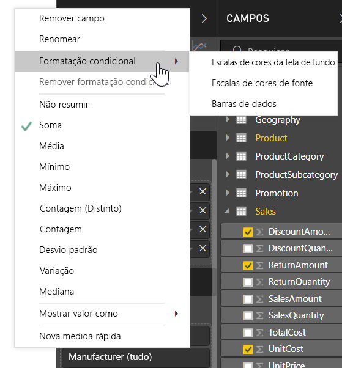
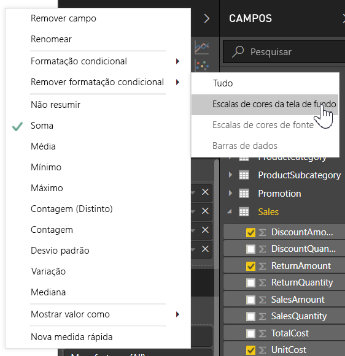
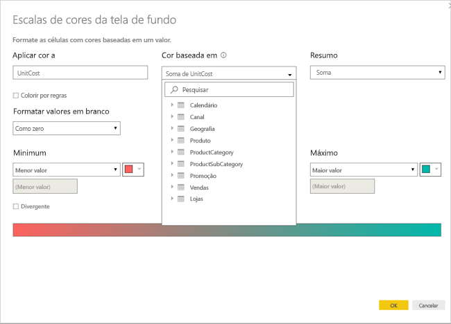
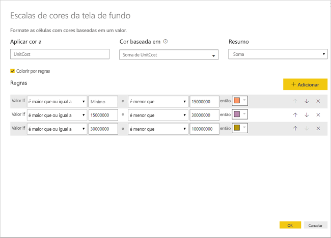
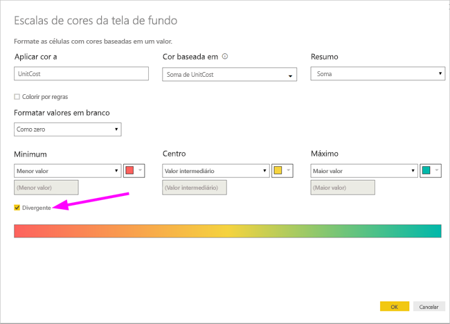
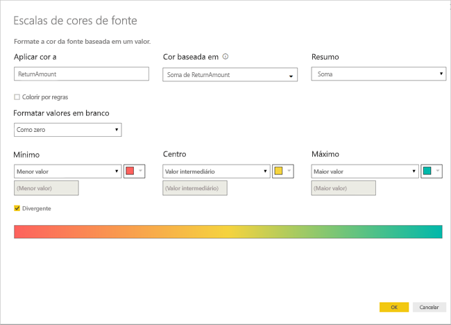
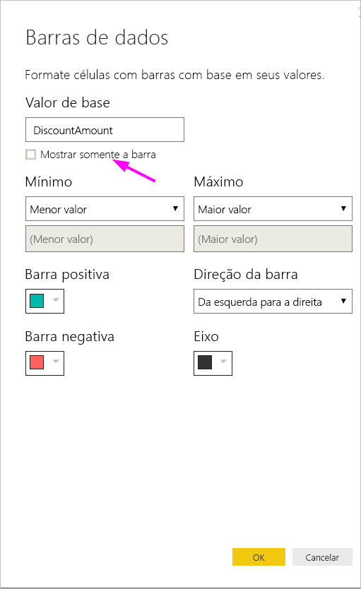

# Formatação condicional em tabelas 
Com a formatação condicional para tabelas, você pode especificar cores personalizadas para as células com base nos valores das células ou em outros valores ou campos, inclusive usando cores de gradiente. Também é possível exibir valores de célula com barras de dados. 

Para acessar a formatação condicional, em **Campos** também do painel **Visualizações** no Power BI Desktop, selecione a seta para baixo ao lado do valor em **Valores** que você deseja formatar (ou clique com o botão direito do mouse no campo). Você pode gerenciar somente a formatação condicional para campos na área **Valores** também em **Campos**.

As seções a seguir descrevem cada uma dessas três opções de formatação condicional. Uma ou mais opções podem ser combinadas em uma única coluna de tabela.

> [!NOTE]
> Quando aplicada a uma tabela, a formatação condicional substitui quaisquer estilos de tabela personalizados aplicados a células formatadas condicionalmente.

Para remover a formatação condicional de uma visualização, basta clicar com o botão direito do mouse no campo novamente e selecionar **Remover formatação condicional** e o tipo de formatação a ser removida.

## Escalas de cores da tela de fundo

Selecionar **Formatação condicional** e **Escalas de cor da tela de fundo** exibe a caixa de diálogo a seguir.

É possível selecionar um campo do modelo de dados para basear as cores definindo **Cor baseada em** nesse campo. Além disso, você pode especificar o tipo de agregação para o campo selecionado com o valor **Resumo**. O campo a ser colorido é especificado no campo **Aplicar cor a**. Assim, você tem o controle. É possível aplicar a formatação condicional a campos de data e de texto, desde que você escolha um valor numérico como a base da formatação.

Para usar valores de cor discretos para intervalos de valor, selecione **Colorir por regras**. Para usar um espectro de cores, deixe **Colorir por regras** desmarcado. 

### Colorir por regras

Quando você seleciona **Colorir por regras**, é possível inserir um ou mais intervalos de valores, cada um com um conjunto de cores.  Cada intervalo de valor começa com uma condição de *valor If*, uma condição de valor *and* e uma cor.

Células de tabela com valores em cada intervalo são preenchidas com determinada cor. Há três regras na figura a seguir.

A tabela de exemplo agora tem esta aparência:

### Valores mínimo e máximo de cor

Você pode configurar os valores *mínimo* e *máximo* e as cores. Se selecionar a caixa **Divergente**, você também poderá configurar um valor opcional para o *Centro*.

A tabela de exemplo agora tem esta aparência:

## Escalas de cores de fonte

Selecionar **Formatação condicional** e **Escalas de cores de fonte** exibe a caixa de diálogo a seguir. Essa caixa de diálogo é semelhante a **Escalas de cor da tela de fundo**, mas altera a cor da fonte em vez da cor da tela de fundo da célula.

A tabela de exemplo agora tem esta aparência:

## Barras de dados

Selecionar **Formatação condicional** e **Barras de dados** exibe a caixa de diálogo a seguir. 

Por padrão, a opção **Mostrar somente a barra** é desmarcada e, portanto, a célula da tabela mostra a barra e o valor real.

Se opção **Mostrar somente a barra** estiver marcada, a célula da tabela mostrará apenas a barra.

