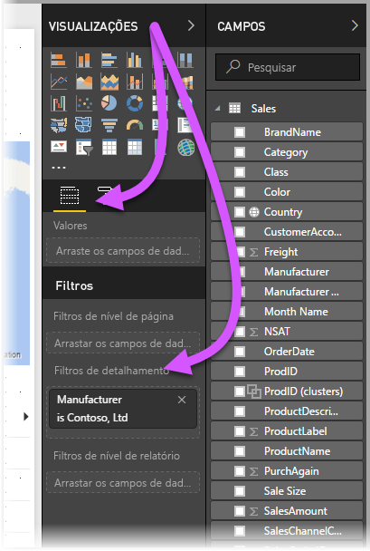
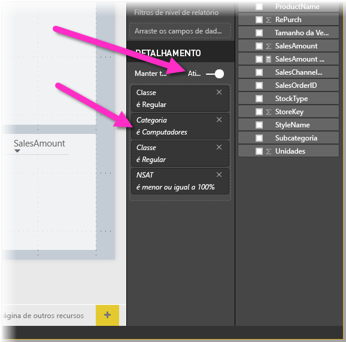

# Usar o detalhamento no Power BI Desktop
Com o **detalhamento** no **Power BI Desktop**, você pode criar uma página em seu relatório que tem como foco uma entidade específica – como um fornecedor, cliente ou fabricante. Com essa página de relatório com foco, os usuários podem clicar com o botão direito do mouse em um ponto de dados em outras páginas do relatório e executar uma consulta drill-through para a página com foco para obter detalhes filtrados para esse contexto.

## Usando o detalhamento
1. Para usar o **detalhamento**, crie uma página de relatório que tem visuais que gostaria de ver para o tipo de entidade sobre o qual você fornecerá o detalhamento. 

    Por exemplo, se estiver interessado em fornecer o detalhamento de fabricantes, poderá criar uma página de detalhamento com visuais que mostram o total de vendas, o total de unidades enviadas, vendas por categoria, vendas por região e assim por diante. Dessa forma, quando você executar uma consulta drill-through para a página, os visuais serão específicos do fabricante selecionado.

2. Em seguida, na página de detalhamento, na seção **Campos** do painel **Visualizações**, arraste o campo para o qual você deseja obter o detalhamento no contêiner **Filtros de detalhamento**.

    

    Quando você adiciona um campo ao contêiner **Filtros de detalhamento**, o **Power BI Desktop** cria automaticamente um visual do botão *Voltar*. Esse visual se torna um botão em relatórios publicados e permite aos usuários que estão consumindo o relatório no **serviço do Power BI** voltar com facilidade à página do relatório de origem (a página em que eles selecionaram o detalhamento).

    

## Use sua própria imagem para um botão Voltar    
 Como o botão Voltar é uma imagem, você pode substituir a imagem desse visual por qualquer imagem desejada e ele ainda funcionará como o botão Voltar para que os consumidores do relatório possam voltar para a página original.

1. Na guia da **Página Inicial**, clique em **Imagem**, em seguida, localize a imagem e coloque-a na página de detalhamento.
2. Selecione a nova imagem na página de Detalhamento e na seção Formatar Imagem, defina o controle deslizante de **Link** como ativado e defina o **Tipo** como **Voltar**. Sua imagem agora funciona como um botão Voltar.

    

    Quando a página de **detalhamento** for concluída e os usuários clicarem com o botão direito do mouse em um ponto de dados no relatório que usa o campo colocado no contêiner **Filtros de detalhamento**, um menu de contexto será exibido e dará suporte a detalhamento para essa página.

    

    Quando os consumidores do relatório escolherem o detalhamento, a página é filtrada para mostrar informações sobre o ponto de dados de origem do clique com o botão direito do mouse. Por exemplo, se eles clicaram com o botão direito do mouse em um ponto de dados sobre a Contoso (um fabricante) e selecionaram o detalhamento, a página de detalhamento para a qual eles foram direcionados será filtrada para Contoso.

## Passar todos os filtros no detalhamento

Começando com a versão de maio de 2018 do **Power BI Desktop**, você pode passar todos os filtros aplicados para a janela de detalhamento. Por exemplo, você pode selecionar apenas uma determinada categoria de produtos e os visuais filtrados para essa categoria e, em seguida, selecionar o detalhamento. Provavelmente você vai querer saber como esse detalhamento ficará com todos esses filtros aplicados.

Para manter todos os filtros aplicados, na seção **Detalhamento** do painel **Visualizações**, basta definir o botão de alternância **Passar todos os filtros** para **habilitado**. 

Nas versões do **Power BI Desktop** anteriores à de maio de 2018, o comportamento é equivalente a quando esse botão de alternância está definido como **desabilitado**.

Em seguida, ao fazer o detalhamento em um visual, você poderá ver quais filtros foram aplicados como resultado da aplicação de filtros temporários no visual de origem. Na janela de detalhamento, esses filtros transitórios são mostrados em itálico. 

Observe que isso poderia ser feito com páginas de dicas de ferramenta, mas essa seria uma experiência estranha (a dica de ferramenta não pareceria estar funcionando corretamente), portanto, não é recomendado fazer isso com dicas de ferramenta.

E isso é tudo o que é necessário para usar o **detalhamento** em seus relatórios. É uma ótima maneira de obter uma exibição expandida das informações de entidade selecionadas para o filtro de detalhamento.

## Próximas etapas

Você também pode estar interessado nos seguintes artigos:

* [Usando segmentações no Power BI Desktop](desktop-slicers.md)

