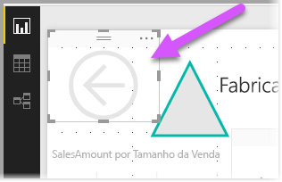
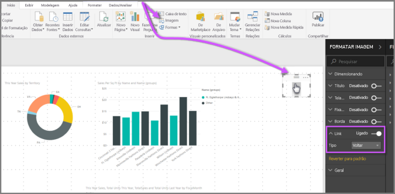
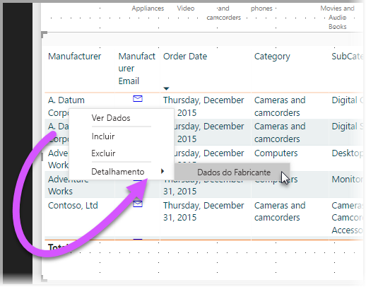

# Usar o detalhamento no Power BI Desktop
Com o **detalhamento** no **Power BI Desktop**, você pode criar uma página em seu relatório que tem como foco uma entidade específica – como um fornecedor, cliente ou fabricante. Com essa página de relatório com foco, os usuários podem clicar com o botão direito do mouse em um ponto de dados em outras páginas do relatório e executar uma consulta drill-through para a página com foco para obter detalhes filtrados para esse contexto.

## Usando o detalhamento
Para usar o **detalhamento**, crie uma página de relatório que tem visuais que gostaria de ver sobre o tipo de entidade para o qual você fornecerá o detalhamento. Por exemplo, se estiver interessado em fornecer o detalhamento de fabricantes, poderá criar uma página de detalhamento com visuais que mostram o total de vendas, o total de unidades enviadas, vendas por categoria, vendas por região e assim por diante. Dessa forma, quando você executar uma consulta drill-through para a página, os visuais serão específicos ao fabricante que recebeu o clique e que foi selecionado para o detalhamento.

Em seguida, na página de detalhamento, na seção **Campos** do painel **Visualizações**, arraste o campo para o qual você deseja obter o detalhamento no contêiner **Filtros de detalhamento**.

Quando você adiciona um campo ao contêiner **Filtros de detalhamento**, o **Power BI Desktop** cria automaticamente um visual do botão *Voltar*. Esse visual se torna um botão em relatórios publicados e permite aos usuários que estão consumindo o relatório no **serviço do Power BI** voltar com facilidade à página do relatório de origem (a página em que eles selecionaram o detalhamento).

Como o botão *Voltar* é uma imagem, você pode substituir a imagem desse visual por qualquer imagem desejada e ele ainda funcionará corretamente como o botão para retornar os consumidores do relatório para a página original. Para usar sua própria imagem para um botão Voltar, basta colocar um visual de imagem na página de detalhamento e, em seguida, selecionar o visual e colocar o controle deslizante do *botão Voltar* como ativado. Isso faz com que a imagem funcione como um botão *Voltar*.

Quando a página de **detalhamento** for concluída, quando os usuários clicarem com o botão direito do mouse em um ponto de dados no relatório que usa o campo colocado no contêiner **Filtros de detalhamento** na página de detalhamento, um menu de contexto será exibido, permitindo aos usuários executar uma consulta drill-through para a página.

Ao escolher o detalhamento, a página é filtrada para mostrar informações sobre o ponto de dados de origem do clique com o botão direito do mouse. Por exemplo, se eles clicaram com o botão direito do mouse em um ponto de dados sobre a Contoso (um fabricante) e selecionaram o detalhamento, a página de detalhamento para a qual eles foram direcionados será filtrada para Contoso.

> [!NOTE]
> Apenas o campo que está nos **Filtros de detalhamento** é passado para a página de relatório de detalhamento. Nenhuma outra informação contextual é passada.
> 
> 

E isso é tudo o que é necessário para usar o **detalhamento** em seus relatórios. É uma ótima maneira de obter uma exibição expandida das informações de entidade selecionadas para o filtro de detalhamento.

