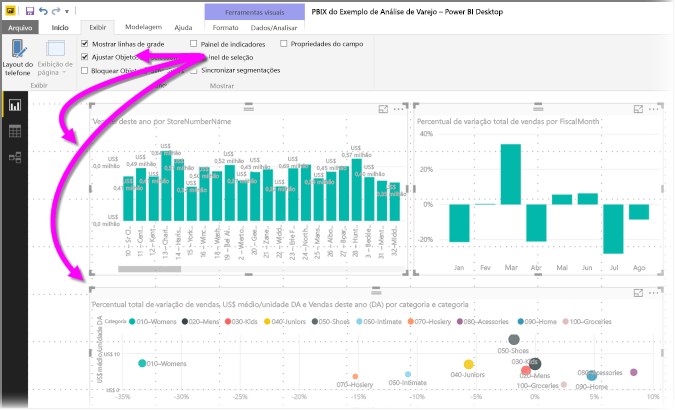
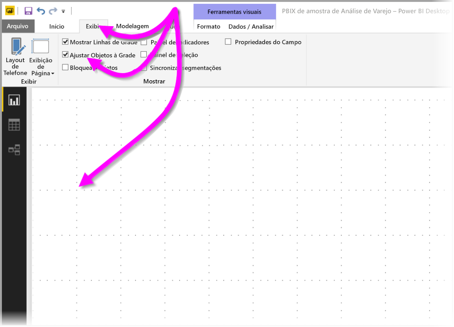
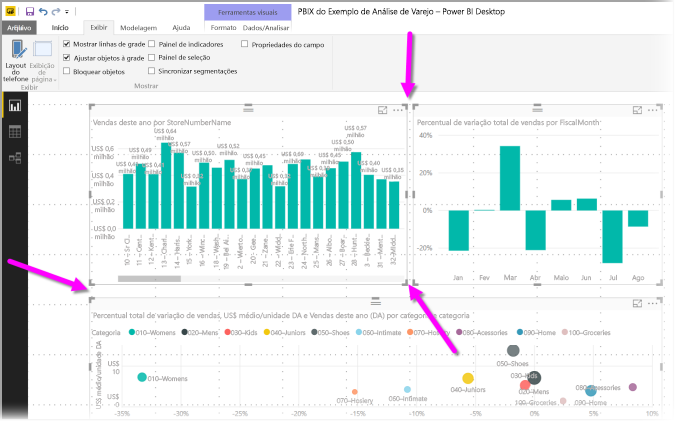
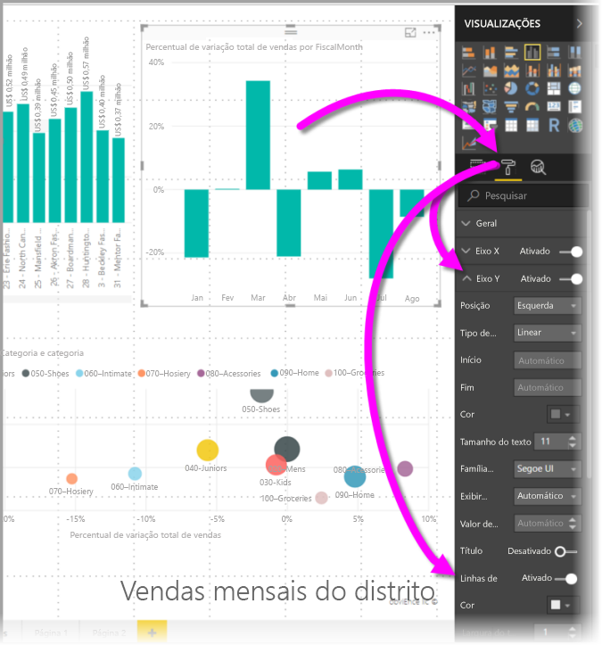
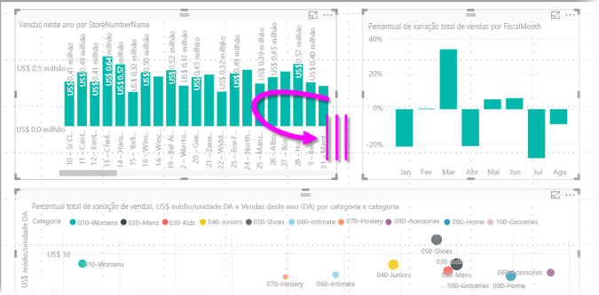
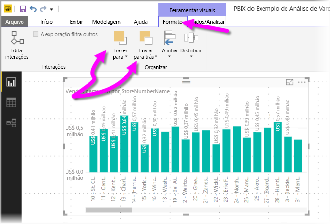
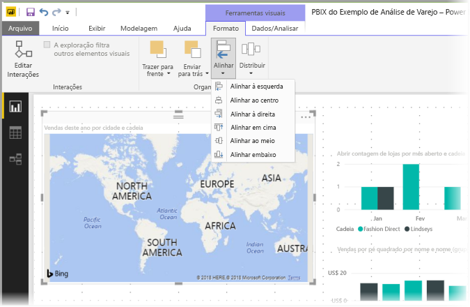
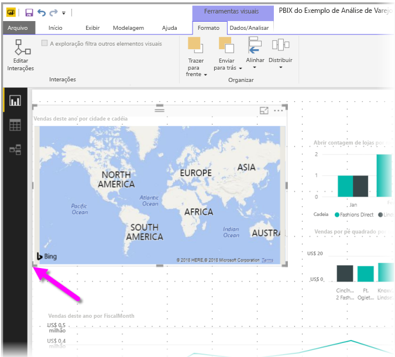
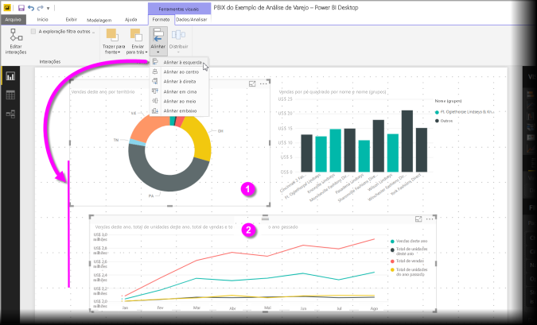
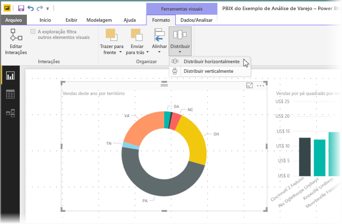

# Use linhas de grade e ajuste de grade em relatórios do Power BI Desktop
A tela de relatório do **Power BI Desktop** fornece linhas de grade que permitem que você alinhe adequadamente visuais em uma página de relatório e também fornece a funcionalidade de ajustar à grade para que os visuais em seus relatórios pareçam limpos, alinhados e com espaçamento uniforme.

No **Power BI Desktop**, também é possível ajustar a ordem z (avançar, recuar) de objetos em um relatório, bem como alinhar ou distribuir uniformemente os visuais selecionados na tela.

### Habilitando linhas de grade e ajuste de grade
Para habilitar as linhas de grade e o ajuste à grade, selecione a faixa de opções **Modo de Exibição**, habilite as caixas de seleção para **Mostrar linhas de grade** e **Ajustar objetos à grade.** Você pode selecionar uma ou ambas as caixas. Elas operam independentemente.

> [!NOTE]
> Se **Mostrar linhas de grade** e **Ajustar objetos na grade** estiverem desabilitadas, conecte-se a qualquer fonte de dados e elas serão habilitadas.
> 
> 

### Uso de linhas de grade
Linhas de grade são guias de elementos visuais que permitem que você veja se dois ou mais elementos visuais estão alinhados corretamente. Quando estiver tentando determinar se dois (ou mais) elementos visuais estão alinhados horizontalmente ou verticalmente, use as linhas de grade para determinar visualmente se suas bordas se alinham.

Você pode usar *CTRL + clique* para selecionar mais de um elemento visual por vez, que exibe as bordas de todos os elementos visuais selecionados, que ajuda você a ver facilmente se os elementos visuais estão alinhados corretamente.

#### Usando linhas de grade dentro de visuais
No Power BI, também há linhas de grade dentro de visuais, que fornecem guias de visuais para comparação de valores e pontos de dados. A partir da versão de setembro de 2017 do **Power BI Desktop**, agora você pode gerenciar as linhas de grade nos visuais usando o cartão **Eixo X** ou **Eixo Y** (conforme apropriado, com base no tipo de visual), encontrado na seção **Formato** do painel **Visualizações**. Gerencie os seguintes elementos de linhas de grade dentro de um visual:

* Ativar ou desativar linhas de grade
* Alterar a cor das linhas de grade
* Ajustar o traço (a largura) das linhas de grade
* Selecionar o estilo de linha das linhas de grade no visual, como sólido, tracejado ou pontilhado

A modificação de alguns elementos das linhas de grade pode ser especialmente útil em relatórios nos quais são usadas telas de fundo escuras em visuais. A imagem a seguir mostra a seção *Linhas de grade* no cartão **Eixo X**.

### Uso da grade de ajuste
Quando você habilita **Ajustar objetos à grade**, todos os elementos visuais na tela do **Power BI Desktop** que você move (ou redimensiona) são alinhados automaticamente para o eixo de grade mais próximo, tornando muito mais fácil garantir que dois ou mais elementos visuais estejam alinhados à mesma localização horizontal ou vertical ou o tamanho.

E isso é tudo para usar **linhas de grade** e **ajuste de grade** para garantir facilmente que os elementos visuais em seus relatórios estejam alinhados adequadamente.

### Usando a ordem z, alinhar e distribuir
Também é possível gerenciar a ordem de frente para trás de elementos visuais em um relatório, frequentemente conhecida como o *ordem z* de elementos. Isso permite que você sobreponha visuais como você desejar. Em seguida, ajuste a ordem de frente para trás de cada elemento visual. Essa classificação é feita usando os botões **Avançar** e **Recuar**, encontrados na seção **Organizar** da faixa de opções **Formatar**, exibida assim que você seleciona um ou mais visuais na página (e não estará disponível se nenhum elemento visual for selecionado).

A faixa de opções **Formatar** também permite que você alinhe seus visuais de várias maneiras diferentes. Isso permite que você garanta que seus visuais sejam exibidos na página no alinhamento que você acredita ter melhor aparência e funcionamento.

Quando um elemento visual é selecionado, usar o botão **Alinhar** alinha esse elemento visual à borda (ou ao centro) da tela do relatório, conforme mostrado na imagem a seguir.

Quando dois ou mais visuais são selecionados, eles são alinhados juntos e usam o limite de alinhamento existente dos visuais para alinhamento. Por exemplo, com dois visuais selecionados e o botão *Alinhar à esquerda* selecionado, os visuais serão alinhados ao limite mais à esquerda de todos os visuais selecionados.

Também é possível distribuir seus visuais de maneira uniforme na tela do relatório, seja vertical ou horizontalmente. Basta usar o botão **Distribuir** da faixa de opções **Formatar**.

Com algumas seleções dessas linhas de grade, alinhamento e ferramentas de distribuição, seus relatórios terão a aparência que você desejar.

