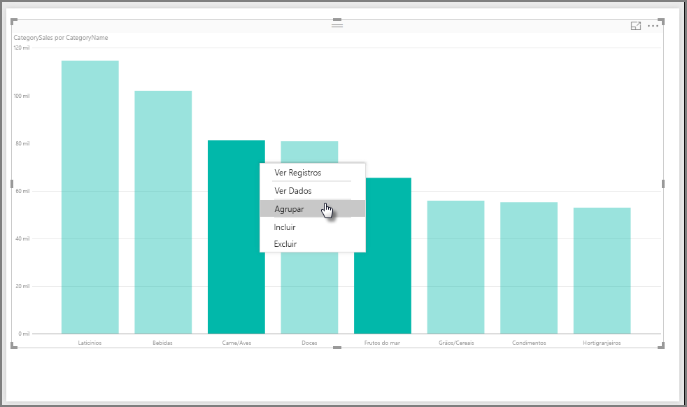
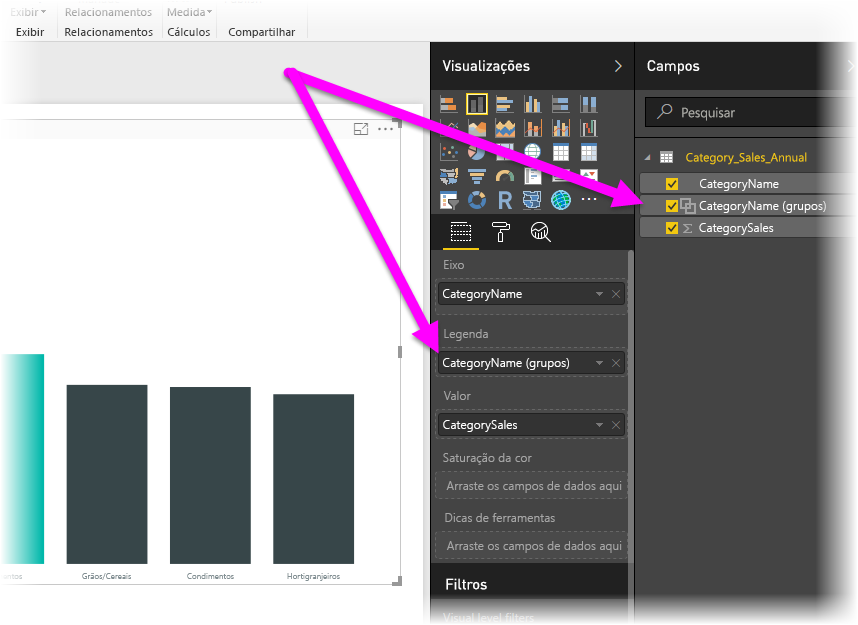
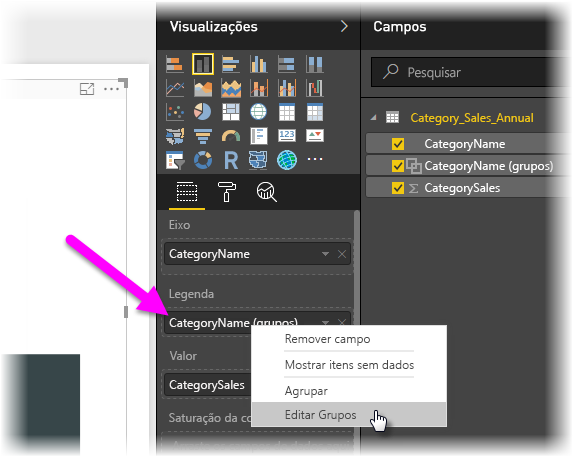
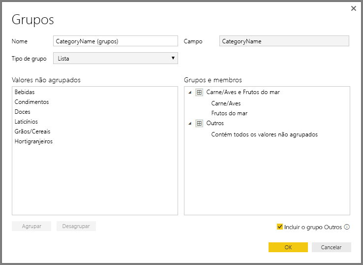
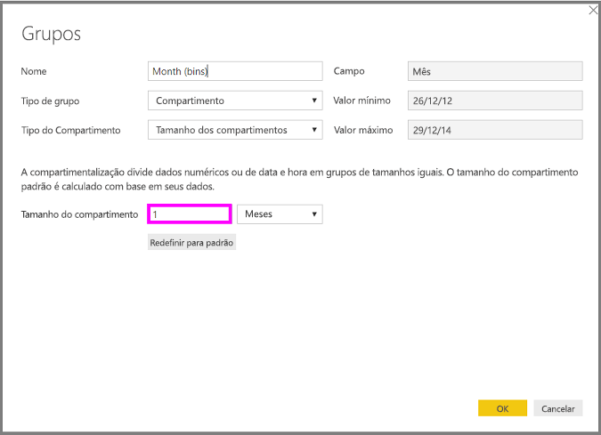

# Usar agrupamento e compartimentalização no Power BI Desktop
Quando o **Power BI Desktop** cria elementos visuais, ele agrega os dados em partes (ou grupos) com base nos valores encontrados nos dados subjacentes. Geralmente isso fica bom, mas pode haver ocasiões nas quais você deseja refinar a maneira como essas partes são apresentadas. Por exemplo, você pode querer colocar três categorias de produtos em uma categoria maior (um *grupo*). Ou talvez você queira ver valores de vendas colocadas em compartimentos de 1.000.000 dólares, em vez de valores divididos uniformemente de 923.983 dólares.

No Power BI Desktop, você pode **agrupar** pontos de dados para ajudá-lo a exibir, analisar e explorar com mais clareza os dados e tendências nos seus elementos visuais. Você também pode definir o **tamanho do compartimento**, muitas vezes chamado de *compartimentalização*, para colocar valores em grupos de mesmo tamanho, o que permite melhor visualização dos dados de maneiras que sejam significativas.

### Usando o agrupamento
Para usar o agrupamento, selecione dois ou mais elementos em um visual usando Ctrl+clique para selecionar vários elementos. Em seguida, clique com o botão direito do mouse em um dos elementos da seleção múltipla e selecione **Agrupar** no menu exibido.

Depois de criado, o grupo é adicionado ao bucket **Legenda** do elemento visual e também aparece na lista de **Campos**.

Uma vez que um grupo é criado, você pode editar facilmente os membros desse grupo clicando com botão direito do mouse no campo do bucket **Legenda** ou na lista de **Campos** e, em seguida, selecionar **Editar grupos**.

Na janela **grupos** que é exibida, você pode criar novos grupos ou modificar os grupos existentes. Também é possível *renomear* qualquer grupo clicando duas vezes no título de grupo na caixa **Grupos e membros** e digitando um novo nome.

Há inúmeras coisas que você pode fazer com grupos. É possível adicionar itens da lista **Valores não agrupados** em um novo grupo ou em um dos grupos existentes. Para criar um novo grupo, selecione dois ou mais itens (usando Ctrl + clique) na caixa **Valores não agrupados** e, em seguida, clique no botão **Grupo** embaixo dessa caixa.

É possível adicionar um valor não agrupado em um grupo existente: basta selecionar o Valor não agrupado e selecione o grupo existente ao qual você deseja adicioná-lo e clique no botão **Agrupar**. Para remover um item de um grupo, selecione-o na caixa **Grupos e membros** e, em seguida, clique em **Desagrupar**. Você também pode selecionar se categorias desagrupadas devem ser colocadas no grupo **Outros** ou devem permanecer desagrupadas.

> [!NOTE]
> É possível criar grupos para qualquer campo em **Campos**, sem necessidade de fazer seleção múltipla em um elemento visual existente. É só clicar com o botão direito do mouse no campo e selecionar **Novo Grupo** no menu exibido.
> 
> 

### Usando a compartimentalização
Você pode definir o tamanho do compartimento para campos numéricos e de tempo no **Power BI Desktop.** Você pode usar a compartimentalização para dar o tamanho correto aos dados que o **Power BI Desktop** exibe.

Para aplicar um tamanho de compartimento, clique com o botão direito do mouse em **Campo** e selecione **Novo Grupo**.

Na janela **Grupos**, defina o **Tamanho do compartimento** com o tamanho desejado.

Quando você seleciona **OK**, você observará que um novo campo aparecerá no painel **Campos** com *(compartimentos)* acrescentado. Você pode arrastar esse campo para a tela para usar o tamanho do compartimento em um elemento visual.

Para ver a **compartimentalização** em ação, dê uma olhada neste [vídeo](https://www.youtube.com/watch?v=BRvdZSfO0DY).

E isso é tudo sobre o uso de **agrupamento** e **compartimentalização** para garantir que os elementos visuais em seus relatórios mostrem seus dados exatamente na forma desejada.

