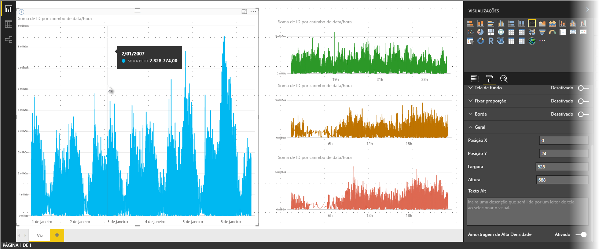
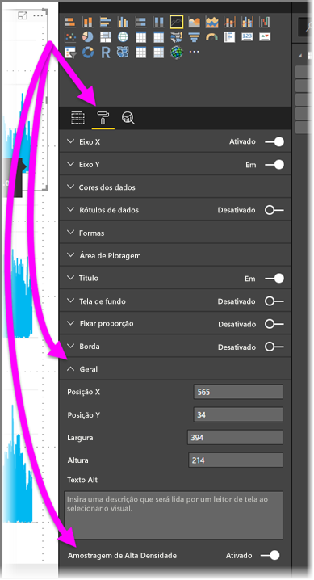

# Amostragem de linha de alta densidade no Power BI
Começando com a versão de junho de 2017 do **Power BI Desktop** e as atualizações para o **serviço do Power BI**, um novo algoritmo de amostragem está disponível para melhorar os visuais com amostragem de dados de alta densidade. Por exemplo, é possível criar um gráfico de linhas dos resultados de vendas de suas lojas de varejo, com cada loja tendo mais de dez mil recibos de venda todo ano. Um gráfico de linhas dessas informações de vendas faria a amostragem (selecione uma representação significativa desses dados, para ilustrar como as vendas variam ao longo do tempo) dos dados de cada loja e criaria um gráfico de linhas multissérie para representar os dados subjacentes. Essa é uma prática comum na visualização de dados de alta densidade. O Power BI Desktop melhorou sua amostragem de dados de alta densidade, cujos detalhes estão descritos neste artigo.

> [!NOTE]
> O algoritmo de **Amostragem de Alta Densidade** descrito neste artigo está disponível tanto no **Power BI Desktop** quanto no **serviço do Power BI**.
> 
> 

## Como a amostragem de linha de alta densidade funciona
Anteriormente, o **Power BI** selecionava uma coleção de pontos de dados de amostra em toda a gama de dados subjacentes de uma maneira determinística. Por exemplo, para dados de alta densidade em um visual que abrangesse um ano civil, poderia haver 350 pontos de dados de amostra exibidos no visual, cada um deles selecionado para garantir que o intervalo completo de dados (a série geral de dados subjacentes) fosse representado no visual. Para ajudar a entender como isso acontece, imagine que estivéssemos plotando o preço de ações durante o período de um ano e selecionássemos 365 pontos de dados para criar um visual de gráfico de linhas (ou seja, um ponto de dados para cada dia).

Nessa situação, há muitos valores para o preço de uma ação em cada dia. Claro que há uma alta e uma baixa diárias, mas isso pode ocorrer a qualquer momento durante o dia quando o mercado de ações está aberto. Para amostragem de linha de alta densidade, se a amostra de dados subjacentes fosse feita às 10h30 e às 12h todos os dias, você receberia um instantâneo representando os dados subjacentes (o preço às 10h30 e às 12h), mas talvez ele não capturasse a alta e a baixa reais do preço da ação para esse ponto de dados representativo (nesse dia). Nessa situação, e em outras, a amostragem representa os dados subjacentes, mas nem sempre captura pontos importantes, que, nesse caso, seriam as altas e baixas do preço da ação por dia.

Por definição, os dados de alta densidade são amostrados para criar com uma rapidez razoável visualizações que atendam à interatividade. Um número muito grande de pontos de dados em um visual pode atrasá-lo e diminuir a visibilidade de tendências. Portanto, como os dados são amostrados é o que orienta a criação do algoritmo de amostragem para fornecer a melhor experiência de visualização possível. No Power BI Desktop, o algoritmo foi melhorado para fornecer a melhor combinação de capacidade de resposta, representação e preservação clara de pontos importantes em cada fração de tempo.

## Como o novo algoritmo de amostragem de linha funciona
O novo algoritmo de amostragem de linha de alta densidade está disponível para visuais de gráfico de linhas e de gráfico de área com um eixo x contínuo.

Para um visual de alta densidade, o **Power BI** segmenta de forma inteligente seus dados em partes de alta resolução e, em seguida, escolhe pontos importantes para representar cada parte. Esse processo de fatiamento de dados de alta resolução é ajustado especificamente para garantir que o gráfico resultante seja praticamente inseparável da renderização de todos os pontos de dados subjacentes, mas de forma mais rápida e mais interativa.

### Valores mínimo e máximo dos visuais de linha de alta densidade
Para qualquer visualização fornecida, aplicam-se as seguintes limitações de visual:

* **3.500** é o número máximo de pontos de dados *exibidos* no visual, independentemente do número de séries ou pontos de dados subjacentes. Sendo assim, se você tiver 10 séries com 350 pontos de dados cada, o visual terá atingido seu limite máximo de pontos de dados gerais. Se você tiver uma série, ela poderá ter até 3.500 pontos de dados se o novo algoritmo considerá-la a melhor amostragem para os dados subjacentes.
* Há um máximo de **60 séries** para qualquer visual. Se você tiver mais de 60 séries, divida os dados e crie vários visuais com 60 séries ou menos cada. É recomendável usar uma **segmentação de dados** para mostrar apenas os segmentos dos dados (apenas determinadas séries). Por exemplo, se você estiver exibindo todas as subcategorias na legenda, será possível usar uma segmentação de dados para filtrar pela categoria geral na mesma página de relatório.

Esses parâmetros garantem que esses visuais no Power BI Desktop sejam renderizados com muita rapidez, sejam dinâmicos na interação com os usuários e não resultem em sobrecarga computacional indevida no computador que está renderizando o visual.

### Avaliando pontos de dados representativos para visuais de linha de alta densidade
Quando o número de pontos de dados subjacentes exceder o máximo de pontos de dados que podem ser representados no visual (exceder 3.500), será iniciado um processo chamado *compartimentalização*, que particiona os dados subjacentes em grupos chamados *compartimentos* e, em seguida, refina esses compartimentos iterativamente.

O algoritmo cria o máximo de compartimentos possível para criar a maior granularidade para o visual. Dentro de cada compartimento, o algoritmo localiza o valor mínimo e máximo de dados, para garantir que os valores importantes e significativos (por exemplo, exceções) sejam capturados e exibidos no visual. Com base nos resultados da compartimentalização e da avaliação subsequente dos dados realizada pelo Power BI, é determinada a resolução mínima do eixo x para o visual para garantir sua granularidade máxima.

Conforme mencionado anteriormente, a granularidade mínima de cada série é de 350 pontos, a máxima é de 3.500.

Cada compartimento é representado por dois pontos de dados, que se tornam os pontos de dados representativos do compartimento no visual. Os pontos de dados são simplesmente o valor alto e baixo desse compartimento e ao selecionar a alta e a baixa, o processo de compartimentalização garante que qualquer valor alto importante, ou valor baixo significativo, seja capturado e renderizado no visual.

Se você acha que há muita análise para garantir que a exceção ocasional seja capturada e exibida corretamente no visual, você está correto, mas esse é o motivo exato para o novo algoritmo e o processo de compartimentalização.

## Dicas de ferramenta e amostragem de linha de alta densidade
É importante observar que esse processo de compartimentalização, que resulta no valor mínimo e máximo em um determinado compartimento que está sendo capturado e exibido no visual, pode afetar como as dicas de ferramentas exibem os dados quando você passa o mouse sobre os pontos de dados. Para explicar como e por que isso ocorre, vamos examinar novamente nosso exemplo sobre preços de ações.

Digamos que você esteja criando um visual com base no preço de ações e comparando duas ações diferentes, que estejam usando **Amostragem de Alta Densidade**. Os dados subjacentes para cada série têm muitos pontos de dados (talvez você capture o preço de ações a cada segundo do dia). O algoritmo de amostragem de linha de alta densidade realiza a compartimentalização de cada série independentemente da outra.

Agora vamos supor que a primeira ação tenha uma alta no preço às 12h02. Em seguida, ela caia rapidamente dez segundos depois. Esse é um ponto de dados importante. Quando a compartimentalização ocorre para essa ação, a alta às 12h02 será um ponto de dados representativo desse compartimento.

Mas, para a segunda ação, às 12h02 não houve uma alta nem uma baixa no compartimento que pudesse incluir esse horário. Talvez a alta e a baixa do compartimento que incluíram 12h02 tenham ocorrido três minutos mais tarde. Nessa situação, quando o gráfico de linhas for criado e você passar o mouse sobre 12h02, você verá um valor na dica de ferramenta para a primeira ação (porque ela subiu às 12h02 e esse valor foi selecionado como o ponto de dados alto desse compartimento), mas você *não* verá nenhum valor na dica de ferramenta às 12h02 para a segunda ação. Isso ocorre, porque a segunda ação não tinha uma alta nem uma baixa para o compartimento que incluía 12h02. Portanto, não há nenhum dado para ser mostrado para a segunda ação às 12h02 e, portanto, nenhum dado de dica de ferramenta é exibido.

Essa situação acontecerá com frequência com dicas de ferramenta. Os valores altos e baixos para um determinado compartimento talvez não correspondam perfeitamente com os pontos de valor do eixo x uniformemente dimensionados e, sendo assim, a dica de ferramenta não exibirá o valor.  

## Como ativar a amostragem de linha de alta densidade
Por padrão, o novo algoritmo está **ativado**. Para alterar essa configuração, acesse o painel **Formatação**, no cartão **Geral** e, na parte inferior, você verá um controle deslizante de alternância chamado **Amostragem de Alta Densidade**. Para desativá-lo, deslize-o para **Desativado**.

## Considerações e limitações
O novo algoritmo de amostragem de linha de alta densidade é uma melhoria importante no Power BI, mas há algumas considerações que você precisa saber ao trabalhar com os dados e valores de alta densidade.

* Devido à maior granularidade e ao processo de compartimentalização, talvez as **Dicas de ferramenta** só mostrarão um valor se os dados de amostra estiverem alinhados com o cursor. Consulte a seção *Dicas de ferramenta e amostragem de linha de alta densidade* neste artigo para obter mais informações.
* Quando o tamanho de uma fonte de dados geral for grande demais, o novo algoritmo eliminará a série (elementos de legenda) para acomodar a máxima restrição de importação de dados.
  
  * Nessa situação, o novo algoritmo ordena a série de legenda alfabeticamente e inicia a lista de elementos de legenda em ordem alfabética até que o máximo de importação de dados seja atingido e não importa uma série adicional.
* Quando um conjunto de dados subjacente tiver mais de 60 séries (o número máximo de séries, conforme descrito anteriormente), o novo algoritmo ordenará a série alfabeticamente e eliminará séries após a 60ª série ordenada alfabeticamente.
* Se os valores nos dados não forem do tipo *numérico* ou de *data/hora*, o Power BI não usará o novo algoritmo e reverterá para o anterior (que não seja de amostragem de alta densidade).
* A configuração **Mostrar itens sem dados** não tem suporte com o novo algoritmo.
* Não há suporte para o novo algoritmo ao usar uma conexão dinâmica com um modelo hospedado no SQL Server Analysis Services (versão 2016 ou anterior). Há suporte para ele em modelos hospedados no **Power BI** ou no Azure Analysis Services.

## Próximas etapas
Para obter informações sobre a amostragem de alta densidade em gráficos de dispersão, confira o artigo a seguir.

* [Amostragem de alta densidade em gráficos de dispersão do Power BI](desktop-high-density-scatter-charts.md)

