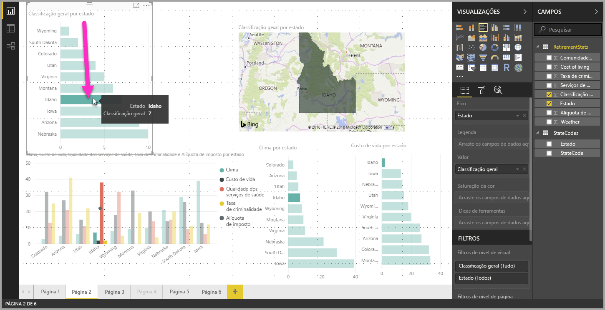
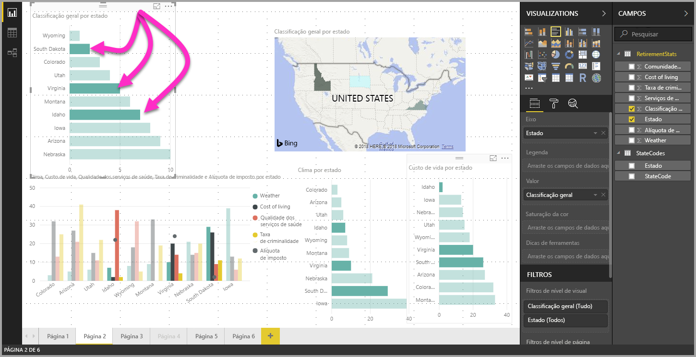

# Elementos de dados multisseleção em elementos visuais usando o Power BI Desktop

No **Power BI Desktop**, você pode realçar um ponto de dados em um determinado elemento visual, bastando clicar no ponto de dados no visual. Por exemplo, se você tiver uma barra ou elemento do gráfico importante e desejar que outros elementos visuais na página do relatório realcem os dados com base na sua seleção, clique no elemento de dados em um elemento visual e veja os resultados refletidos em outros elementos visuais na página. Isso é realce básico ou realce de seleção única. A imagem a seguir mostra um realce básico. 

Com a seleção múltipla, agora você pode selecionar mais de um ponto de dados na sua página de relatórios do **Power BI Desktop** e realçar os resultados entre os visuais na página. Isso é equivalente a uma instrução **and** ou uma funcionalidade como "realçar resultados para Idaho **e** Virgínia". Para selecionar vários pontos de dados em elementos visuais, basta usar **Ctrl+clique** para selecionar vários pontos de dados. A imagem a seguir mostra **vários pontos de dados** selecionados (seleção múltipla).

Isso parece uma funcionalidade simples, mas abre todos os tipos de oportunidades ao criar, compartilhar e interagir com relatórios. 

## Próximas etapas

Você também pode estar interessado nos seguintes artigos:

* [Use linhas de grade e ajuste de grade em relatórios do Power BI Desktop](desktop-gridlines-snap-to-grid.md)
* [Sobre filtros e realce em relatórios do Power BI](power-bi-reports-filters-and-highlighting.md)

