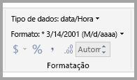
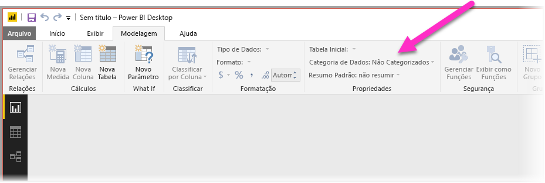
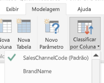
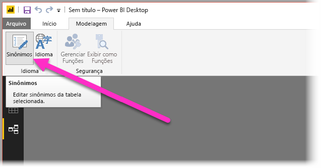
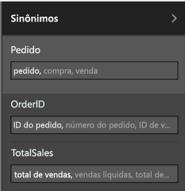

# Usar P e R no Power BI Desktop para consultas de linguagem natural
Usar linguagem natural e expressões comuns para fazer perguntas sobre seus dados é eficiente. É ainda mais eficiente quando seus dados respondem, que é o que P e R no **Power BI Desktop** permite que você faça.

Para habilitar P e R para interpretar com êxito a coleção de perguntas a qual é capaz de responder, a seção de P e R deve fazer suposições sobre o modelo. Se a estrutura do modelo não atender a uma ou mais dessas suposições, ajuste o seu modelo. Esses ajustes para P e R são as mesmas otimizações de práticas recomendadas para qualquer modelo no Power BI, independentemente se você usar P e R. 

> [!NOTE]
> As P e R estarão disponíveis apenas ao trabalhar com um modelo que contenha dados **importados**. Não há suporte para conexões dinâmicas com modelos SSAS e DirectQuery.
>
>

Nas seções a seguir, descrevemos como ajustar o modelo para que funcione bem com P e R no Power BI.

## Adicionar relacionamentos ausentes

Se o seu modelo tem relacionamentos ausentes entre tabelas, nem os relatórios do Power BI nem P e R podem interpretar como unir essas tabelas caso você faça uma pergunta sobre eles. Relacionamentos são a base de um bom modelo. Por exemplo, você não pode solicitar o "total de vendas para clientes de Seattle" se o relacionamento entre a tabela de *pedidos* e a tabela de *clientes* está ausente. As imagens a seguir mostram exemplos de um modelo que precisa de trabalho e um modelo que está pronto para P e R.

**Precisa de trabalho**

**Pronto para P e R**

## Renomear tabelas e colunas

A escolha de tabelas e colunas é muito importante para P e R. Por exemplo, se você tiver uma tabela chamada *CustomerSummary* que contém uma lista de seus clientes, faça perguntas como "Listar os resumos de clientes em Chicago" em vez de "Listar os clientes em Chicago". 

Embora P e R possa fazer alguma quebra de palavras básica e detecção de plurais, P e R pressupõe que os nomes da tabela e da coluna reflitam com precisão o conteúdo.

Considere outro exemplo. Imagine uma tabela chamada *Contagem de Funcionários* que contém nomes e sobrenomes e os números de funcionários, e outra tabela chamada *Funcionários* que contém os números de funcionários, datas de início e de números de trabalho. Embora isso possa ser compreendido por pessoas que estão familiarizadas com o modelo, outra pessoa que solicita "contagem de funcionários” obterá uma contagem das linhas da tabela "Funcionários", que provavelmente não é o que ela tinha em mente, já que é uma contagem de todos os trabalhos de cada funcionário. Seria muito melhor renomear essas tabelas para refletir realmente o que elas contêm.

**Precisa de trabalho**

**Pronto para P e R**

## Corrigir os tipos de dados incorretos

Dados importados podem ter tipos de dados incorretos. Em particular, as colunas *data* e *número* que são importadas como *cadeias de caracteres* não serão interpretadas por P e R como datas e números. Verifique se você selecionou o tipo de dados correto em seu modelo do Power BI.

## Marcar colunas de ano e identificador como Não resumir

O Power BI agrega agressivamente colunas numéricas por padrão, portanto perguntas como "total de vendas por ano" às vezes podem resultar em um total geral de vendas junto com o total de anos. Se você tiver colunas específicas na qual não deseja que o Power BI tenha esse comportamento, defina a propriedade **Resumir por** na coluna como **Não resumir**. Lembre-se das colunas **ano**, **mês**, **dia** e **ID**, pois elas são os problemas mais frequentes. Outras colunas que não sejam convenientes para soma, como *idade*, também podem se beneficiar da configuração **Resumir por** como **Não resumir** ou **Média**. Essa configuração está na guia **Modelagem**.

## Escolher uma categoria de dados para cada coluna de data e geografia

A **Categoria de Dados** fornece conhecimento semântico adicional sobre o conteúdo de uma coluna além de seu tipo de dados. Por exemplo, uma coluna de inteiro pode ser marcada como um CEP, uma coluna de cadeia de caracteres pode ser marcada como cidade, país, região e assim por diante. Essas informações são usadas por P e R de duas maneiras importantes: para seleção de visualização e tendências de idioma.

Em primeiro lugar, P e R usa as informações de **Categoria de Dados** para ajudar a tomar decisões sobre qual tipo de exibição visual será usado. Por exemplo, ela reconhece que colunas com **Categorias de Dados** de data ou hora geralmente são uma boa escolha para o eixo horizontal do gráfico de linhas ou o eixo de reprodução de um gráfico de bolhas. E pressupõe que os resultados que contém colunas com **Categorias de Dados** geográficos podem ter uma boa aparência em um mapa.

Em segundo lugar, P e R faz algumas suposições informadas sobre como os usuários falarão sobre as colunas de data e geografia, para ajudá-los a entender determinados tipos de perguntas. Por exemplo, "quando" em "Quando John Smith foi contratado?" é quase certo para mapear para uma coluna de data e "Brown" em "Contagem de clientes em Brown" é mais provável de ser uma cidade que uma cor de cabelo.

## Escolher uma classificação por coluna para as colunas relevantes

A propriedade **Classificar por Coluna** permite classificar em uma coluna para classificar automaticamente por uma coluna diferente. Por exemplo, quando pedir "classificar clientes por tamanho de camisa", você provavelmente desejará que a coluna de tamanho de camisa classifique pelo número de tamanho subjacente (XS, S, M, L, XL) em vez de em ordem alfabética (L, M, S, XL, XS).

## Normalizar seu modelo

Tenha certeza de que não estamos sugerindo que você precisa alterar a forma do modelo inteiro. No entanto, há determinadas estruturas que são simplesmente tão difíceis que P e R não vai lidar bem com elas. Se você executar alguma normalização básica da estrutura do seu modelo, o uso de relatórios do Power BI aumentará significativamente, assim como a precisão dos resultados de P e R.

A regra geral é: cada "item" exclusivo abordado pelo usuário deve ser representado por exatamente um objeto do modelo (tabela ou coluna). Portanto, se seus usuários falam sobre clientes, deve haver um objeto *cliente*. Se os usuários falam sobre vendas, deve haver um objeto *vendas*. Bem simples, não é? Dependendo da forma dos dados com os quais você está iniciando, pode ser. Há recursos avançados de modelagem de dados disponíveis no **Editor de Consultas** se você precisar, embora muitas das transformações mais simples possam ocorrer simplesmente usando cálculos no modelo do Power BI.

As seções a seguir contêm algumas transformações comuns que talvez você precise executar.

### Criar novas tabelas para entidades de várias colunas

Se você tiver várias colunas que atuam como uma única unidade distinta dentro de uma tabela maior, essas colunas deverão ser divididas em sua própria tabela. Por exemplo, se você tiver colunas Nome de Contato, Cargo do Contato e Telefone de Contato dentro da tabela *Empresas*, um design melhor seria ter uma tabela *Contatos* separada com Nome, Cargo e Telefone e um link de volta para a tabela *Empresas*. Isso facilita muito para fazer perguntas sobre contatos independentemente de perguntas sobre empresas para as quais eles são o contato e aumenta a flexibilidade de exibição.

**Precisa de trabalho**

**Pronto para P e R**

### Dinamizar para eliminar pacotes de propriedade

Se você tiver pacotes de propriedade em seu modelo, eles deverão ser reestruturados para ter uma única coluna por propriedade. Embora os pacotes de propriedade sejam convenientes para gerenciar grandes números de propriedades, eles têm várias limitações inerentes que nem os relatórios do Power BI nem P e R são projetados para encontrar uma solução alternativa.

Por exemplo, considere uma tabela *CustomerDemographics* com colunas CustomerID, Propriedade e Valor, em que cada linha representa uma propriedade diferente do cliente (por exemplo, idade, estado civil, cidade etc.). Ao sobrecarregar o significado da coluna Valor com base no conteúdo da coluna Propriedade, P e R não consegue interpretar a maioria das consultas que fazem referência a ela. Uma pergunta simples, como "mostrar a idade de cada cliente" pode funcionar, desde que ela possa interpretada como "mostrar os clientes e os dados demográficos do cliente em que a propriedade é idade". No entanto, a estrutura do modelo simplesmente não dá suporte a perguntas um pouco mais complexas como "idade média dos clientes em Chicago". Embora os usuários que criam diretamente os relatórios do Power BI possam, às vezes, encontrar formas inteligentes de obter os dados que procuram, P e R só funciona quando cada coluna tem apenas um único significado.

**Precisa de trabalho**

**Pronto para P e R**

### União para eliminar o particionamento

Se você particionou seus dados em várias tabelas ou dinamizou valores em várias colunas, será difícil ou impossível para seus usuários executar diversas operações comuns. Considere primeiro uma tabela típica de particionamento: uma tabela *Sales2000-2010* e uma tabela *Sales2011-2020*. Se todos os relatórios importantes forem restritos a uma década específica, provavelmente você poderia deixar desta forma para relatórios do Power BI. Porém, a flexibilidade de P e R levará os usuários a esperar respostas a perguntas como "total de vendas por ano". Para que isso funcione, você precisará unir os dados em uma única tabela de modelo do Power BI.

Da mesma forma, considere a possibilidade de uma coluna de valor dinâmico típico: uma tabela *BookTour* contendo as colunas Autor, Livro, Cidade1, Cidade2 e Cidade3. Com uma estrutura semelhante a essa, até mesmo perguntas simples como "contagem de livros por cidade" não podem ser interpretadas corretamente. Para que isso funcione, crie uma tabela *BookTourCities* separada, que une os valores de cidade em uma única coluna.

**Precisa de trabalho**

**Pronto para P e R**

### Dividir colunas formatadas

Se a origem da qual você está importando dados contiver colunas formatadas, os relatórios do Power BI e (P e R) não atingirão o interior da coluna para analisar seu conteúdo. Portanto, se tiver, por exemplo, uma coluna **Endereço Completo** que contém o endereço, a cidade e o país, você também deverá dividi-la em colunas de Endereço, Cidade e País para que os usuários possam consultá-las individualmente.

**Precisa de trabalho**

**Pronto para P e R**

Da mesma forma, se você tiver alguma coluna de nome completo de uma pessoa, talvez queira adicionar as colunas **Nome** e **Sobrenome**, caso alguém queira fazer perguntas usando nomes parciais. 

### Criar novas tabelas para colunas com vários valores

Em uma situação semelhante, se a origem da qual você está importando dados contiver colunas com vários valores, os relatórios do Power BI e (P e R) não atingirão o interior da coluna para analisar o conteúdo. Portanto, se você tiver, por exemplo, uma coluna Compositor que contém os nomes de vários compositores de uma música, divida-a em várias linhas em uma tabela *Compositores* separada.

**Precisa de trabalho**

**Pronto para P e R**

### Desnormalizar para eliminar relacionamentos inativos

Uma exceção à regra de "normalização é melhor" ocorre quando há mais de um caminho para ir de uma tabela a outra. Por exemplo, se você tiver uma tabela *Voos* com colunas SourceCityID e DestinationCityID, cada uma delas estará relacionada à tabela *Cidades* e um desses relacionamentos precisará ser marcado como inativo. P e R só pode usar relacionamentos ativos, por isso você não poderá fazer perguntas sobre origem ou destino, dependendo do que você escolher. Se você desnormalizar as colunas de nome de cidade na tabela *Voos*, poderá fazer perguntas como: "listar os voos de amanhã tendo Seattle como cidade de origem e São Francisco como cidade de destino".

**Precisa de trabalho**

**Pronto para P e R**

### Adicionar sinônimos a tabelas e colunas

Esta etapa aplica-se especificamente a P e R (e não a relatórios do Power BI em geral). Os usuários geralmente têm uma variedade de termos que eles usam para se referir à mesma coisa, como total de vendas, vendas líquidas, total de vendas líquidas. O modelo do Power BI permite que esses sinônimos sejam adicionados a tabelas e colunas dentro do modelo. 

Isso pode ser uma etapa muito importante. Mesmo com nomes de coluna e tabela simples, os usuários de P e R fazem perguntas usando o vocabulário mais comum a eles e não escolhendo em uma lista predefinida de colunas. Quanto mais sensíveis os sinônimos adicionados, melhor será experiência dos usuários com seu relatório. Para adicionar sinônimos, na exibição **Relacionamentos**, selecione o botão Sinônimos na faixa de opções, conforme mostrado na imagem a seguir.

O campo **Sinônimos** é exibido no lado direito do **Power BI Desktop**, em que você pode adicionar seus sinônimos, como mostrado na imagem a seguir.

 Tenha cuidado ao adicionar sinônimos, pois a adição do mesmo sinônimo a mais de uma coluna ou tabela apresenta ambiguidade. P e R utiliza contexto quando possível para escolher entre sinônimos ambíguos, mas nem todas as perguntas têm contexto suficiente. Por exemplo, quando o usuário solicita " contagem de clientes", se você tiver três itens com o sinônimo "cliente" em seu modelo, talvez eles não recebam a resposta que estão procurando. Nesses casos, verifique se o sinônimo primário é exclusivo, pois esse é o usado na reformulação. Ele pode alertar o usuário da ambiguidade (por exemplo, uma reformulação de "mostrar o número de registros de clientes arquivados"), orientando-os a perguntar de maneira diferente.

## Próximas etapas
Para obter mais informações sobre os recursos no Power BI Desktop, confira os seguintes artigos:

* [Usar o detalhamento no Power BI Desktop](desktop-drillthrough.md)
* [Exibir um bloco do dashboard ou visual do relatório no modo de Foco](service-focus-mode.md)

