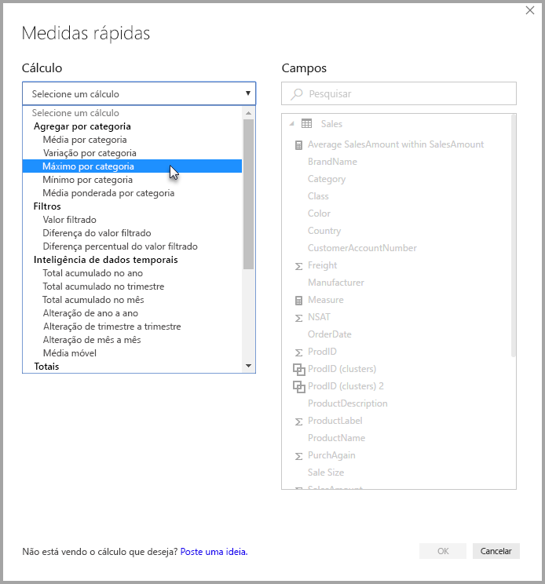
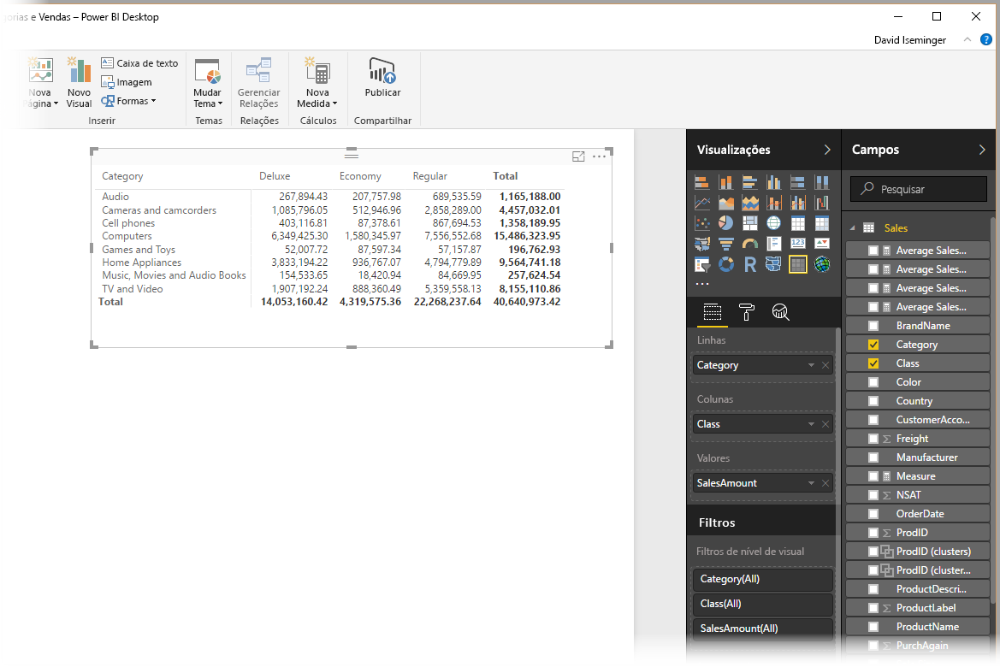
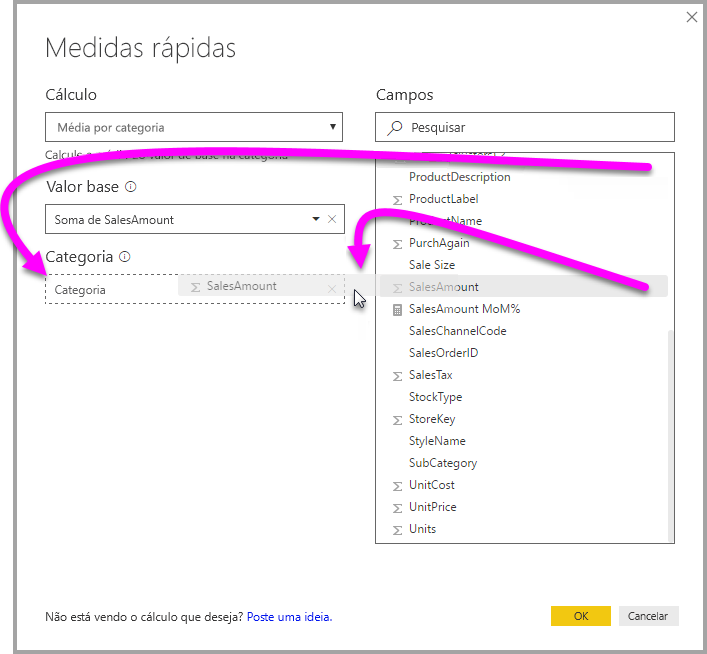
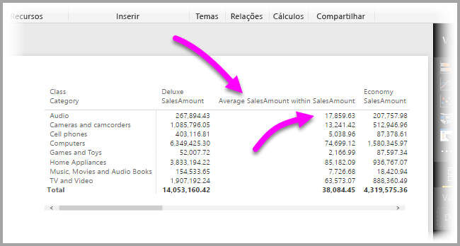
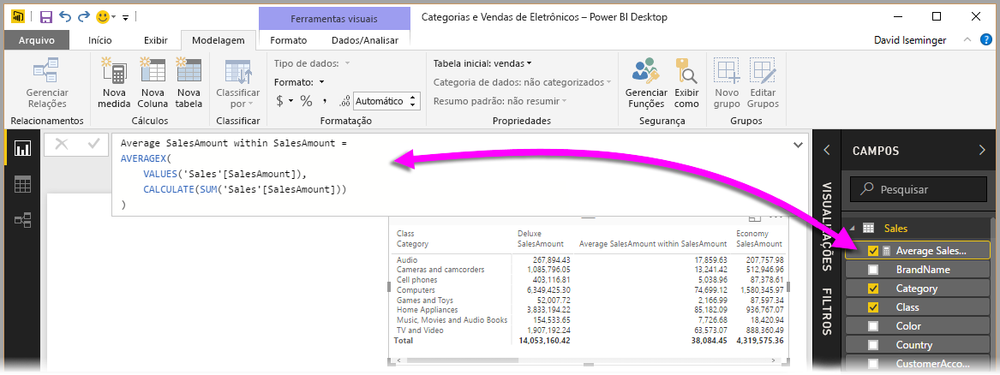
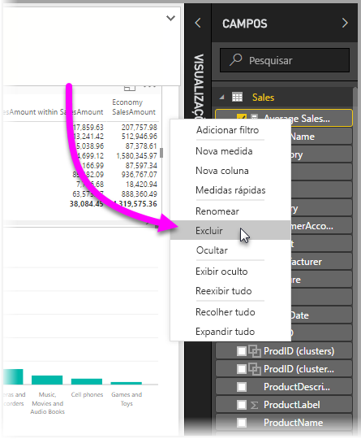

# Usar medidas rápidas para facilmente executar cálculos comuns e avançados
Você pode usar **Medidas rápidas** para executar cálculos comuns e avançados com rapidez e praticidade. Uma **Medida rápida** executa um conjunto de comandos DAX nos bastidores (não é necessário compilar o DAX; isso já foi feito para você) com base nos dados fornecidos em uma caixa de diálogo e, em seguida, apresenta os resultados para você usar em seu relatório. O melhor de tudo é poder visualizar o DAX executado pela Medida rápida e estimular ou expandir seu próprio conhecimento do DAX.

Para criar **Medidas rápidas**, clique com o botão direito do mouse em um campo no espaço **Campos** e, em seguida, selecione **Medidas rápidas** no menu exibido. Outra opção é clicar com o botão direito do mouse em qualquer valor no painel **Valores** de um elemento visual existente (como o campo *Valores* em um elemento visual do *Gráfico de barras*). Há muitas categorias de cálculos disponíveis, bem como maneiras de modificar cada cálculo para atender às suas necessidades.

### Medidas rápidas agora disponíveis de maneira geral

A partir da versão de fevereiro de 2018 do **Power BI Desktop**, as medidas rápidas estarão geralmente disponíveis (não mais em versão prévia). Se você estiver usando uma versão anterior do **Power BI Desktop**, poderá tentar o recurso de **Medidas rápidas** a partir da versão de **abril de 2017** do **Power BI Desktop** selecionando **Arquivo > Opções e configurações > Opções > Versão Prévia dos Recursos**. Em seguida, marque a caixa de seleção ao lado de **Medidas rápidas**.

Você precisará reiniciar o **Power BI Desktop** depois de fazer a seleção.

## Uso das Medidas rápidas
Para criar uma **Medida rápida**, clique com o botão direito do mouse em um campo (qualquer campo) no espaço **Campos** no **Power BI Desktop** e selecione **Medida rápida** no menu exibido.

Ao usar conexões dinâmicas do SSAS (SQL Server Analysis Services), algumas **Medidas rápidas** estão disponíveis. O **Power BI Desktop** exibe apenas a coleção de **Medidas rápidas** para as quais a versão do SSAS com a qual a conexão é feita dá suporte. Portanto, se você está conectado a uma fonte de dados dinâmicos do SSAS e você não vê certas **Medidas rápidas** na lista, é porque a versão do SSAS à qual você está conectado não dá suporte à medida DAX usada para implementar essa **Medida rápida**.

Se a seleção for feita no menu de atalho, a seguinte janela de **Medidas rápidas** será exibida, permitindo selecionar o cálculo desejado e os campos relacionados nos quais você pretende executar o cálculo.

Na seleção do menu suspenso, é apresentada uma longa lista de **Medidas rápidas** disponíveis.

Há cinco diferentes grupos de tipos de cálculo de Medidas rápidas, cada qual com uma coleção de cálculos. Esses grupos e cálculos são os seguintes:

* **Agregar por categoria**
  * Média por categoria
  * Variação por categoria
  * Máximo por categoria
  * Mínimo por categoria
  * Média ponderada por categoria
* **Filtros**
  * Valor filtrado
  * Diferença do valor filtrado
  * Diferença percentual do valor filtrado
  * Vendas de novas categorias
* **Inteligência de dados temporais**
  * Total acumulado no ano
  * Total acumulado no trimestre
  * Total acumulado no mês
  * Alteração ano a ano
  * Alteração em relação ao trimestre anterior
  * Alteração em relação ao mês anterior
  * Média móvel
* **Totais**
  * Total acumulado
  * Total da categoria (filtros aplicados)
  * Total da categoria (filtros não aplicados)
* **Operações matemáticas**
  * Addition
  * Subtração
  * Multiplicação
  * Divisão
  * Diferença percentual
  * Coeficiente de correlação
* **Texto**
  * Classificação por estrelas
  * Lista de valores concatenados

Nós nos antecipamos incrementando esses cálculos e gostaríamos de saber por quais **Medidas rápidas** você se interessa, bem como receber ideias (incluindo fórmulas DAX subjacentes) sobre **Medidas rápidas**, caso queira nos enviar alguma para apreciação. Veja mais informações sobre o assunto no fim deste artigo.

## Exemplo de Medidas rápidas
Vamos examinar um exemplo dessas **Medidas rápidas** em ação.

O elemento visual da **Matriz** a seguir mostra uma tabela de vendas de diversos produtos eletrônicos. Trata-se de uma tabela básica que inclui o total de cada categoria.

Quando clicamos com o botão direito do mouse no espaço do campo **Valores** e selecionamos **Medidas rápidas**, é possível selecionar *Média por categoria* como o *Cálculo*, selecionar *Soma de SalesAmount* como o *Valor base* e, por fim, especificar *SalesAmount* arrastando esse campo da caixa *Campos* no painel direito até a seção *Categoria* à esquerda.

Ao selecionarmos **OK**, é possível observar algumas coisas interessantes acontecendo, conforme mostrado na imagem que acompanha esta lista:

1. O elemento visual da **Matriz** inclui agora uma nova coluna que mostra o nosso cálculo (nesse caso, *SalesAmount médio em SalesAmount*).
2. Foi criada uma nova **medida** que está disponível no espaço **Campos** e exibida com destaque (o Power BI insere uma caixa amarela ao redor dela). Essa medida está disponível em qualquer outro elemento visual do relatório, e não apenas no elemento visual para o qual foi originalmente criada.
3. A fórmula DAX criada para a **Medida rápida** é exibida na barra de Fórmulas.

Para iniciar com o primeiro item, observe que a **Medida rápida** foi aplicada ao visual. Há uma nova coluna e um valor associado e ambos se baseiam na **Medida rápida** criada.

Segundo, a **Medida rápida** é exibida no espaço **Campos** do modelo de dados e pode ser usada como qualquer outro campo do modelo e em qualquer outro elemento visual. Na imagem a seguir, um elemento visual rápido de **gráfico de barras** foi criado usando o novo campo gerado pela **Medida rápida**.

Passemos à próxima seção para discutir o terceiro item: fórmulas DAX.

## Conhecer o DAX usando Medidas rápidas
Outra grande vantagem do recurso **Medida rápida** está no fato de ele apresentar diretamente a fórmula DAX criada para implementar a medida. Na imagem a seguir, selecionamos a medida criada pela **Medida rápida** (a medida se encontra agora no espaço **Campos**, então basta clicar nela). Após executarmos esse procedimento, a **barra de Fórmulas** é exibida, mostrando a fórmula DAX criada pelo Power BI para implementar a medida.

Isso por si só é ótimo, pois mostra a fórmula por trás da medida. Mas o mais importante, talvez, seja o fato de o recurso permitir o uso das **Medidas rápidas** para verificar como as fórmulas DAX subjacentes devem ser criadas.

Imagine que você tenha de efetuar um cálculo comparativo do ano, mas está em dúvida sobre como estruturar a fórmula DAX (ou não tem ideia de por onde começar). Em vez de quebrar a cabeça, você pode criar uma **Medida rápida** usando o cálculo de **Alteração em relação ao ano anterior** e ver o que acontece. Da mesma forma, crie a **Medida rápida** e veja como ela será exibida no seu elemento visual, confira como a fórmula DAX funcionou e faça alterações diretamente no DAX ou crie outra medida até que os cálculos atendam às suas necessidades ou expectativas.

É como ter um professor rápido que responde imediatamente às suas perguntas hipotéticas com apenas alguns cliques. Você sempre poderá excluir essas medidas do seu modelo se não ficar satisfeito com elas. Isso muito fácil: basta clicar com o botão direito do mouse na medida e selecionar **Excluir**.

Assim que a medida estiver finalmente aperfeiçoada, você poderá renomeá-la como desejar usando o mesmo menu de atalho.

## Limitações e considerações
Há algumas limitações e considerações para se ter em mente.

* As **medidas rápidas** só estão disponíveis quando você pode modificar o modelo, o que não é o caso ao trabalhar com algumas conexões dinâmicas (há suporte para conexões dinâmicas tabulares do SSAS, como já explicado).
* A medida adicionada ao espaço **Campos** pode ser usada com qualquer elemento visual no relatório.
* Você poderá visualizar sempre o DAX associado à **Medida rápida** selecionando a medida criada no espaço **Campos** e, em seguida, verificando a fórmula na **barra de Fórmulas**.
* Você não pode criar medidas rápidas de inteligência de tempo ao trabalhar no modo DirectQuery. As funções DAX usadas nessas medidas rápidas tem implicações no desempenho quando convertidas nas instruções T-SQL que são enviadas à fonte de dados.

> [!WARNING]
> Atualmente, medidas rápidas geram *somente* instruções DAX com vírgulas como separadores de argumentos. Se sua versão do **Power BI Desktop** estiver localizada para um idioma que usa vírgulas como separadores decimais, as medidas rápidas não funcionarão corretamente.
> 
> 

### Inteligência de dados temporais e Medidas rápidas
Começando com a atualização de outubro de 2017 do **Power BI Desktop**, você pode usar suas próprias tabelas de datas personalizadas com **medidas rápidas** de inteligência de dados temporais. Se você estiver usando um modelo tabular externo, verifique se quando o modelo foi criado, essa coluna de data primária na tabela foi marcada como uma tabela de data, conforme é descrito [neste artigo](https://docs.microsoft.com/sql/analysis-services/tabular-models/specify-mark-as-date-table-for-use-with-time-intelligence-ssas-tabular). Se você estiver importando sua própria tabela de data, marque-a como uma tabela de data, conforme é descrito [neste artigo](https://docs.microsoft.com/power-bi/desktop-date-tables)

### Exemplos e informações adicionais
Nós nos antecipamos fornecendo exemplos e diretrizes para cada um dos cálculos de **Medidas rápidas**, portanto confira novamente em breve as atualizações do artigo em destaque.

Tem uma ideia para uma **Medida rápida** que ainda não foi criada? Ótimo! Confira [esta página](https://go.microsoft.com/fwlink/?linkid=842906) e envie suas ideias (e a fórmula DAX) sobre a **Medida rápida** que gostaria de ver incluída no **Power BI Desktop**, e nós avaliaremos a viabilidade de adicioná-la à lista de **Medidas rápidas** em uma versão futura.

