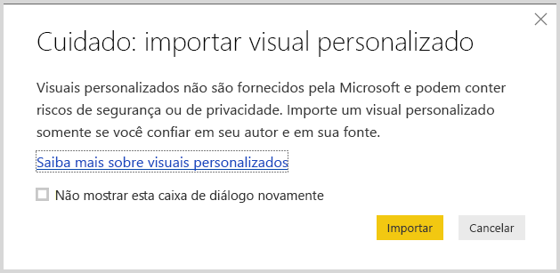
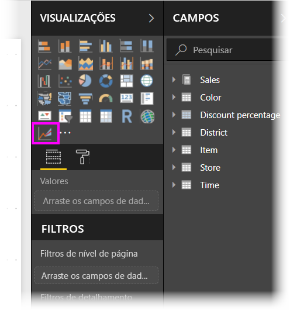
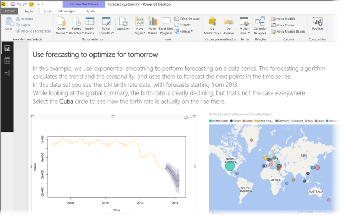
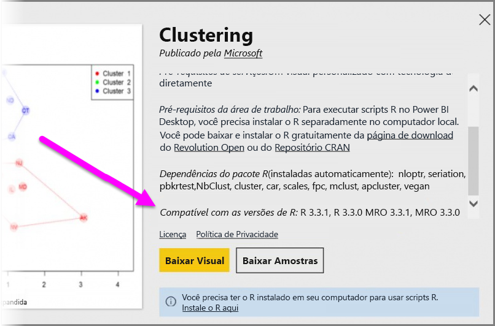

# Usar elementos visuais personalizados baseados em R no Power BI
Com a versão de outubro de 2016 do **Power BI Desktop** e no **serviço do Power BI**, você pode usar elementos visuais personalizados baseados em R sem qualquer conhecimento do R e sem qualquer script do R. Isso permite que você aproveite o poder analítico e visual de elementos visuais e dos scripts do R, sem a necessidade de aprender ou fazer programação em R.

Para usar elementos visuais personalizados baseados em R, primeiro, selecione e baixe o elemento visual personalizado R em que está interessado na seção **elementos visuais baseados em R** da galeria de **elementos visuais personalizados** do Power BI.

As seções a seguir descrevem como selecionar, carregar e usar elementos visuais baseados em R no **Power BI Desktop**.

### Uso de elementos visuais personalizados R
Para usar elementos visuais personalizados baseados em R, você precisa baixar cada elemento visual da biblioteca de **elementos visuais personalizados**, depois, usar o elemento visual como qualquer outro tipo de elemento visual no **Power BI Desktop**. Aqui estão as etapas para fazer isso:

1. Navegue até a biblioteca de [elementos visuais personalizados](http://app.powerbi.com/visuals), localizada em [http://app.powerbi.com/visuals](http://app.powerbi.com/visuals). Selecione o link *elementos visuais baseados em R* próximo à parte superior da página.
   
   
2. Selecione na galeria o **elemento visual baseado em R** que você tem interesse em usar. É exibida uma caixa de diálogo com detalhes adicionais. Selecione **Baixar elemento visual** para baixar.
   
   > [!NOTE]
> Para criar no **Power BI Desktop**, você precisa ter o R instalado no computador local. Mas quando os usuários desejarem exibir um elemento visual baseado em R no **serviço do Power BI** eles *não* precisam ter o R instalado localmente.
   > 
   > 
   
   
   
   Você não precisa instalar o R para usar elementos visuais personalizados baseados em R no **serviço do Power BI**, no entanto, se você quiser usar elementos visuais personalizados baseados em R no **Power BI Desktop**, *instale* o R no computador local. Você pode baixar o R nos seguintes locais:
   
   * [CRAN 3.3.1](https://cran.r-project.org/bin/windows/base/R-3.3.1-win.exe)
   * [MRO 3.3.1](https://mran.microsoft.com/install/mro/3.3.1/microsoft-r-open-3.3.1.msi)
3. Depois que o elemento visual é baixado (que é como baixar de qualquer arquivo do seu navegador), vá para **Power BI Desktop** e clique com o botão direito do mouse nas reticências (...) no painel de **Visualizações** e selecione **Importar um elemento visual personalizado**.
   
   
4. Você sabe como importar um elemento visual personalizado, conforme mostrado na imagem a seguir:
   
   
5. Navegue para onde o arquivo do elemento visual foi salvo, depois, selecione o arquivo. Visualizações personalizadas do **Power BI Desktop** têm a extensão .pbiviz.
   
   
6. Quando você retorna ao Power BI Desktop, é possível ver o novo tipo de elemento visual no painel de **Visualizações**.
   
   
7. Quando você importar o novo visual (ou abrir um relatório que contém um elemento visual personalizado baseado em R), o **Power BI Desktop** instala os pacotes do R necessários.
   
   

A partir daí, você pode adicionar dados para o elemento visual assim como faria com qualquer outro elemento visual do **Power BI Desktop**. Ao concluir, é possível ver seu elemento visual concluído na tela. No elemento visual a seguir, o elemento visual baseado em R de **Previsão** foi usado com projeções de taxa de nascimento das Nações Unidas (NU) (elemento visual à esquerda).

Como qualquer outro elemento visual do **Power BI Desktop**, você pode publicar esse relatório com seus elementos visuais baseados em R no **serviço do Power BI** e compartilhá-lo com outras pessoas.

Verifique a biblioteca de [elementos visuais personalizados baseados em R](https://app.powerbi.com/visuals/R-powered) com frequência, pois novos elementos visuais estão sendo adicionados o tempo todo.

### Contribuição de elementos visuais personalizados baseados em R
Se você criar elementos visuais do R para uso em seus relatórios, poderá compartilhar esses elementos visuais com o mundo colocando o seu elemento visual personalizado na **galeria de elementos visuais personalizados**. Contribuições são feitas por meio do GitHub e o processo é descrito nas seguintes localizações:

* [Contribuição na galeria de elementos visuais personalizados baseados em R](https://github.com/Microsoft/PowerBI-visuals#building-r-powered-custom-visual-corrplot)

### Solução de problemas de elementos visuais personalizados baseados em R
Os elementos visuais personalizados baseados em R têm determinadas dependências que devem ser atendidas para que os elementos visuais funcionem corretamente. Quando os elementos visuais personalizados baseados em R não executam ou não carregam corretamente, o problema é geralmente um dos seguintes:

* O mecanismo de R está ausente
* Erros no script de R no qual o elemento visual se baseia
* Os pacotes de R estão ausentes ou desatualizados

A seção a seguir descreve as etapas de solução de problemas que podem ser seguidas para ajudar a resolver os problemas que você encontrar.

#### Pacotes de R ausentes ou desatualizados
Ao tentar instalar um elemento visual personalizado baseado em R, você pode encontrar erros quando houver pacotes de R ausentes ou desatualizados; isso costuma ocorrer devido a um dos seguintes motivos:

* A instalação do R é incompatível com o pacote do R,
* Configurações de proxy, software antivírus ou um firewall estão impedindo o R de conectar-se com a Internet
* A conexão com a Internet está lenta ou há um problema de conexão com a Internet

A equipe do Power BI está trabalhando ativamente para atenuar esses problemas antes que eles cheguem a você e o próximo Power BI Desktop incorporará atualizações para resolver esses problemas. Até lá, você pode executar uma ou mais das etapas a seguir para atenuar os problemas:

1. Remova o elemento visual personalizado e instale-o novamente. Isso iniciará uma reinstalação dos pacotes de R.
2. Se sua instalação do R não estiver atualizada, atualize sua instalação do R e, em seguida, remova/reinstale o elemento visual personalizado conforme descrito na etapa anterior.
   
   * As versões de R com suporte estão listadas na descrição de cada elemento visual personalizado baseado em R, conforme mostrado na imagem a seguir.
     
     > [!NOTE]
> Mantenha a instalação original do R e associe apenas o Power BI Desktop com a versão atual que instalar. Vá para **Arquivo > Opções e configurações > Opções > Script de R**.
3. Instale os pacotes de R manualmente, usando qualquer console do R. As etapas desta abordagem são as seguintes:
   
   a.  Baixe o script de instalação do elemento visual baseado em R e salve esse arquivo em uma unidade local.
   
   b.  No console do R, execute o seguinte:
   
       > source(“C:/Users/david/Downloads/ScriptInstallPackagesForForecastWithWorkarounds.R”)    
   
   Os locais típicos de instalação padrão são os seguintes:
   
       c:\Program Files\R\R-3.3.x\bin\x64\Rterm.exe (for CRAN-R)
       c:\Program Files\R\R-3.3.x\bin\x64\Rgui.exe (for CRAN-R)
       c:\Program Files\R\R-3.3.x\bin\R.exe (for CRAN-R)
       c:\Program Files\Microsoft\MRO-3.3.x\bin\R.exe (for MRO)
       c:\Program Files\Microsoft\MRO-3.3.x\bin\x64\Rgui.exe (for MRO)
       c:\Program Files\RStudio\bin\rstudio.exe (for RStudio)
4. Se as etapas anteriores não funcionarem, tente o seguinte:
   
   a. Use o **R Studio** e siga a etapa descrita acima em 3.b. (executar a linha de script do console do R).
   
   b. Se a etapa anterior não funcionar, altere **Ferramentas > Opções globais > Pacotes** no **R Studio** e habilite a caixa de seleção **Usar a biblioteca/proxy do Internet Explorer para HTTP** e, em seguida, repita a etapa 3.b. das etapas acima.

### Próximas etapas
Analise as informações adicionais a seguir sobre o R no Power BI.

* [Galeria de elementos visuais personalizados do Power BI](https://app.powerbi.com/visuals/)
* [Executando scripts do R no Power BI Desktop](desktop-r-scripts.md)
* [Criar elementos visuais do R no Power BI Desktop](desktop-r-visuals.md)
* [Usar um IDE R externo com o Power BI](desktop-r-ide.md)

