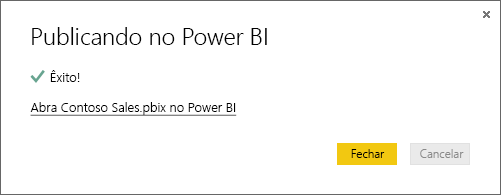

# Publicar por meio do Power BI Desktop
Quando você publicar um arquivo do **Power BI Desktop** no **serviço do Power BI**, os dados no modelo e os relatórios criados na exibição **Relatório** serão publicados no espaço de trabalho do Power BI. Você verá um novo conjunto de dados com o mesmo nome e todos os relatórios no seu navegador de espaço de trabalho.

Publicar por meio do **Power BI Desktop** tem o mesmo efeito que usar **Obter Dados** no Power BI para se conectar e carregar um arquivo do **Power BI Desktop**.

> [!NOTE]
> Quaisquer alterações feitas no Power BI de relatórios, como adicionar, excluir ou alterar visualizações em relatórios, não serão salvas no arquivo original do **Power BI Desktop**.
> 
> 

## Para publicar relatórios e um conjunto de dados e relatório do Power BI Desktop
1. No Power BI Desktop \> **Arquivo** \> **Publicar** \> **Publicar no Power BI** ou clique em **Publicar** na faixa de opções.  
   
2. Entre no Power BI.

Ao concluir, você receberá um link para abrir o relatório no seu site do Power BI.  
    

## Publicar novamente ou substituir um conjunto de dados publicado por meio do Power BI Desktop
Ao publicar um arquivo do **Power BI Desktop**, o conjunto de dados e relatórios criados no **Power BI Desktop** são carregados no seu site do Power BI. Quando você publicar novamente o arquivo do **Power BI Desktop**, o conjunto de dados no seu site do Power BI será substituído pelo conjunto de dados atualizado do arquivo do **Power BI Desktop**.

Isso é tudo muito simples, mas há algumas coisas que você deve saber:

* Se você já tiver dois ou mais conjuntos de dados no Power BI com o mesmo nome que o arquivo do **Power BI Desktop**, a publicação poderá falhar. Verifique se que você tem apenas um conjunto de dados no Power BI com o mesmo nome. Também pode renomear o arquivo e publicar, criando um novo conjunto de dados com o mesmo nome de arquivo.
* Se você renomear ou excluir uma coluna ou medida, qualquer visualizações que você já tenha no Power BI com esse campo poderá ser desfeita. 
* O Power BI ignora as alterações de formato de colunas existentes. Por exemplo, se você alterar o formato de uma coluna de 0,25 para 25%.
* Se você tiver um agendamento de atualização configurado para o conjunto de dados existente no Power BI e adicionar novas fontes de dados ao seu arquivo e, em seguida, publicá-las novamente, será necessário entrar nelas em *Gerenciar Fontes de Dados* antes da próxima atualização agendada.

