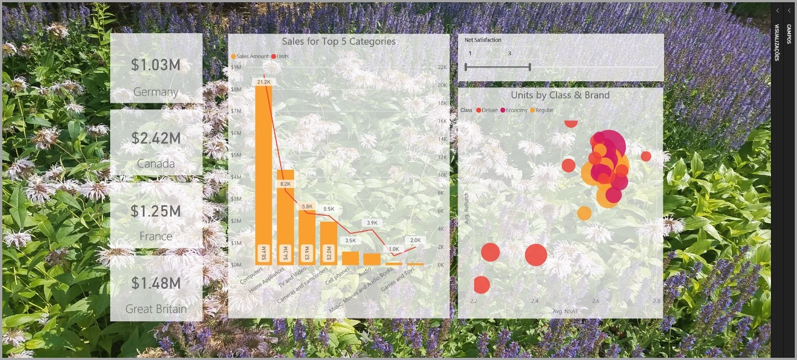
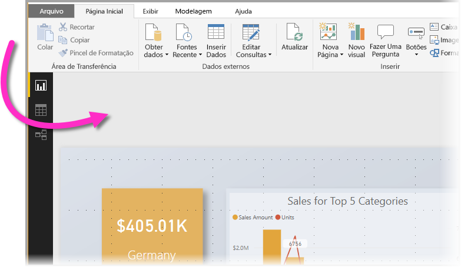
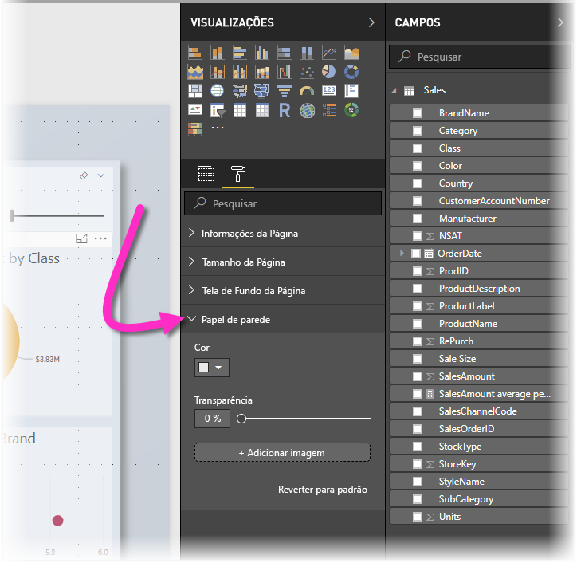
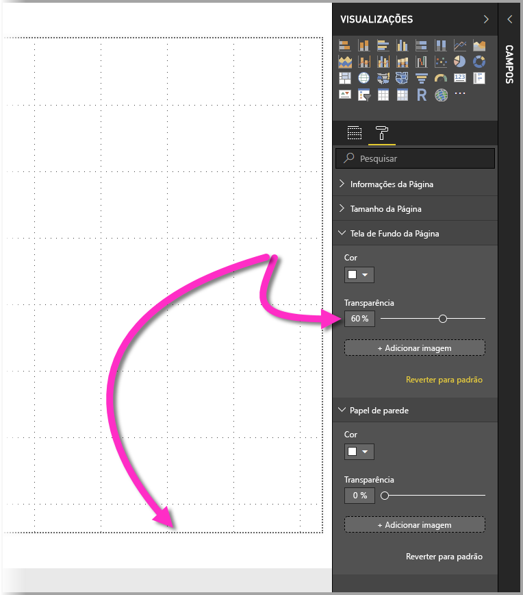
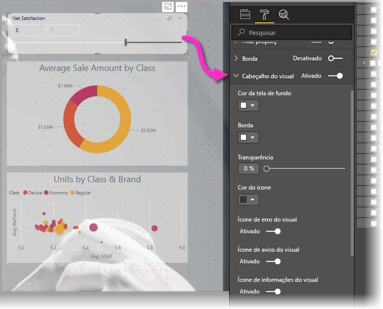
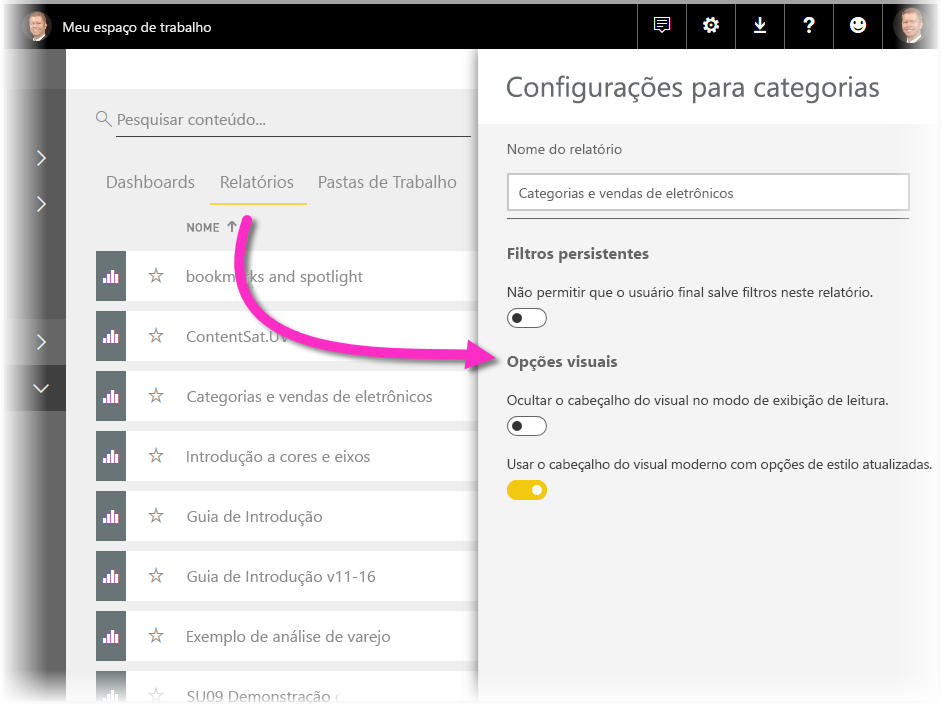
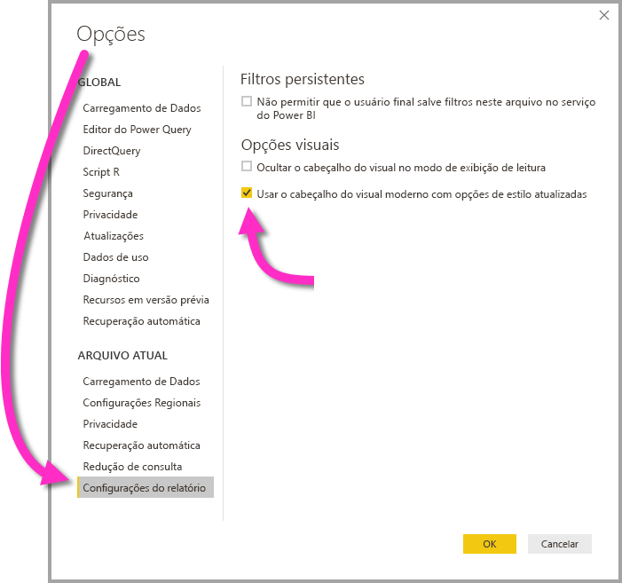

# Usar elementos visuais para aprimorar os relatórios do Power BI

Com o **Power BI Desktop**, você pode usar elementos visuais, como papel de parede e cabeçalhos visuais aprimorados para visualizações, para melhorar a aparência dos relatórios.

A partir da versão de julho de 2018 do **Power BI Desktop**, passa a ser possível aplicar melhorias nos relatórios, tornando as análises e relatórios ainda mais atraentes do que nunca. Dentre as melhorias tratadas neste artigo estão: 

* A aplicação de um **papel de parede** a relatórios para que o plano de fundo realce ou destaque os elementos da história que você deseja contar com os dados
* O uso melhorado de **cabeçalhos visuais** para visualizações individuais com o propósito de criar elementos visuais perfeitamente alinhados na tela do relatório. 

As seções a seguir descrevem como usar esses aprimoramentos e como aplicá-los aos relatórios.

## Uso do papel de parede em relatórios do Power BI

Você pode formatar a área cinzenta fora da página do relatório usando um **papel de parede**. A seta na imagem a seguir mostra onde se aplica a área do papel de parede. 

É possível definir um papel de parede para cada página do relatório ou usar o mesmo papel de parede para todas as páginas. Para definir o papel de parede, toque ou clique no ícone de **Formatação** quando nenhum elemento visual estiver selecionado no relatório e o cartão do **papel de parede** aparecerá no painel.

É possível aplicar uma cor como **papel de parede** selecionando a lista suspensa **Cor** ou o botão **Adicionar imagem** para selecionar uma imagem a ser aplicada como papel de parede. Também é possível aplicar transparência ao papel de parede, seja a uma cor ou imagem, usando o controle deslizante **Transparência**.

Vale lembrar as seguintes definições pertencentes ao **papel de parede**:

* A área cinzenta externa à área do relatório é o **papel de parede**
* A área da tela onde você pode inserir os elementos visuais é conhecida como a **página** do relatório, que pode ser modificada no **Painel Formatar** usando a lista suspensa **Plano de fundo da página**.

A **página** do relatório sempre fica em primeiro plano (em relação ao papel de parede), enquanto o **papel de parede** fica por trás, sendo o elemento mais ao fundo da página do relatório. Ao aplicar transparência à página, os elementos visuais do relatório também ficam transparentes, permitindo que o papel de parede fique visível no segundo plano através dos elementos visuais.

As configurações padrão para todos os novos relatórios são as seguintes:

* A **página** do relatório é definida para **branco** e a transparência para **100%**
* O **papel de parede** é definido para **branco** e a transparência para **0%**

Se você definir a transparência do plano de fundo da página para mais de 50%, uma borda pontilhada aparecerá enquanto você estiver criando ou editando o relatório, para mostrar o limite da borda da tela do relatório. 

É importante observar que o limite pontilhado *só* aparece ao editar o relatório e *não* é exibido para as pessoas que estiverem visualizando o relatório publicado, da forma como aparece ao ser exibido no **Serviço do Power BI**.

## Uso de cabeçalhos visuais aprimorados em relatórios do Power BI

A partir da versão de julho de 2018 do **Power BI Desktop**, os cabeçalhos dos elementos visuais nos relatórios passam a ter uma melhoria significativa. Os principais aprimoramentos se referem ao cabeçalho, que foi desconectado do elemento visual para que a posição dele possa ser ajustada com base em sua preferência de layout e posicionamento, e que ele agora é exibido dentro do próprio elemento visual, em vez de ficar flutuante sobre este. 

O cabeçalho é exibido por padrão dentro do elemento visual, alinhado com o título. Na imagem a seguir, você pode ver o cabeçalho (os ícones de fixação, de expansão e de reticências) dentro do elemento visual e alinhados à direita, ao longo da mesma posição horizontal que o título do elemento visual.

Se o elemento visual não tiver um título, o cabeçalho flutuará acima da parte superior dele, alinhado à direita, conforme a imagem a seguir. 

Se o elemento visual estiver totalmente posicionado na parte superior do relatório, o cabeçalho visual então se encaixa na parte inferior do elemento visual. 

Todo elemento visual também tem um cartão na seção de **Formatação** do painel de **Visualizações** chamado **Cabeçalho visual**. Nesse cartão, é possível ajustar todo tipo de característica do cabeçalho visual

> [!NOTE]
> A exibição dos botões de alternância não afetam o relatório durante a criação ou edição. É necessário publicar o relatório e exibi-lo no modo de leitura para ver o efeito. Esse comportamento garante que as várias opções fornecidas nos cabeçalhos visuais sejam importantes durante a edição, especialmente os ícones de aviso que alertam quanto a problemas durante a edição.

Para os relatórios que aparecem apenas no **Serviço do Power BI**, é possível ajustar o uso de cabeçalhos visuais acessando **Meu espaço de trabalho > Relatórios** e selecionando o ícone **Configurações**. Lá você verá as definições do relatório para o qual selecionou **Configurações** e pode ajustá-las a partir daí, conforme mostrado na imagem a seguir.

### Habilitar cabeçalhos visuais aprimorados para relatórios existentes

O novo cabeçalho visual é o comportamento padrão para todos os novos relatórios. Para os relatórios existentes, é preciso habilitar esse comportamento no **Power BI Desktop** acessando **Arquivo > Opções e configurações > Opções** e depois, na seção **Configurações do relatório**, habilitar a caixa de seleção **Usar o cabeçalho visual moderno com as opções de estilo atualizadas**.

## Próximas etapas
Para obter mais informações sobre o **Power BI Desktop** e como começar, confira os artigos a seguir.

* [O que é o Power BI Desktop?](desktop-what-is-desktop.md)
* [Visão geral de Consulta com o Power BI Desktop](desktop-query-overview.md)
* [Fontes de dados no Power BI Desktop](desktop-data-sources.md)
* [Conectar-se a dados no Power BI Desktop](desktop-connect-to-data.md)
* [Formatar e combinar dados com o Power BI Desktop](desktop-shape-and-combine-data.md)
* [Tarefas comuns de consulta no Power BI Desktop](desktop-common-query-tasks.md)   

