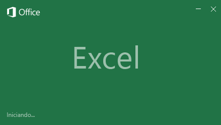

Bem-vindo à seção **Power BI e Excel** do curso **Aprendizagem interativa** sobre o Power BI.

É bem provável que você já usou o **Excel**. Talvez você tenha usado o Excel para criar ou exibir relatórios ou para criar gráficos de pizza ou outros visuais. Ou talvez você tenha usado o **Power Pivot** ou o **Power Query** para criar soluções que eram um pouco mais técnicas. Sendo assim, você se sentirá como se estivesse em casa no Power BI, bem como suas pastas de trabalho.

Esta seção mostra como é fácil inserir pastas de trabalho do Excel no Power BI e demonstra que o Power BI e o Excel fazem uma excelente parceria.

## Introdução ao uso de dados do Excel no Power BI
*Assista a uma introdução sobre as formas pelas quais o Excel e o serviço do Power BI funcionam em conjunto*

Com o Power BI, é fácil inserir seus dados do Excel no Power BI.

Os tópicos a seguir vão orientá-lo em como carregar uma pasta de trabalho do Excel com uma tabela simples no Power BI. Em seguida, você verá como carregar pastas de trabalho criadas com recursos mais avançados do Excel de relatório e modelagem de dados para o BI, como o Power Pivot e Power View.

Você também conhecerá algumas vantagens de salvar seus arquivos de pasta de trabalho do Excel no OneDrive for Business. Quando você se conecta a arquivos do Excel no OneDrive do Power BI, os relatórios e dashboards no Power BI são atualizados automaticamente ao fazer alterações e salvar o trabalho.

