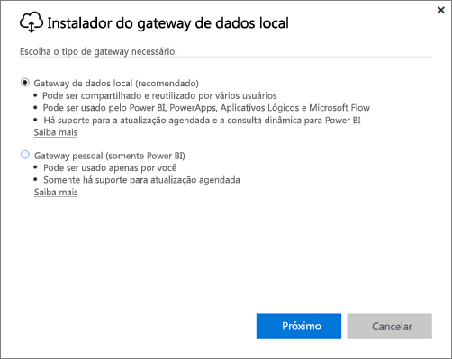
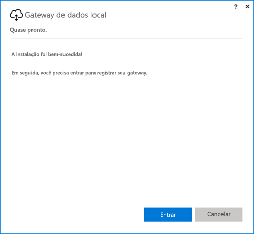
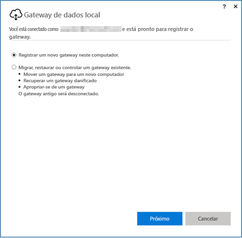

## Instalar o Gateway de dados local
O gateway de dados é instalado e executado em seu computador. É aconselhável instalar o gateway em um computador que pode ser deixado em execução o tempo todo.

> [!NOTE]
> Há suporte para o gateway apenas em sistemas operacionais Windows de 64 bits.
> 
> 

Para o Power BI, a primeira opção que você precisa fazer é o modo do gateway.

* **Gateway de dados local:** vários usuários podem compartilhar e reutilizar um gateway nesse modo. Este gateway pode ser usado pelo Power BI, PowerApps, Flow ou pelos Aplicativos Lógicos. Para o Power BI, isso inclui suporte para atualização de agendamento e o DirectQuery
* **Pessoal:** destina-se apenas ao Power BI e pode ser usado como um indivíduo sem nenhuma configuração do administrador. Isso pode ser usado apenas para a atualização sob demanda e a atualização de agendamento. Essa seleção inicia a instalação do gateway pessoal.

Há alguns detalhes a serem observados na instalação dos modos do gateway:

* ambos os gateways exigem sistemas operacionais Windows de 64 bits
* gateways não podem ser instalados em um controlador de domínio
* instale até dois Gateways de dados locais no mesmo computador, cada um executando um dos modos (pessoal e padrão). 
* você não pode ter mais de um gateway em execução no mesmo modo no mesmo computador.
* instale vários Gateways de dados locais em computadores diferentes e gerencie-os usando a mesma interface de gerenciamento de gateway do Power BI (exceto o modo pessoal, consulte o marcador a seguir)
* Você só pode ter um gateway de modo Pessoal em execução para cada usuário do Power BI. Se você instalar outro gateway de modo Pessoal para o mesmo usuário, mesmo que em um computador diferente, a instalação mais recente substituirá a instalação anterior existente.

Estes são alguns pontos a serem considerados antes da instalação do gateway.

* Se você estiver realizando a instalação em um laptop e o laptop estiver desligado, não conectado à Internet ou suspenso, o gateway não funcionará e os dados no serviço de nuvem não serão sincronizados com os dados locais.
* Se seu computador estiver conectado a uma rede sem fio, o gateway poderá ter um desempenho mais lento que fará com que leve mais tempo para sincronizar os dados no serviço de nuvem com os dados locais.

Depois de instalar o gateway, você precisará entrar com sua conta corporativa ou de estudante.

Depois de entrar, você terá a opção para configurar um novo gateway, ou de migrar, restaurar ou assumir um gateway existente.

## Configurar um novo gateway
1. Insira um **nome** para o gateway
2. Insira uma **chave de recuperação**. Isso deve ter um mínimo de 8 caracteres.
3. Selecione **Configurar**.

> [!NOTE]
> A chave de recuperação será necessária se você precisar migrar, restaurar ou assumir um gateway. Lembre-se de manter essa chave em um local seguro.
> 
> 

### Migrar, restaurar ou assumir um gateway existente
Você precisará selecionar o gateway que deseja recuperar e fornecer a chave de recuperação que foi usada para primeiro criar o gateway.

### Gateway de dados local conectado
Depois de configurar o gateway, você poderá utilizá-lo para se conectar a fontes de dados locais.

Se o gateway for destinado ao Power BI, você precisará adicionar suas fontes de dados ao gateway no serviço do Power BI. Isso é feito dentro da área de **Gerenciar gateways**. Você pode consultar os artigos sobre gerenciar fontes de dados para obter mais informações.

Para o PowerApps, você precisará selecionar um gateway para uma conexão definida de fontes de dados com suporte. Para o Flow e os Aplicativos Lógicos, esse gateway está pronto para ser usado com as conexões locais.

