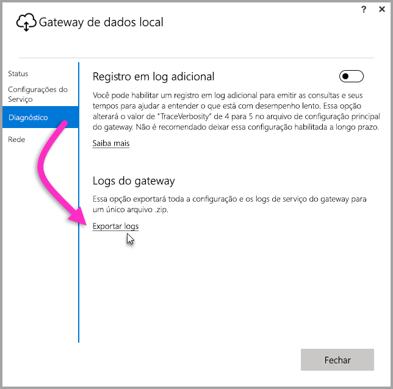
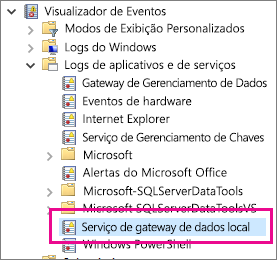

## Ferramentas para solução de problemas
<a name="logs" />

### Coletando logs do configurador do gateway
Existem vários logs que você pode coletar para o gateway e você sempre deve começar com os logs. A maneira mais simples de coletar logs depois de instalar o gateway é por meio da interface do usuário. Na interface do usuário **Gateway de dados local**, selecione **Diagnóstico** e, em seguida, selecione o link **Exportar logs** próximo à parte inferior da página, conforme mostrado na imagem a seguir.

**Logs do instalador**

    %localappdata%\Temp\On-premises_data_gateway_*.log

**Logs de configuração**

    %localappdata%\Microsoft\On-premises Data Gateway\GatewayConfigurator*.log

**Logs de serviço do gateway de dados local**

    C:\Users\PBIEgwService\AppData\Local\Microsoft\On-premises Data Gateway\Gateway*.log

### Logs de eventos
Os logs de eventos do **serviço do gateway de dados local** estão presentes nos **Logs de Aplicativos e Serviços**.

<a name="fiddler" />

### Rastreamento do Fiddler
[Fiddler](http://www.telerik.com/fiddler) é uma ferramenta gratuita da Telerik que monitora o tráfego HTTP.  Você pode ver a parte de trás e frente com o serviço do Power BI do computador cliente. Isso pode mostrar erros e outras informações relacionadas.

