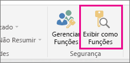

## Validando a função no Power BI Desktop
Depois de criar sua função, você poderá testar os resultados da função no Power BI Desktop. Para fazer isso, selecione **Exibir Como Funções**.

A caixa de diálogo **Exibir como funções** permite alterar a exibição do que você está vendo para esse usuário ou função específica. Você verá as funções criadas.

Selecione a função criada e **OK** para aplicar essa função ao que está sendo exibido. Os relatórios somente renderizarão os dados relevantes a essa função.

Você também pode selecionar Outro usuário e fornecer um usuário específico. É melhor fornecer o nome UPN, pois esse é o que será usado pelo serviço do Power BI. Selecione **OK** e os relatórios serão renderizados com base no que esse usuário pode ver. 

> [!NOTE]
> No Power BI Desktop, isso exibirá apenas resultados diferentes se você estiver usando a segurança dinâmica com base nas expressões DAX.
> 
> 

