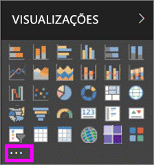
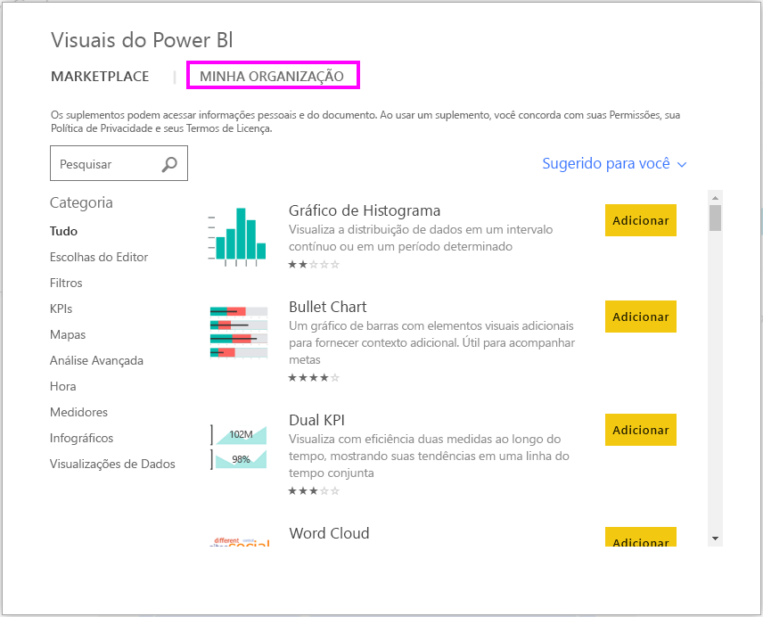
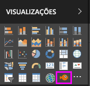
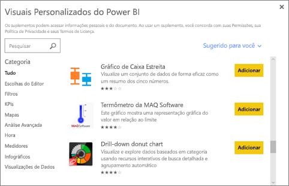
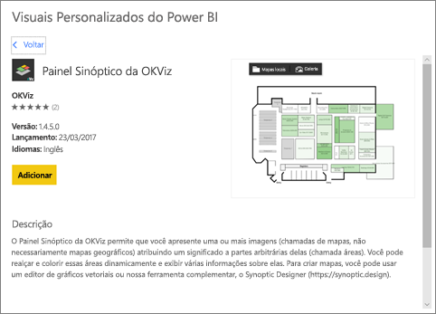
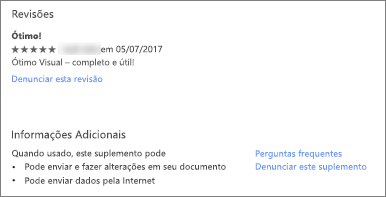
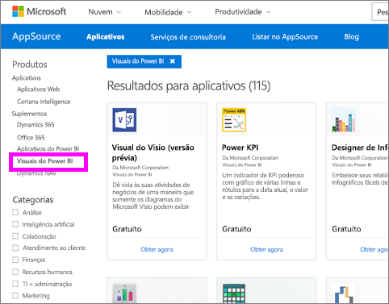
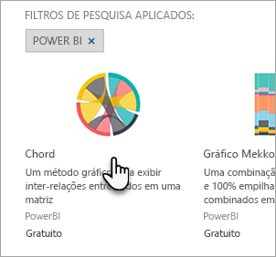
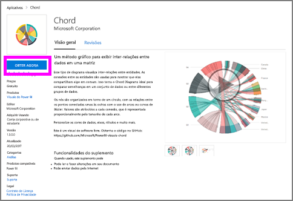
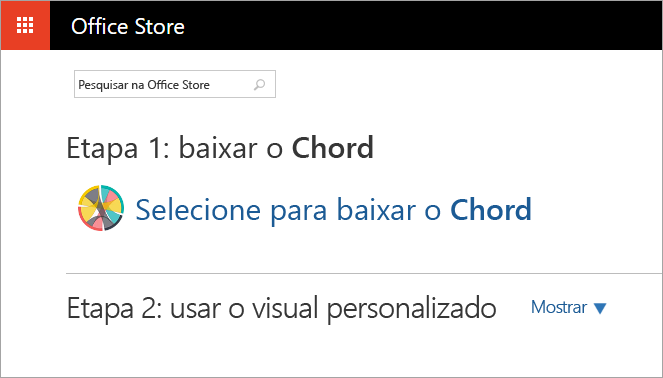

# Visuais personalizados no Power BI
Ao criar ou editar um relatório do Power BI, há muitos tipos diferentes de visuais disponíveis para uso. Esses visuais são exibidos no painel **Visualizações**. Quando você baixar o Power BI Desktop ou abrir o serviço do Power BI (app.powerbi.com), esse conjunto de visuais é "predefinido".

Mas você não está limitado a esse conjunto de visuais, selecionar reticências abre outra origem de visuais do relatório: *visuais personalizados*.

Os elementos visuais personalizados são criados por desenvolvedores usando os SDK personalizados a fim de permitir que os usuários vejam os dados de maneira que melhor se adapte ao seu negócio. Os autores do relatório podem, em seguida, importar os arquivos visuais personalizados para seus relatórios e usá-los como quaisquer outros elementos visuais do Power BI. Os elementos visuais personalizados são cidadãos de 1º de classe no Power BI e podem ser filtrados, realçados, editados, compartilhados etc.

Os elementos visuais personalizados podem estar na forma de 3 canais de implantação:
* Arquivos de elementos visuais personalizados
* Elementos visuais da organização
* Elementos visuais do Marketplace

## Arquivos de elementos visuais personalizados

Os elementos visuais personalizados são pacotes que incluem o código para renderizar os dados que são fornecidos a eles. Qualquer pessoa pode criar um visual personalizado e empacotá-lo como um arquivo .pbiviz único, que pode ser importado em um relatório do Power BI.

> [!WARNING]
> Um visual personalizado pode conter código com riscos de segurança ou privacidade; verifique se você confia no autor e a fonte do visual personalizado antes de importá-lo em seu relatório.
> 
> 

## Elementos visuais da organização

Os administradores do Power BI podem implantar visuais personalizados em sua organização, para que os autores do relatório possam descobrir e usar com facilidade os elementos visuais personalizados que o administrador aprovou para usar dentro da organização. Isso dá ao administrador o controle para escolher os elementos visuais personalizados específicos para implantar na organização, bem como uma maneira fácil de gerenciar (ou seja, atualizar versão, ativar/desativar) os elementos visuais. Para o autor do relatório, é uma maneira fácil de descobrir elementos visuais que são exclusivos para a organização, bem como um suporte contínuo para atualizar esses elementos.

Para obter mais informações sobre os elementos visuais personalizados da organização, [Leia mais sobre os elementos visuais organizacionais](power-bi-custom-visuals-organization.md).

## Elementos visuais do Marketplace

Os membros da comunidade, bem como a Microsoft, contribuíram com seus elementos visuais personalizados para o benefício do público e os publicaram no marketplace [AppSource](https://appsource.microsoft.com/en-us/marketplace/apps?product=power-bi-visuals). Esses visuais podem ser baixados e adicionados aos relatórios do Power BI. Todos esses elementos visuais personalizados foram testados e aprovados pela Microsoft em relação à funcionalidade e à qualidade.

O que é o AppSource? De forma simples, é o lugar para encontrar aplicativos, suplementos e extensões para o seu software da Microsoft. A [AppSource](https://appsource.microsoft.com/en-us/) conecta milhões de usuários de produtos como o Office 365, Azure, Dynamics 365, Cortana e Power BI com soluções que os ajudam a realizar seu trabalho com mais eficiência, perspicácia ou harmonia do que antes.

### Elementos visuais certificados

Os visuais certificados para o Power BI são elementos visuais que passaram por rigorosos testes de qualidade adicionais e têm suporte em cenários adicionais, como [assinaturas de email](https://docs.microsoft.com/power-bi/service-report-subscribe) e para serem [exportados para o PowerPoint](https://docs.microsoft.com/power-bi/service-publish-to-powerpoint).
Para ver a lista de visuais personalizados certificados ou para enviar seus próprios, consulte [Certified custom visuals (Visuais personalizados certificados)](https://docs.microsoft.com/power-bi/power-bi-custom-visuals-certified).

Você é um desenvolvedor da Web e está interessado em criar suas próprias visualizações e adicioná-las ao AppSource? Consulte [Introdução às Ferramentas para Desenvolvedores](https://docs.microsoft.com/power-bi/service-custom-visuals-getting-started-with-developer-tools) e saiba como [publicar visuais personalizados na AppSource](https://appsource.microsoft.com/en-us/marketplace/apps?product=power-bi-visuals).

### Importar um visual personalizado de um arquivo

1. Selecione as reticências na parte inferior do painel de Visualizações.

    

2. No menu suspenso, selecione **Importar do arquivo**.

    

3. No menu Abrir arquivo, selecione o arquivo .pbiviz que você deseja importar e, em seguida, selecione Abrir. O ícone do visual personalizado é adicionado à parte inferior do painel de Visualizações e agora está disponível para uso em seu relatório.

    

### Importar elementos visuais da organização

1. Selecione as reticências na parte inferior do painel de Visualizações.

    

2. No menu suspenso, selecione Importar do marketplace.

    

3. Selecione **MINHA ORGANIZAÇÃO** no menu da guia superior.

    

4. Role a lista para localizar o visual para importar.
    
    

5. Importe o visual personalizado selecionando **Adicionar**. O ícone do visual personalizado é adicionado à parte inferior do painel de Visualizações e agora está disponível para uso em seu relatório.

    
 
## Baixar ou importar visuais personalizados do Microsoft AppSource
Você tem duas opções para baixar e importar os visuais personalizados; de dentro do Power BI e do site do AppSource.

### Importar visuais personalizados do Power BI

1. Selecione as reticências na parte inferior do painel de Visualizações.

    

2. No menu suspenso, selecione **Importar do marketplace**.

    

3. Role a lista para localizar o visual para importar.

    

4. Para saber mais sobre um dos visuais, realce e selecione-o.

    

5. Na página de detalhes, você pode exibir capturas de tela, vídeos, descrições detalhadas e muito mais.

    

6. Role para baixo para ver as análises.

    

7. Importe o visual personalizado selecionando Adicionar. O ícone do visual personalizado é adicionado à parte inferior do painel de Visualizações e agora está disponível para uso em seu relatório.

    

### Baixar e importar visuais personalizados do Microsoft AppSource

1. Inicie em [Microsoft AppSource](https://appsource.microsoft.com) e selecione a guia para **Aplicativos**. 

    

2. Isso leva você para a [página de resultados de Aplicativos](https://appsource.microsoft.com/en-us/marketplace/apps) na qual você pode exibir os principais aplicativos em cada categoria, incluindo *Aplicativos do Power BI*. Mas estamos procurando visuais personalizados, portanto, vamos restringir os resultados selecionando **visuais do Power BI** na lista de navegação à esquerda.

    

3. O AppSource exibe um bloco para cada visual personalizado.  Cada bloco tem um instantâneo do visual personalizado e fornece uma breve descrição e um link de download. Para ver mais detalhes, selecione o bloco. 

    

4. Na página de detalhes, você pode exibir capturas de tela, vídeos, descrições detalhadas e muito mais. Baixe o visual personalizado selecionando **Obtê-lo agora** e, em seguida, concordando com os Termos de uso. 

    

5. Selecione o link para baixar o visual personalizado.

    

    A página de download também inclui instruções sobre como importar o visual personalizado para o Power BI Desktop e para o serviço do Power BI.

    Você também pode baixar um relatório de exemplo que inclua o visual personalizado e apresente suas funcionalidades.

    

6. Salve o arquivo. pbiviz e, em seguida, abra o Power BI.

7. Importe o arquivo .pbiviz em seu relatório (confira a seção [Importar um visual personalizado de um arquivo](#import-a-custom-visuals-from-a-file) acima)

## Considerações e solução de problemas

- Um visual personalizado é adicionado a um relatório específico quando importado. Se você desejar usar o visual em outro relatório, você precisará importá-lo nesse relatório também. Quando um relatório com um visual personalizado é salvo com a opção **Salvar como** , uma cópia do visual personalizado será salva com o novo relatório.

- Se você não ver um painel **Visualizações**, isso significará que não é necessário editar permissões para o relatório.  Você só pode adicionar visuais personalizados para relatórios que você pode editar, não para relatórios que foram compartilhados com você.

Mais perguntas? [Experimente a Comunidade do Power BI](http://community.powerbi.com/)
