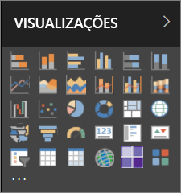
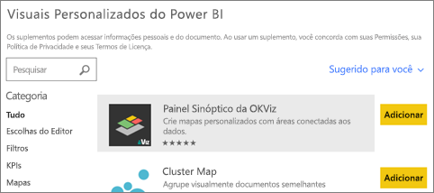
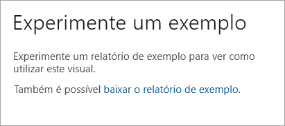
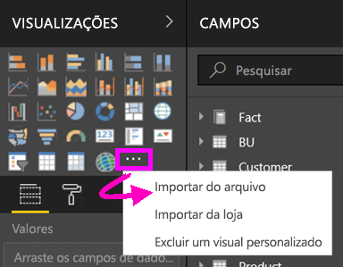

# Visuais personalizados no Power BI
Ao criar ou editar um relatório do Power BI, há muitos tipos diferentes de visuais disponíveis para uso. Esses visuais são exibidos no painel **Visualizações**. Quando você baixar o Power BI Desktop ou abrir o serviço do Power BI (app.powerbi.com), esse conjunto de visuais é "predefinido". 

Mas você não está limitado a esse conjunto de visuais, selecionar reticências abre outra origem de visuais do relatório: *visuais personalizados*.

Visuais personalizados são criados por membros da comunidade e pela Microsoft e são hospedados no [AppSource](https://appsource.microsoft.com/marketplace/apps?product=power-bi-visuals). Esses visuais podem ser baixados e adicionados aos relatórios do Power BI. Todos esses visuais personalizados foram aprovados pela Microsoft e se comportam de maneira semelhante às visualizações pré-empacotadas incluídas no Power BI: eles podem ser filtrados, realçados, editados, compartilhados, etc. 

O que é o AppSource? De forma simples, é o lugar para encontrar aplicativos, suplementos e extensões para o seu software da Microsoft. A [AppSource](https://appsource.microsoft.com) conecta milhões de usuários de produtos como o Office 365, Azure, Dynamics 365, Cortana e Power BI com soluções que os ajudam a realizar seu trabalho com mais eficiência, perspicácia ou harmonia do que antes.

## Dois tipos de visuais personalizados

Os visuais personalizados do Power BI disponíveis do AppSource se enquadram em 2 categorias: **aprovados** e **certificados**. Os visuais *Aprovados pelo AppSource* podem ser executados em navegadores, relatórios e dashboards.  Os visuais *certificados para o Power BI* passaram por testes rigorosos e têm suporte em cenários adicionais, como [assinaturas de email](service-report-subscribe.md) e para serem [exportados para o PowerPoint](service-publish-to-powerpoint.md).

Para ver a lista de visuais personalizados certificados ou para enviar seus próprios, consulte [Certified custom visuals (Visuais personalizados certificados)](power-bi-custom-visuals-certified.md).

Você é um desenvolvedor da Web e está interessado em criar suas próprias visualizações e adicioná-las ao AppSource?  Consulte [Introdução às Ferramentas para Desenvolvedores](service-custom-visuals-getting-started-with-developer-tools.md) e saiba como [publicar visuais personalizados na AppSource](https://appsource.microsoft.com/marketplace/apps?product=power-bi-visuals).

## Baixar ou importar visuais personalizados do Microsoft AppSource
Você tem duas opções para baixar e importar os visuais personalizados; de dentro do Power BI e do site do AppSource. 

###    Importar visuais personalizados do Power BI
1. Selecione as reticências na parte inferior do painel de Visualizações. 

    

2. No menu suspenso, selecione **Importar do repositório**.

    

3. Role a lista para localizar o visual para importar. 

    

4.  Para saber mais sobre um dos visuais, realce e selecione-o.

    

5.  Na página de detalhes, você pode exibir capturas de tela, vídeos, descrições detalhadas e muito mais. 

    

6. Role para baixo para ver as análises.

    

7.    Importe o visual personalizado selecionando **Adicionar**. O ícone do visual personalizado é adicionado à parte inferior do painel de Visualizações e agora está disponível para uso em seu relatório.

       

###    Baixar e importar visuais personalizados do Microsoft AppSource

1. Inicie em [Microsoft AppSource](https://appsource.microsoft.com) e selecione a guia para **Aplicativos**. 

    

2. Isso leva você para a [página de resultados de Aplicativos](https://appsource.microsoft.com/en-us/marketplace/apps) na qual você pode exibir os principais aplicativos em cada categoria, incluindo *Aplicativos do Power BI*. Mas estamos procurando visuais personalizados, portanto, vamos restringir os resultados selecionando **visuais do Power BI** na lista de navegação à esquerda.

    

3. O AppSource exibe um bloco para cada visual personalizado.  Cada bloco tem um instantâneo do visual personalizado e fornece uma breve descrição e um link de download. Para ver mais detalhes, selecione o bloco. 

    

4. Na página de detalhes, você pode exibir capturas de tela, vídeos, descrições detalhadas e muito mais. Baixe o visual personalizado selecionando **Obtê-lo agora** e, em seguida, concordando com os Termos de uso. 

    

5. Selecione o link para baixar o visual personalizado.

    

    A página de download também inclui instruções sobre como importar o visual personalizado para o Power BI Desktop e para o serviço do Power BI.

    Você também pode baixar um relatório de exemplo que inclua o visual personalizado e apresente suas funcionalidades.

    

6. Salve o arquivo. pbiviz e, em seguida, abra o Power BI.    
7. Abra o relatório em que você deseja adicionar visual personalizado e, na parte inferior do painel **Visualizações**, selecione reticências > **Importar do arquivo**.  

      

8. Selecione o arquivo de visual personalizado para adicionar o ícone de visual personalizado na parte inferior do seu painel **Visualizações**. O visual personalizado agora está disponível para uso em seu relatório.

    
    
##    Considerações e solução de problemas

- Um visual personalizado é adicionado a um relatório específico quando importado. Se você desejar usar o visual em outro relatório, você precisará importá-lo nesse relatório também. Quando um relatório com um visual personalizado é salvo com a opção **Salvar como** , uma cópia do visual personalizado será salva com o novo relatório.

- Se você não ver um painel **Visualizações**, isso significará que não é necessário editar permissões para o relatório.  Você só pode adicionar visuais personalizados para relatórios que você pode editar, não para relatórios que foram compartilhados com você.

Mais perguntas? [Experimente a Comunidade do Power BI](http://community.powerbi.com/)

