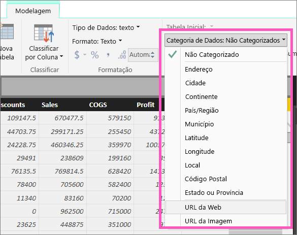
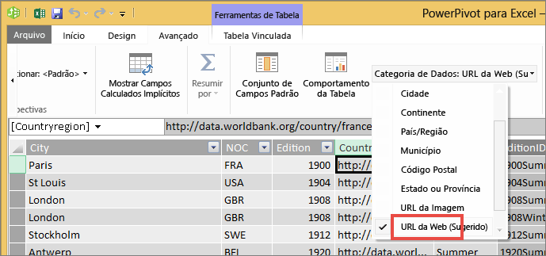

# Hiperlinks nas tabelas
Este tópico ensina como usar o Power BI Desktop para criar hiperlinks. Em seguida, depois de criados, use o serviço Power BI ou Power BI Desktop para adicioná-los às suas tabelas e matrizes de relatório. 

> **OBSERVAÇÃO**: hiperlinks em [blocos nos painéis](service-dashboard-edit-tile.md) e [caixas de texto nos painéis](service-dashboard-add-widget.md) podem ser criados facilmente usando o serviço do Power BI. Hiperlinks em [caixas de texto nos relatórios](service-add-hyperlink-to-text-box.md) podem ser criados facilmente usando o serviço do Power BI e o Power BI Desktop.
> 
> 

## Para criar um hiperlink em uma tabela ou matriz usando o Power BI Desktop
É possível criar hiperlinks em tabelas e matrizes no Power BI Desktop, mas não no Serviço do Power BI. Também é possível criar hiperlinks no Excel Power Pivot antes que a pasta de trabalho seja importada para o Power BI. Ambos os métodos são descritos abaixo.

## Criar um hiperlink de tabela ou matriz no Power BI Desktop
O procedimento para adicionar um hiperlink depende se você importou os dados ou os conectou usando DirectQuery. Ambos os cenários são descritos abaixo.

### Para dados importados para o Power BI
1. Se o hiperlink ainda não existir como uma coluna no conjunto de dados, use o Desktop para adicioná-la como uma [coluna personalizada](desktop-common-query-tasks.md).
2. Na exibição Dados, selecione a coluna e, na guia **Modelagem**, escolha **Categoria de Dados** no menu suspenso.
   
    
3. Selecione **URL da Web**.
4. Mude para o modo de exibição de relatório e crie uma tabela ou matriz usando o campo categorizado como uma URL da Web. Os hiperlinks estarão em azul e sublinhados.
   
    
5. Se não quiser exibir uma URL longa em uma tabela, você poderá exibir um ícone de hiperlink  em vez disso. Observe que você não consegue exibir ícones em matrizes.
   
   * Selecione o gráfico para torná-lo ativo.
   * Selecione o ícone de rolo de pintura  para abrir a guia Formatação.
   * Expanda **Valores**, localize o **ícone de URL** e altere-o para **Ativado.**
6. (Opcional) [Publique o relatório do Power BI Desktop no serviço do Power BI](guided-learning/publishingandsharing.yml?tutorial-step=2) e abra o relatório no serviço do Power BI. Os hiperlinks funcionarão lá também.

### Para dados conectados com DirectQuery
Você não poderá criar uma nova coluna no modo DirectQuery.  No entanto, se seus dados já contêm URLs, você pode transformá-los em hiperlinks.

1. Na exibição Relatório, crie uma tabela usando um campo que contém as URLs.
2. Selecione a coluna e, na guia **Modelagem**, escolha **Categoria de Dados**no menu suspenso.
3. Selecione **URL da Web**. Os hiperlinks estarão em azul e sublinhados.
4. (Opcional) [Publique o relatório do Power BI Desktop no serviço do Power BI](guided-learning/publishingandsharing.yml?tutorial-step=2) e abra o relatório no serviço do Power BI. Os hiperlinks funcionarão lá também.

## Criar um hiperlink de tabela ou matriz no Excel Power Pivot
Outra maneira de adicionar hiperlinks às tabelas e matrizes do Power BI é criar hiperlinks no conjunto de dados antes de importar/conectar-se ao conjunto de dados no Power BI. Este exemplo usa uma pasta de trabalho do Excel.

1. Abra sua pasta de trabalho no Excel.
2. Selecione a guia **PowerPivot** e, em seguida, escolha **Gerenciar**.
   
   
3. Quando o PowerPivot for aberto, selecione a guia **Avançado**.
   
   
4. Coloque o cursor na coluna que contém as URLs que você deseja transformar em hiperlinks nas tabelas do Power BI.
   
   > **OBSERVAÇÃO**: as URLS devem começar com **http://, https://** ou **www**.
   > 
   > 
5. No grupo **Propriedades de relatório** , selecione na lista suspensa **Categoria de dados** e escolha **URL do Web**. 
   
   
6. No serviço do Power BI ou no Power BI Desktop, conecte-se ou importe essa pasta de trabalho.
7. Crie uma visualização de tabela que contém o campo de URL.
   
   

## Considerações e solução de problemas
P: Posso usar uma URL personalizada como um hiperlink em uma tabela ou matriz?    
R: Não. Você pode usar um ícone de link. Se precisar de texto personalizado para os hiperlinks e a lista de URLs for pequena, use uma caixa de texto.

## Próximas etapas
[Visualizações em relatórios do Power BI](power-bi-report-visualizations.md)

[Power BI – conceitos básicos](service-basic-concepts.md)

Mais perguntas? [Experimente a Comunidade do Power BI](http://community.powerbi.com/)

