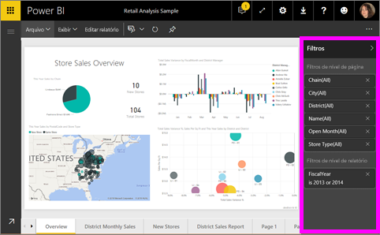
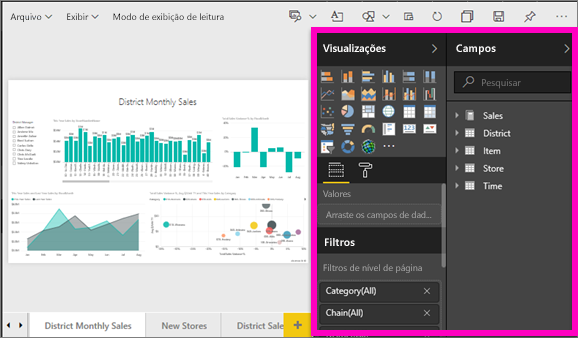
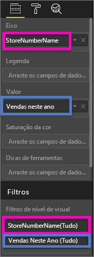
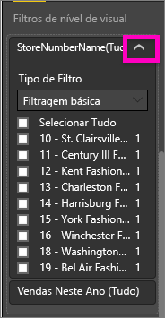
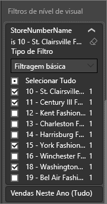
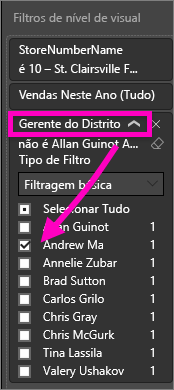
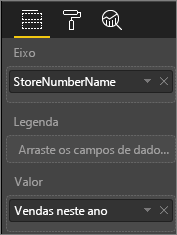
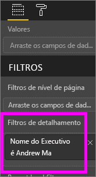
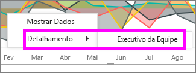

# Adicionar um filtro a um relatório do serviço do Power BI (na exibição Edição)
> [!TIP]
> Recomendamos que você leia primeiro [Sobre filtros e realces nos relatórios do Power BI](power-bi-reports-filters-and-highlighting.md).

Estes exemplos neste artigo mostram o serviço do Power BI. No entanto, as etapas são quase idênticas no Power BI Desktop.
> 
> 

## Qual é a diferença entre os filtros de relatório no Modo de exibição de edição e no	Modo de exibição de leitura
Há dois modos de exibir relatórios e interagir com eles: [Exibição de Leitura](consumer/end-user-reading-view.md) e [Exibição de Edição](service-interact-with-a-report-in-editing-view.md).  E os recursos de filtragem disponíveis para você dependem do modo no qual você está.

* No Modo de exibição de edição é possível adicionar relatório, página e filtros visuais. Ao salvar o relatório, os filtros são salvos com ele. Pessoas olhando para o relatório no Modo de Exibição de Leitura podem interagir com os filtros que você adicionou.
* Na Modo de Exibição de Leitura, é possível interagir qualquer relatório, detalhamento, página e filtros visuais que já existem no relatório, mas você não pode adicionar novos filtros. No entanto, as alterações feitas no painel Filtros serão salvas com o relatório – mesmo se você exibir o relatório em um aplicativo móvel e sair do relatório e retornar depois.  

> [!NOTE]
> Este artigo descreve como criar filtros no **Modo de Exibição de Edição** de relatório.  Para obter mais informações sobre filtros, consulte [Interagindo com filtros em Modo de Exibição de Leitura de relatórios](consumer/end-user-reading-view.md).

## Filtros disponíveis no painel *Filtros* do Power BI
Independentemente de você estar usando o Power BI Desktop ou o serviço do Power BI, o painel Filtros é exibido no lado direito da tela do relatório. Caso não veja o painel Filtros, selecione o ícone ">" no canto superior direito para expandi-lo.

Há quatro tipos de filtros.

- Um **filtro de página** se aplica a todos os visuais da página do relatório     
- Um **filtro de visual** se aplica a um único visual da página do relatório    
- Um **filtro de detalhamento** se aplica a uma única entidade em um relatório    
- Um **filtro de relatório** se aplica a todas as páginas no relatório    

    

Como os filtros *persistem*, quando você sai do relatório, o Power BI retém o filtro, a divisão e outras alteração de exibição de dados que você realizou. Portanto, você poderá continuar onde parou quando retornar ao relatório. Se você não quiser que as alterações do filtro persistam, selecione **Redefinir para padrão** na barra de menus superior.

## Adicionar um filtro a uma visualização específica (também conhecido como filtro visual)
Há duas maneiras para fazer isso: 

* filtrando um campo que já esteja sendo usado pela visualização
* identificando um campo que ainda não esteja sendo usado pela visualização e adicionando esse campo diretamente ao bucket **Filtros de nível visual**.

### Filtrando os campos que já estão na visualização
1. Abra um [relatório no modo de Exibição de Edição](consumer/end-user-reading-view.md).
   
   
2. Abra o painel de visualizações e filtros e o painel Campos (se ainda não estiverem abertos).
   
   
3. Selecione um visual para ativá-lo. Todos os campos que estão sendo usados pelo visual são identificados no painel **Campos** e também listados no painel **Filtros**, sob o cabeçalho **Filtros de nível visual**.
   
   
4. Agora vamos adicionar um filtro a um campo que já está sendo usado pela visualização. 
   
   * Role para baixo até a área de **Filtros de nível visual** e selecione a seta para expandir o campo que você deseja filtrar. Neste exemplo, vamos filtrar **StoreNumberName**
     
       
   * Defina os controles de filtro **Básico**, **Avançado** ou **N superior** (consulte [Como usar filtros de relatório](consumer/end-user-report-filter.md)). Neste exemplo, selecionaremos a filtragem Básica e colocaremos marcas de seleção ao lado dos números 10, 11, 15 e 18.
     
       
   * O visual é alterado para refletir o novo filtro. Se você salvar o relatório com o filtro, os leitores do relatório poderão interagir com o filtro no modo de exibição de leitura, marcando ou desmarcando valores.
     
      
5. Agora vamos adicionar um campo totalmente novo, como um Filtro de nível visual, à nossa visualização.
   
   * No painel de Campos, selecione o campo que você deseja adicionar como um novo filtro de nível visual e arraste-o para a **área de Filtros de nível visual**.  Neste exemplo arrastaremos **Gerente regional** para o bucket **Filtros de nível visual** e selecionaremos apenas Andrew Ma. 
     
      
   * Observe que o **Gerente regional** *não* é adicionado à visualização em si. A visualização ainda é composta por **StoreNumberName** como o eixo e **Vendas Deste Ano** como o valor.  
     
      
   * Assim, a própria visualização agora é filtrada para mostrar apenas as vendas de Andrew neste ano para as lojas especificadas.
     
     

## Adicionar um filtro a uma página inteira (também conhecido como filtro de modo de exibição de página)
1. Abra um [relatório no modo de Exibição de Edição](consumer/end-user-reading-view.md).
2. Abra o painel de visualizações e filtros e o painel Campos (se ainda não estiverem abertos).
3. No painel Campos, selecione o campo que você deseja adicionar como um novo filtro de nível de página e arraste-o para a área **Filtros de nível de página**.  
4. Selecione os valores que você deseja filtrar e defina os controles de filtragem **Básico** ou **Avançado** (veja [Como usar filtros de relatório](consumer/end-user-report-filter.md)).
   
   Todas as visualizações na página, afetadas por esse filtro, serão redesenhadas para refletir a alteração. 
   
   

Se você salvar o relatório com o filtro, os leitores do relatório poderão interagir com o filtro no modo de exibição de leitura, marcando ou desmarcando valores.

## Adicionar um filtro de detalhamento
Com o detalhamento no serviço do Power BI Desktop e do Power BI Desktop, você pode criar uma página de relatório de *destino* que tem como foco uma entidade específica, como um fornecedor, cliente ou fabricante. Agora, de outras páginas de relatório, os usuários podem clicar com o botão direito do mouse em um ponto de dados da entidade em questão e executar uma consulta drill-through na página focalizada.

### Criar um filtro de detalhamento
Para acompanhar, abra o exemplo Rentabilidade do Cliente no Modo de Edição de Exibição. Vamos supor que você deseja uma página concentrada em áreas de negócios executivos.   

1. Adicione uma nova página ao relatório e chame-a de **Equipe Executiva**. Essa será a página de *destino* do detalhamento.
2. Adicione visualizações que acompanham as principais métricas das áreas de negócios executivos da equipe.    
3. Adicione também **Executivo > Nome do Executivo** aos filtros de detalhamento.    
   
    
   
    Observe que o Power BI adiciona uma seta para voltar à página do relatório.  Selecionar essa seta faz com que os usuários retornem à página do relatório de *origem*: a página que eles estavam quando aceitaram o detalhamento. A seta para voltar só funciona no Modo de Exibição de Leitura.
   
     

### Usar o filtro de detalhamento
Vejamos como funciona o filtro de detalhamento.

1. Inicie a página do relatório **Scorecard da Equipe**.    
2. Vamos supor que você é Andrew Ma e deseja ver a página do relatório Equipe Executiva filtrada somente com os seus dados.  No gráfico da área superior esquerda, clique com o botão direito do mouse em qualquer ponto de dados verde para abrir a opção de menu Detalhamento.
   
    
3. Selecione **Detalhamento > Equipe Executiva** executar uma consulta drill-through na página de relatório chamada **Equipe Executiva**. A página é filtrada para mostrar informações do ponto de dados no qual você clicou com o botão direito do mouse, nesse caso, Andrew Ma. Apenas o campo que está nos filtros de Detalhamento é passados para a página de relatório de detalhamento.  
   
    

## Adicione um filtro a um relatório inteiro (também conhecido como filtro de relatório)
1. Abra um [relatório no modo de Exibição de Edição](consumer/end-user-reading-view.md).
2. Abra o painel de visualizações e filtros e o painel Campos (se ainda não estiverem abertos).
3. No painel Campos, selecione o campo que você deseja adicionar como um novo filtro de nível de relatório e arraste-o para a área de **Filtros de nível de relatório**.  
4. Selecione os valores que você deseja filtrar (consulte [Como usar filtros de relatório](consumer/end-user-report-filter.md).

    Os visuais na página ativa e em todas as páginas do relatório são alterados para refletir o novo filtro. Se você salvar o relatório com o filtro, os leitores do relatório poderão interagir com o filtro no modo de exibição de leitura, marcando ou desmarcando valores.

1. Selecione a seta para voltar para retornar à página do relatório anterior.

## Considerações e solução de problemas

- Existem situações em que o filtro de nível de visual e o filtro de nível de página podem retornar resultados diferentes.  Por exemplo, quando você adiciona um filtro de nível de visual, o Power BI filtra nos resultados agregados.  A agregação padrão é Soma, mas você pode [alterar o tipo de agregação](service-aggregates.md).  

    Quando você adiciona um filtro de nível de página, o Power BI filtra sem agregação.  Ele faz isso, pois uma página pode ter vários visuais, que, individualmente, podem utilizar diferentes tipos de agregação.  Portanto, o filtro é aplicado em cada linha de dados.

- Se você não vir o painel Campos, verifique se você está no [Modo de Exibição de Edição](service-interact-with-a-report-in-editing-view.md) do relatório    
- Se você tiver feito muitas alterações nos filtros e quiser retornar para as configurações padrão do autor do relatório, selecione **Redefinir para padrão** na barra de menus superior.

## Próximas etapas
 [Como usar filtros de relatório](consumer/end-user-report-filter.md)

  [Filtros e realce em relatórios](power-bi-reports-filters-and-highlighting.md)

[Interação com os filtros e realce no relatório de exibição de leitura](consumer/end-user-reading-view.md)

[Alterar como elementos visuais de relatórios executam filtro cruzado e realce cruzado entre si](consumer/end-user-interactions.md)

Mais perguntas? [Experimente a Comunidade do Power BI](http://community.powerbi.com/)

