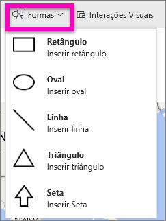
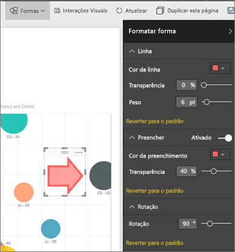

# Conteúdo estático nos relatórios do Power BI
No Modo de Exibição de Edição, adicione caixas de texto e formas a um relatório no serviço do Power BI. 

> **OBSERVAÇÃO**: no Power BI Desktop, também é possível [adicionar imagens estáticas ao relatório](guided-learning/visualizations.yml#step-11) conforme mostrado neste vídeo.
> 
> <iframe width="560" height="315" src="https://www.youtube.com/embed/_3q6VEBhGew" frameborder="0" allowfullscreen></iframe>
> 
> 

## Adicionar uma caixa de texto a um relatório
1. Coloque o cursor em qualquer lugar na tela de relatório e selecione **Caixa de Texto**.
   
   
2. Digite o texto na caixa de texto e, opcionalmente, formate a fonte, cor e alinhamento do texto. 
   
   
3. Para posicionar a caixa de texto, selecione a área cinza na parte superior e arraste. E para redimensionar a caixa de texto, selecione e arraste qualquer uma das alças da estrutura de tópicos. 
   
   
4. Para fechar a caixa de texto, selecione qualquer espaço em branco na tela de relatório.
5. Selecione o ícone de pino  para fixar a caixa de texto em um dashboard. 

## Adicionar uma forma a um relatório
1. Posicione seu cursor em qualquer lugar na tela do relatório e selecione **Formas**.
   
   
2. No menu suspenso, selecione uma forma para adicioná-la à tela do seu relatório. Vamos adicionar uma seta para direcionar a atenção para a bolha com a maior variação total de vendas. 
   
   No painel **Formatar forma**, personalize sua forma. Neste exemplo, criamos uma seta vermelha com uma borda vermelho escuro, girada em 90 graus.
   
   
3. Para posicionar a forma, selecione a área cinza na parte superior e arraste. E para redimensionar a forma, selecione e arraste qualquer uma das alças da estrutura de tópicos. 

> **OBSERVAÇÃO**: as formas não podem ser fixadas em um dashboard. 
> 
> 

### Próximas etapas
[Adicionar um hiperlink a uma caixa de texto](service-add-hyperlink-to-text-box.md)

[Relatórios no Power BI](service-reports.md)

[Visualizações em relatórios do Power BI](power-bi-report-visualizations.md)

[Power BI – conceitos básicos](service-basic-concepts.md)

Mais perguntas? [Experimente a Comunidade do Power BI](http://community.powerbi.com/)

