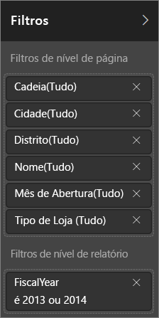
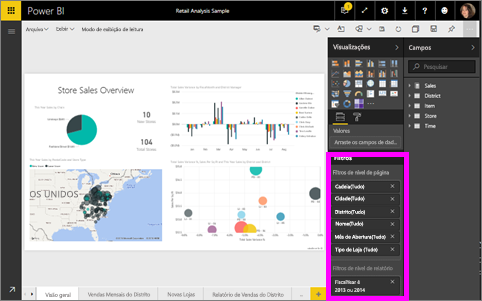

# Sobre filtros e realce em relatórios do Power BI
Os ***Filtros*** removem tudo, menos os dados que você deseja se concentrar.  O ***Realce*** não filtra, pois não remove dados, mas realça um subconjunto dos dados visíveis; os dados não realçados permanecem visíveis, mas esmaecidos.

Há muitas maneiras diferentes de filtrar e realçar relatórios no Power BI. Colocar todas essas informações em um artigo seria confuso, portanto, nós as dividimos assim:

* Introdução aos filtros e realce (o artigo que você está lendo agora)
* As maneiras pelas quais você pode [criar e usar filtros e realce em Modo de exibição de edição/relatórios que você tem](power-bi-report-add-filter.md). Quando você tem permissões de edição para um relatório, pode criar, modificar e excluir filtros e realce em relatórios.
* As maneiras pelas quais você pode [usar filtros e realce em um relatório compartilhado com você ou no Modo de exibição de edição](service-reading-view-and-editing-view.md). O que você pode fazer é mais limitado, mas o Power BI ainda oferece uma ampla variedade de opções de filtragem e realce.  
* [Um tour detalhado dos controles de filtro e realce disponíveis no Modo de exibição de edição](power-bi-how-to-report-filter.md) incluindo uma visão detalhada dos tipos de filtros (por exemplo, data e hora, numérico, texto) e a diferença entre as opções básicas e avançadas.
* Agora que você aprendeu como filtros e realce funcionam por padrão, [saiba como alterar a maneira pela qual as visualizações em uma página filtram e realçam umas às outras](service-reports-visual-interactions.md)

> [!TIP]
> Como o Power BI sabe de que forma os dados estão relacionados?  Ele usa as relações entre diferentes tabelas e campos no [modelo de dados](https://support.office.com/article/Create-a-Data-Model-in-Excel-87e7a54c-87dc-488e-9410-5c75dbcb0f7b?ui=en-US&rs=en-US&ad=US) subjacente para fazer os itens em uma página de relatório interagir uns com os outros.
> 
> 

## Introdução aos filtros e realce em relatórios usando o painel Filtros

Filtros e realce podem ser aplicadas usando o painel **Filtros** ou fazendo seleções diretamente no relatório (ad-hoc, consulte a parte inferior da página). O painel Filtros mostra as tabelas e os campos usados no relatório e os filtros aplicados, caso haja algum. Os filtros são divididos em **Filtros de nível de página**, **Filtros de nível de relatório**, e **Filtros no nível visual**.  Você só verá filtros no nível visual se tiver selecionado uma visualização na tela de relatório.

> [!TIP]
> Se o filtro tiver a palavra **Todos** ao lado, isso significará que todo o campo está sendo incluído como filtro.  Por exemplo, **Cadeia(Todos)** na captura de tela abaixo informa que essa página de relatório inclui dados sobre cadeias de armazenamento.  Por outro lado, o filtro de nível de relatório ou **FiscalYear é 2013 ou 2014** informa que o relatório inclui somente dados para os anos fiscais de 2013 e 2014.
> 
> 

## Filtros no Modo de Exibição de Leitura versus Modo de Exibição de Edição
Há dois modos de interagir com relatórios: [modo de exibição de Leitura e modo de exibição de Edição](service-reading-view-and-editing-view.md).  E os recursos de filtragem disponíveis para você dependem do modo no qual você está.

* No Modo de exibição de edição é possível adicionar relatório, página e filtros visuais. Ao salvar o relatório, os filtros são salvos com ele. Pessoas olhando para o relatório no modo de leitura podem interagir com os filtros que você adicionou, mas não salvar suas alterações.
* Na Exibição de Leitura, é possível interagir com os filtros de página e de visual que já existem no relatório, mas você não poderá salvar as alterações do filtro.

### O painel Filtros no Modo de exibição de leitura
Se você só tiver acesso a um relatório no Modo de Exibição de Leitura, o painel Filtros terá uma aparência semelhante a esta:

Então, essa página do relatório tem 6 filtros de nível de página e 1 filtro de nível de relatório.

Para ver se existem filtros de nível de visual, selecione um visual. Na imagem abaixo, o gráfico de bolhas tem 6 filtros aplicados.

No Modo de exibição de leitura, explore os dados modificando os filtros existentes. Saiba como, no artigo [Interagir com filtros no Modo de exibição de leitura](service-reading-view-and-editing-view.md)

### O painel Filtros no Modo de exibição de edição
Quando você tem permissões do proprietário para um relatório e o abre no Modo de exibição de edição, vê que **Filtros** é apenas um dos vários painéis de edição disponíveis.

Ao passo que no Modo de exibição de leitura (acima) vemos que essa página do relatório tem 6 filtros de nível de página e 1 filtro de nível de relatório. E ao selecionar o gráfico de bolhas, veríamos que ele tem 6 filtros de nível de visual aplicados.

Mas, no Modo de Exibição de Edição, há muito mais que podemos fazer com filtros e realce. A principal diferença é que podemos adicionar novos filtros. Saiba como fazer isso e muito mais no artigo [Adicionar um filtro a um relatório](power-bi-report-add-filter.md)

## Filtragem e realce ad hoc
Selecione um campo na tela de relatório para filtrar e realçar o restante da página. Selecione um espaço vazio no mesmo visual para removê-lo. Esse tipo de filtragem e realce não é salvo com o relatório, mas é uma maneira divertida de explorar rapidamente os impactos dos dados. Para ajustar como funciona esse tipo de filtragem cruzada e realce cruzado, consulte [Interações visuais](service-reports-visual-interactions.md)

## Próximas etapas
[Interact with filters and highlighting (in Reading View)](service-reading-view-and-editing-view.md) (Interagir com os filtros e realce (no Modo de Exibição de Leitura))

[Add a filter to a report (in Editing View)](power-bi-report-add-filter.md) (Adicionar um filtro a um relatório (no Modo de Exibição de Edição))

[Faça um tour pelo painel Filtros do relatório](power-bi-how-to-report-filter.md)

[Alterar como elementos visuais de relatórios executam filtro cruzado e realce cruzado entre si](service-reports-visual-interactions.md)

Leia mais sobre [relatórios no Power BI](service-reports.md)

Mais perguntas? [Experimente a Comunidade do Power BI](http://community.powerbi.com/)

