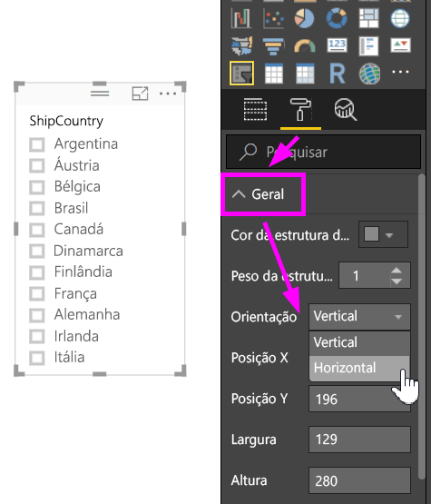
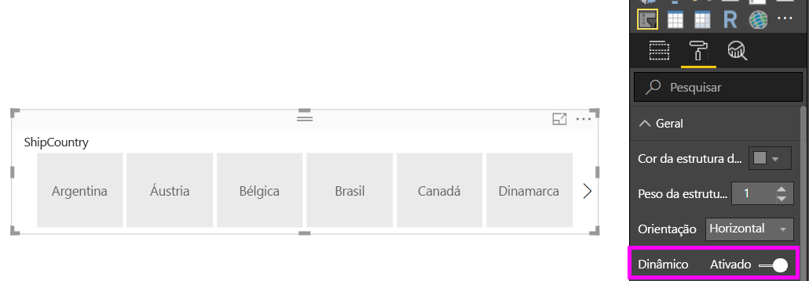
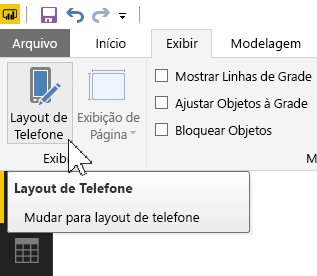
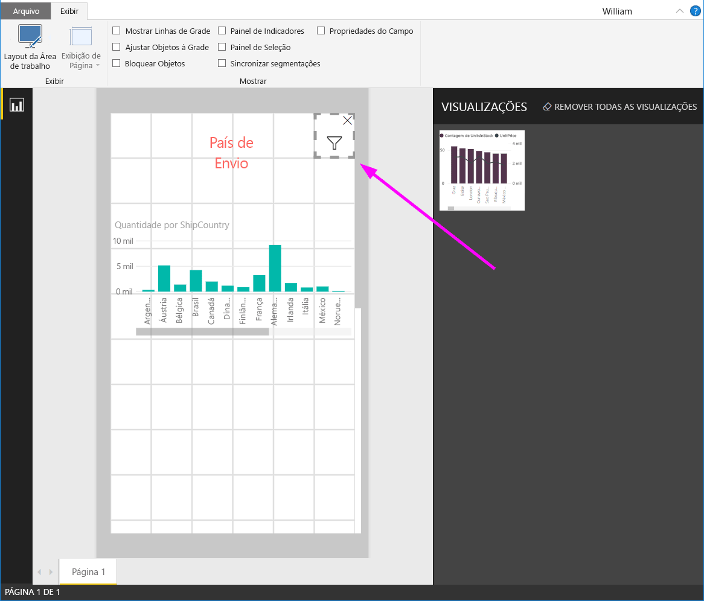

# Criar uma segmentação responsiva que você possa redimensionar no Power BI

As segmentações responsivas são redimensionadas para se ajustar a qualquer espaço no seu relatório. Com segmentações responsivas, redimensione-as para diferentes tamanhos e formas, de horizontal para quadrado e vertical, e os valores na segmentação são reorganizadas como você faria. No Power BI Desktop e no serviço do Power BI, você pode fazer segmentações horizontais e segmentações de data/intervalo responsivas. Segmentações de data/intervalo também têm áreas de toque aprimoradas para facilitar a alteração com a ponta do dedo. Crie segmentações responsivas pequenas ou grandes; elas também são redimensionadas automaticamente para se ajustar bem a relatórios no serviço do Power BI e também em aplicativos móveis do Power BI. 

## Criar uma segmentação

A primeira etapa para criar uma segmentação dinâmica é criar uma segmentação básica. 

1. Selecione o ícone **Segmentação**,  no painel **Visualizações**.
2. Arraste o campo que você deseja filtrar para **Campo**.

    

## Converter em uma segmentação horizontal

1. Com a segmentação selecionada, no painel **Visualizações**, selecione a guia **Formato**.
2. Expanda a seção **Geral**. Para **Orientação**, selecione **Horizontal**.

     

1.  É provável que você queira deixá-la mais larga, para mostrar mais valores.

     

## Torná-la responsiva e experimentar com ela

Esta etapa é fácil. 

1. À direita, em **Orientação** na seção **Geral** da guia **Formato**, deslize **Responsiva** para **Ligado**.  

    

1. Agora você pode brincar com ela. Arraste os cantos para deixá-la baixa, alta, larga e estreita. Se você a fizer pequena o suficiente, ela se tornará apenas um ícone de filtro.

    

## Adicioná-la a um layout de relatório do telefone

No Power BI Desktop, crie um layout de telefone para cada página de um relatório. Se uma página tiver um layout de telefone, ela será exibida em um celular no modo retrato. Caso contrário, você precisará exibi-la no modo paisagem. 

1. No menu **Exibir**, selecione **Layout do Telefone**.

     
    
1. Arraste todos os visuais que você deseja no relatório do telefone para a grade. Quando você arrasta a segmentação responsiva, deixe-a do tamanho desejado – nesse caso, um ícone de filtro.

    

Leia mais sobre a criação de [relatórios otimizados para aplicativos móveis do Power BI](desktop-create-phone-report.md).

## Tornar uma segmentação de tempo ou intervalo responsiva

Siga as mesmas etapas para fazer com que uma segmentação de tempo ou de intervalo se torne responsiva. Depois de definir **Responsiva** como **Ligado**, observe alguns aspectos:

- Visuais otimizam a ordem das caixas de entrada dependendo do tamanho permitido na tela. 
- A exibição do elemento de dados é otimizada para tornar a segmentação o mais útil possível, com base no tamanho permitido na tela. 
- Novo guidões arredondados nos controles deslizantes otimizam interações de toque. 
- Quando um visual fica muito pequeno para ser útil, ele se torna um ícone que representa o tipo de visual em seu lugar. Para interagir com ele, toque duas vezes para abri-lo no modo de foco. Isso economiza espaço valioso na página de relatório sem perder a funcionalidade.

## Próximas etapas

- [Segmentações no serviço do Power BI](power-bi-visualization-slicers.md)
- Mais perguntas? [Experimente perguntar à Comunidade do Power BI](http://community.powerbi.com/)