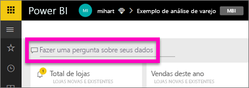
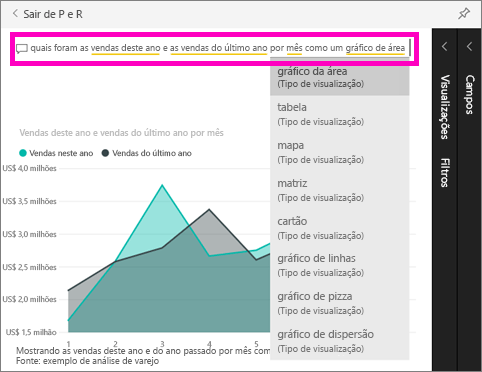

# Introdução à P e R do Power BI
## Usar a P e R do Power BI com o exemplo de Análise de Varejo
Às vezes, a maneira mais rápida de obter uma resposta de seus dados é fazer uma pergunta usando o idioma natural.  Neste início rápido, examinaremos 2 formas diferentes de criar a mesma visualização: primeira, compilá-la em um relatório e, segunda, fazer uma pergunta com P e R. Usaremos um serviço do Power BI, mas o processo é quase idêntico usando o Power BI Desktop.

Para acompanhar, você deve usar um relatório que você possa editar, então usaremos um dos exemplos disponíveis com o Power BI.

## Método 1: usando o editor de relatórios
1. Em seu espaço de trabalho do Power BI, selecione **Obter Dados** \> **Amostras** \> **Amostra de Análise de Varejo** > **Conectar**.
   
    
2. O painel contém um bloco de gráfico de área para "Vendas do último ano e vendas deste ano”.  Selecione este bloco. 
   
   * Se este bloco foi criado com perguntas e respostas, selecionar o bloco vai abrir o P e R. 
   * Mas esse bloco foi criado em um relatório, portanto o relatório é aberto para a página que contém esta visualização.
3. Abra o relatório no modo Exibir Edição selecionado **Editar Relatório**.  Se você não for proprietário de um relatório, não terá a opção para abri-lo no modo de exibição de edição.
   
    
4. Selecione o gráfico de área e examinar as configurações do painel **Campos** .  O criador do relatório criou esse gráfico selecionando esses três valores (**Hora > FiscalMonth**, **Vendas > Vendas Deste Ano**, **Vendas > Vendas do Ano Passado > Valor**) e organizando-os nas seções **Eixo** e **Valores**.
   
    

## Método 2: usando perguntas e respostas
Como podemos criar esse mesmo gráfico de linha usando perguntas e respostas?

1. Navegue de volta para o dashboard de exemplo Análise de Varejo.
2. Use a linguagem natural, digite de forma semelhante na caixa de pergunta:
   
   **quais foram as vendas deste ano e as vendas do ano passado por mês como um gráfico de área**
   
   Ao digitar uma pergunta, o P e R do Power BI escolhe a melhor visualização para exibir sua resposta, e a visualização muda dinamicamente, na medida em que você modifica a pergunta. Além disso, P e R e ajuda a formatar sua pergunta com sugestões, preenchimento automático e a correção ortográfica.
   
   Quando você terminar de digitar sua pergunta, o resultado será exatamente o mesmo gráfico que vimos no relatório.  Mas criá-lo dessa maneira era muito mais rápido!
   
   
3. De modo semelhante ao trabalho com relatórios, na P e R, você tem acesso aos painéis Visualizações, Filtros e Campos.  Abra esses painéis para explorar e modificar ainda mais seu visual.
4. Fixar o gráfico para o painel de controle, selecione o ícone de pino .

## Próximas etapas
[P e R no Power BI](power-bi-q-and-a.md)

[Faça seus dados funcionarem bem com P e R no Power BI](service-prepare-data-for-q-and-a.md)

Mais perguntas? [Experimente a Comunidade do Power BI](http://community.powerbi.com/)

