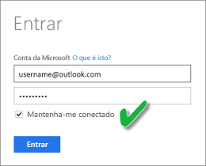

# Atualizar um conjunto de dados criado com base em um arquivo .CSV no OneDrive ou SharePoint Online
## Quais são as vantagens?
Quando você se conecta a um arquivo .csv no OneDrive ou no SharePoint Online, um conjunto de dados é criado no Power BI. Os dados do arquivo .csv são então importados para o conjunto de dados no Power BI. Em seguida, o Power BI se conecta automaticamente ao arquivo e atualiza todas as alterações com o conjunto de dados no Power BI. Se você editar o arquivo .csv no OneDrive ou SharePoint Online, depois de salvar, essas alterações aparecerão no Power BI, normalmente, em menos de uma hora. Todas as visualizações no Power BI baseadas no conjunto de dados também são atualizadas automaticamente.

Se os arquivos estiverem em uma pasta compartilhada no OneDrive for Business ou SharePoint Online, outros usuários poderão trabalhar no mesmo arquivo. Depois de salvas, quaisquer alterações feitas são atualizadas automaticamente no Power BI, geralmente em uma hora.

Muitas organizações executam processos que consultam automaticamente nos bancos de dados os dados que são então salvos em um arquivo .csv todos os dias. Se o arquivo estiver armazenado no OneDrive ou SharePoint Online e o mesmo arquivo for substituído todos os dias, em vez de criar um novo arquivo com um nome diferente todos os dias, será possível se conectar a esse arquivo no Power BI. O conjunto de dados que se conecta ao arquivo será sincronizado logo depois que o arquivo no OneDrive ou SharePoint Online for atualizado. Todas as visualizações baseadas no conjunto de dados também são atualizadas automaticamente.

## O que tem suporte?
Arquivos de valores separados por vírgulas são arquivos de texto simples; portanto, não há suporte para conexões a relatórios e fontes de dados externas. Não é possível agendar uma atualização em um conjunto de dados criado por meio de um arquivo delimitado por vírgulas. No entanto, quando o arquivo estiver no OneDrive ou SharePoint Online, o Power BI sincronizará todas as alterações no arquivo com o conjunto de dados automaticamente em intervalos aproximados de sessenta minutos.

## OneDrive ou OneDrive for Business. Qual é a diferença?
Se você tiver um OneDrive Pessoal e um OneDrive para Empresas, é recomendável manter todos os arquivos aos quais deseja se conectar no Power BI no OneDrive para Empresas. Eis o porquê: você provavelmente usa duas contas diferentes para entrar neles.

A conexão ao OneDrive para Empresas no Power BI é normalmente contínua, porque a mesma conta com a qual você usa para entrar no Power BI é geralmente a mesma conta usada para entrar no OneDrive para Empresas. Mas, com o OneDrive pessoal, você provavelmente entrará com outra [conta da Microsoft](http://www.microsoft.com/account/default.aspx).

Quando você entrar com sua conta da Microsoft, certifique-se de selecionar Mantenha-me conectado. Em seguida, o Power BI pode sincronizar as atualizações com conjuntos de dados no Power BI

Se você fizer alterações no arquivo .csv no OneDrive que não podem ser sincronizadas com o conjunto de dados no Power BI devido à possibilidade de as suas credenciais de conta da Microsoft terem sido alteradas, você precisará se conectar ao arquivo e importá-lo novamente do seu OneDrive pessoal.

## Quando algo dá errado
Se os dados no arquivo .csv no OneDrive forem alterados e essas alterações não forem refletidas no Power BI, isso ocorre provavelmente porque o Power BI não pode se conectar ao OneDrive. Tente se conectar ao arquivo e importá-lo novamente. Se você for solicitado a entrar, certifique-se de selecionar **Manter-me conectado**.

## Próximas etapas
[Ferramentas para solução de problemas de atualização](service-gateway-onprem-tshoot.md)
[Solucionar problemas de atualização](refresh-troubleshooting-refresh-scenarios.md)

Mais perguntas? [Experimente perguntar à Comunidade do Power BI](https://community.powerbi.com/)

