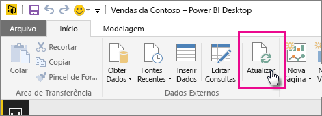
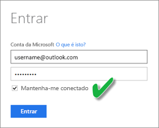

# Atualizar um conjunto de dados armazenado no OneDrive ou no SharePoint Online
Importar arquivos do OneDrive ou SharePoint Online, para o serviço Power BI é uma ótima maneira de garantir que o trabalho que você está fazendo no **Power BI Desktop** permaneça em sincronia com o serviço do Power BI.

## Vantagens de armazenar um arquivo do Power BI Desktop no OneDrive ou no SharePoint Online
Quando você armazena um arquivo do **Power BI Desktop** no OneDrive ou no SharePoint Online, os dados que você tiver carregado para o modelo do seu arquivo são importados para o conjunto de dados e quaisquer relatórios criados no arquivo são carregados para **Relatórios** no Power BI que recebeu manutenção. Quando você faz alterações em seu arquivo no OneDrive ou SharePoint Online, como adicionar novas medidas, alterar nomes de coluna ou editar visualizações, depois de salvar o arquivo, essas alterações também serão atualizadas no serviço do Power BI também, normalmente em menos de uma hora.

É possível realizar uma única atualização manual diretamente no Power BI Desktop selecionando Atualizar na faixa de opções Início. Ao selecionar Atualização aqui, os dados no modelo *do arquivo* serão atualizados com dados atualizados da fonte de dados original. Esse tipo de atualização, feita totalmente no próprio aplicativo Power BI Desktop, é diferente da atualização manual ou agendada no Power BI, e é importante compreender a diferença entre elas.

Quando você importa o arquivo do Power BI Desktop do OneDrive ou SharePoint Online, os dados, juntamente com outras informações sobre o modelo, são carregados em um conjunto de dados no Power BI. No serviço do Power BI (não o Power BI Desktop), você deseja atualizar os dados no conjunto de dados, visto que são neles que os relatórios contidos no serviço do Power BI se baseiam. Como as fontes de dados são externas, é possível atualizar manualmente o conjunto de dados usando **Atualizar agora** ou configurar um agendamento de atualização usando **Agendar Atualização**.

Quando você atualiza o conjunto de dados, o Power BI não se conecta ao arquivo no OneDrive ou SharePoint Online para consultar e verificar se há dados atualizados. Ele usa informações do conjunto de dados para conectar diretamente às fontes de dados para consultar os dados atualizados e os carrega no conjunto de dados. Esses dados atualizados no conjunto de dados não são sincronizados de volta com o arquivo no OneDrive ou SharePoint Online.

## O que tem suporte?
No Power BI, há suporte para os recursos Atualizar Agora e Agendar Atualização para os conjuntos de dados criados por meio de arquivos do Power BI Desktop importados de uma unidade local em que Obter Dados ou o Editor de Consultas é usado para se conectar a qualquer uma das seguintes fontes de dados e carregar dados por meio de uma delas:

### Gateway do Power BI - Pessoal
* Todas as fontes de dados online mostradas no Editor de Consultas e em Obter Dados no Power BI Desktop.
* Todas as fontes de dados locais mostradas no Editor de Consultas e em Obter Dados no Power BI Desktop, exceto o arquivo do Hadoop (HDFS) e o Microsoft Exchange.

<!-- Refresh Data sources-->
[!INCLUDE [refresh-datasources](./includes/refresh-datasources.md)]

> [!NOTE]
> Um gateway deve ser instalado e estar em execução para que o Power BI se conecte a fontes de dados locais e atualize o conjunto de dados.
> 
> 

## OneDrive ou OneDrive for Business. Qual é a diferença?
Se você tiver um OneDrive Pessoal e um OneDrive para Empresas, é recomendável manter todos os arquivos que deseja importar no Power BI no OneDrive para Empresas. Eis o porquê: você provavelmente usa duas contas diferentes para entrar neles.

A conexão ao OneDrive para Empresas no Power BI é normalmente contínua, porque a mesma conta com a qual você usa para entrar no Power BI é geralmente a mesma conta usada para entrar no OneDrive para Empresas. Mas, com o OneDrive pessoal, você provavelmente entrará com outra [conta da Microsoft](http://www.microsoft.com/account/default.aspx).

Quando você entrar com sua conta da Microsoft, certifique-se de selecionar Mantenha-me conectado. O Power BI pode então sincronizar as atualizações feitas no arquivo do Power BI Desktop com conjuntos de dados no Power BI  
    

Se você fizer alterações no arquivo no OneDrive que não podem ser sincronizadas com o conjunto de dados ou os relatórios no Power BI devido à possibilidade de as suas credenciais de conta da Microsoft terem sido alteradas, você precisará se conectar e importar o arquivo novamente do seu OneDrive pessoal.

## Como faço para agendar uma atualização?
Quando você configurar um agendamento de atualização, o Power BI se conectará diretamente às fontes de dados usando as informações de conexão e as credenciais no conjunto de dados para consultar os dados atualizados e, em seguida, carregará os dados atualizados no conjunto de dados. Todas as visualizações em relatórios e em dashboards baseadas nesse conjunto de dados no serviço do Power BI também são atualizadas.

Para obter detalhes sobre como configurar a atualização de agendamento, veja [Configurar uma atualização agendada](refresh-scheduled-refresh.md).

## Quando algo dá errado
Quando as coisas dão errado, normalmente, isso se deve ao fato de o Power BI não conseguir entrar em fontes de dados. Outra razão é que se o conjunto de dados se conecta a uma fonte de dados local, o gateway fica offline. Verifique se o Power BI pode entrar em fontes de dados. Se uma senha que você usa para entrar em uma fonte de dados for alterada ou o Power BI for desconectado de uma fonte de dados, certifique-se de tentar entrar novamente em suas fontes de dados novamente nas Credenciais da Fonte de Dados.

Se você fizer alterações no arquivo do Power BI Desktop no OneDrive e salvar, e essas alterações não forem refletidas no Power BI em uma hora ou mais, isso pode ser devido ao fato de o Power BI não conseguir se conectar ao OneDrive. Tente se conectar novamente ao arquivo no OneDrive. Se você for solicitado a entrar, certifique-se de selecionar Manter-me conectado. Como o Power BI não conseguiu se conectar ao seu OneDrive para sincronizar com o arquivo, você precisará importar o arquivo novamente.

Lembre-se de deixar a opção **Enviar email de notificação de falha de atualização para mim** marcada. Você desejará saber imediatamente de uma falha em uma atualização agendada.

## Solução de problemas
Às vezes, a atualização de dados pode não ocorrer da maneira esperada. Normalmente, isso será um problema relacionado a um gateway. Examine os artigos de solução de problemas do gateway para ver ferramentas e problemas conhecidos.

[Solução de problemas do gateway de dados local](service-gateway-onprem-tshoot.md)

[Solução de problemas do Gateway do Power BI – Pessoal](service-admin-troubleshooting-power-bi-personal-gateway.md)

Mais perguntas? [Experimente perguntar à Comunidade do Power BI](http://community.powerbi.com/)

