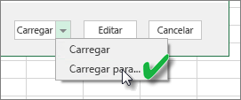
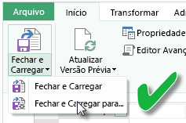
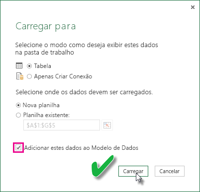

# Atualizar um conjunto de dados criado com base em uma pasta do Excel em uma unidade local
## O que tem suporte?
No Power BI, há suporte para os recursos Atualizar Agora e Agendar Atualização para os conjuntos de dados criados por meio de pastas de trabalho do Excel importadas de uma unidade local em que o Power Query (Obter e Transformar dados no Excel 2016) ou o Power Pivot é usado para se conectar a qualquer uma das seguintes fontes de dados e carregar dados no modelo de dados do Excel:  

### Gateway do Power BI - Pessoal
* Todas as fontes de dados online mostradas no Power Query.
* Todas as fontes de dados locais mostradas no Power Query, exceto o arquivo do Hadoop (HDFS) e o Microsoft Exchange.
* Todas as fontes de dados online mostradas no Power Pivot.\*
* Todas as fontes de dados locais mostradas no Power Pivot, exceto o arquivo do Hadoop (HDFS) e o Microsoft Exchange.

<!-- Refresh Data sources-->
[!INCLUDE [refresh-datasources](./includes/refresh-datasources.md)]

> **Observações:**  
> 
> * Um gateway deve ser instalado e estar em execução para que o Power BI se conecte a fontes de dados locais e atualize o conjunto de dados.
> * Ao usar o Excel 2013, certifique-se de que você atualizou o Power Query para a versão mais recente.
> * Não há suporte para a atualização para pastas de trabalho do Excel importadas de uma unidade local em que os dados existem somente em planilhas ou tabelas vinculadas. Haverá suporte para a atualização para dados de planilha se eles forem armazenados e importados do OneDrive. Para saber mais, veja [Atualizar um conjunto de dados criado com base em uma pasta de trabalho do Excel no OneDrive ou SharePoint Online](refresh-excel-file-onedrive.md).
> * Quando você atualiza um conjunto de dados criado por meio de uma pasta de trabalho do Excel importada de uma unidade local, somente os dados consultados das fontes de dados são atualizados. Se você alterar a estrutura do modelo de dados no Excel ou no Power Pivot, por exemplo, criar uma nova medida ou alterar o nome de uma coluna, essas alterações não serão copiadas no conjunto de dados. Se você fizer essas alterações, você precisará carregar ou publicar novamente a pasta de trabalho. Se você pretende fazer alterações regulares na estrutura da pasta de trabalho e quiser que elas sejam refletidas no conjunto de dados no Power BI sem a necessidade de carregar novamente, considere colocar sua pasta de trabalho no OneDrive. O Power BI atualiza automaticamente a estrutura e os dados de planilha das pastas de trabalho armazenadas e importadas do OneDrive.
> 
> 

## Como ter certeza de que os dados são carregados no modelo de dados do Excel?
Quando você usa o Power Query (Obter e transformar dados no Excel 2016) para se conectar a uma fonte de dados, você tem várias opções de onde carregar os dados. Para se certificar de que você carrega os dados no modelo de dados, você deve selecionar a opção **Adicionar esses dados ao Modelo de Dados** na caixa de diálogo **Carregar Para** .

> [!NOTE]
> As imagens aqui mostram o Excel 2016.
> 
> 

Em **Navegador**, clique em **Carregar para...**  
    

Ou então, se você clicar em **Editar** no Navegador, você abrirá o Editor de Consultas. Lá, é possível clicar em **Fechar e Carregar para...**  
    

Em seguida, em **Carregar para**, certifique-se de que você selecionou **Adicionar esses dados ao Modelo de Dados**.  
    

### E se eu usar o recurso Obter Dados Externos no Power Pivot?
Sem problemas. Sempre que você usar o Power Pivot para se conectar e consultar dados de uma fonte de dados local ou online, os dados serão carregados automaticamente no modelo de dados.

## Como faço para agendar uma atualização?
Quando você configurar um agendamento de atualização, o Power BI se conectará diretamente às fontes de dados usando as informações de conexão e as credenciais no conjunto de dados para consultar os dados atualizados e, em seguida, carregará os dados atualizados no conjunto de dados. Todas as visualizações em relatórios e em dashboards baseadas nesse conjunto de dados no serviço do Power BI também são atualizadas.

Para obter detalhes sobre como configurar a atualização de agendamento, veja [Configurar uma atualização agendada](refresh-scheduled-refresh.md).

## Quando algo dá errado
Quando as coisas dão errado, normalmente, isso se deve ao fato de o Power BI não conseguir entrar em fontes de dados. Outra razão é que se o conjunto de dados se conecta a uma fonte de dados local, o gateway fica offline. Verifique se o Power BI pode entrar em fontes de dados. Se uma senha que você usa para entrar em uma fonte de dados for alterada ou o Power BI for desconectado de uma fonte de dados, certifique-se de tentar entrar novamente em suas fontes de dados novamente nas Credenciais da Fonte de Dados.

Lembre-se de deixar a opção **Enviar email de notificação de falha de atualização para mim marcada**. Você desejará saber imediatamente de uma falha em uma atualização agendada.

>[!IMPORTANT]
>Não há suporte para a atualização de feeds OData conectados ao Power Pivot e consultados por meio dele. Ao usar um feed OData como uma fonte de dados, use o Power Query.

## Solução de problemas
Às vezes, a atualização de dados pode não ocorrer da maneira esperada. Normalmente, isso será um problema relacionado a um gateway. Examine os artigos de solução de problemas do gateway para ver ferramentas e problemas conhecidos.

[Solução de problemas do gateway de dados local](service-gateway-onprem-tshoot.md)

[Solução de problemas do Gateway do Power BI – Pessoal](service-admin-troubleshooting-power-bi-personal-gateway.md)

## Próximas etapas
Mais perguntas? [Experimente a Comunidade do Power BI](http://community.powerbi.com/)

