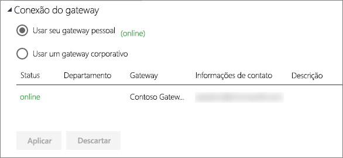
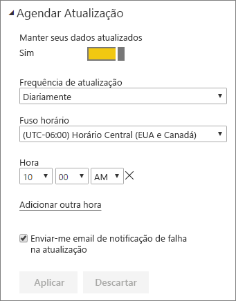

# Configurando a atualização agendada

>[!NOTE]
>Depois de dois meses de inatividade, a atualização agendada do conjunto de dados é pausada. Consulte a seção [*Atualização agendada*](#schedule-refresh) mais adiante neste artigo para obter mais informações.
> 
> 

Se seu conjunto de dados dá suporte à atualização agendada, usando Atualizar Agora e Agendar Atualização, há alguns requisitos e configurações importantes que você precisa saber para que a atualização seja bem-sucedida. Eles são **Conexão do gateway**, **Credenciais da Fonte de Dados** e **Agendar Atualização**. Vamos examinar mais detalhadamente cada etapa.

Isso descreverá as opções disponíveis tanto para o [Power BI Gateway – Personal](personal-gateway.md) quanto para o [gateway de dados local](service-gateway-onprem.md).

Para acessar a tela da atualização agendada, faça o seguinte.

1. Selecione as **reticências (...)** ao lado de um conjunto de dados listado em **Conjuntos de Dados**.
2. Selecione **Agendar Atualização**.
   
    

## Conexão do gateway
Você verá diferentes opções aqui, dependendo se tem um gateway pessoal ou corporativo, online e disponível.

Se nenhum gateway estiver disponível, você verá as **configurações do Gateway** desabilitadas. Você também verá uma mensagem indicando como instalar o gateway pessoal.

Se você tiver um gateway pessoal configurado, ele estará disponível para selecionar, caso esteja online. Ela mostrará offline se ele não estiver disponível.

Você também pode selecionar o gateway corporativo, se houver um disponível. Você só verá um gateway corporativo disponível se sua conta estiver listada na guia Usuários da fonte de dados configurada para determinado gateway.

## Credenciais da fonte de dados
### Gateway do Power BI - Pessoal
Se estiver usando o gateway pessoal para atualizar os dados, você precisará fornecer as credenciais usadas para se conectar à fonte de dados de back-end. Se você estiver conectado a um pacote de conteúdo por meio de um serviço online, as credenciais inseridas para se conectar serão transferidas para a atualização agendada.

Você só precisa entrar nas fontes de dados na primeira vez que você usar a atualização desse conjunto de dados. Uma vez inseridas, essas credenciais são mantidas com o conjunto de dados.

> [!NOTE]
> Para alguns métodos de autenticação, se a senha usada para entrar em uma fonte de dados expirar ou se for alterada, você também precisará alterá-la na fonte de dados em Credenciais da Fonte de Dados.
> 
> 

Quando as coisas dão errado, o problema geralmente tem algo a ver com o gateway estar offline porque não foi possível entrar no Windows e iniciar o serviço ou Power BI não conseguiu se conectar às fontes de dados para consultar dados atualizados. Se a atualização falhar, verifique as configurações do conjunto de dados. Se o serviço de gateway estiver offline, o Status do Gateway é onde você verá o erro. Se não conseguir entrar no Power BI em fontes de dados, você verá um erro em Credenciais da Fonte de Dados.

### Gateway de dados local
Se você estiver usando o gateway de dados local para atualizar dados, não será necessário fornecer credenciais, pois elas são definidas para a fonte de dados pelo administrador do gateway.

> [!NOTE]
> Ao se conectar ao SharePoint local para atualização de dados, o Power BI dá suporte apenas a mecanismos de autenticação *Anônima*, *Básica* e *Windows (Kerberos/NTLM)*. O Power BI não dá suporte a *ADFS* ou a nenhum mecanismo de *Autenticação Baseada em Formulários* para atualização de dados de fontes de dados locais do SharePoint.
> 
> 

## Agendar atualização
A seção sobre atualização agendada é o local em que você define a frequência e os slots de tempo para atualizar o conjunto de dados. Algumas fontes de dados não exigem a presença de um gateway para que estejam disponíveis para configuração. Outras exigirão um gateway.

É preciso justar o controle deslizante **Manter seus dados atualizados** como **Sim** para definir as configurações.

> [!NOTE]
> O serviço do Power BI tem como meta iniciar a atualização de seus dados dentro de **15 minutos** do seu horário de atualização agendado.
> 
> 

> [!NOTE]
> Depois de dois meses de inatividade, a atualização agendada do conjunto de dados é pausada. Um conjunto de dados será considerado inativo quando nenhum usuário tiver visitado qualquer dashboard ou relatório criado no conjunto de dados. Nesse momento, é enviado ao proprietário do conjunto de dados um email indicando que a atualização agendada foi pausada e o agendamento da atualização para o conjunto de dados é exibido como **desabilitado**. Para continuar com a atualização agendada, simplesmente acesse novamente o dashboard ou o relatório criado no conjunto de dados.
> 
> 

## O que tem suporte?
Para alguns conjuntos de dados, há suporte para a atualização agendada em gateways diferentes. Aqui está uma referência para entender o que está disponível.

### Gateway do Power BI - Pessoal
**Power BI Desktop**

* Todas as fontes de dados online mostradas no Editor de Consultas e em Obter Dados no Power BI Desktop.
* Todas as fontes de dados locais mostradas no Editor de Consultas e em Obter Dados no Power BI Desktop, exceto o arquivo do Hadoop (HDFS) e o Microsoft Exchange.

**Excel**

> [!NOTE]
> No Excel 2016 e posterior, o Power Query agora é listado na seção Dados da faixa de opções, sob Obter e Transformar dados.
> 
> 

* Todas as fontes de dados online mostradas no Power Query.
* Todas as fontes de dados locais mostradas no Power Query, exceto o arquivo do Hadoop (HDFS) e o Microsoft Exchange.
* Todas as fontes de dados online mostradas no Power Pivot.\*
* Todas as fontes de dados locais mostradas no Power Pivot, exceto o arquivo do Hadoop (HDFS) e o Microsoft Exchange.

<!-- Refresh Data sources-->
[!INCLUDE [refresh-datasources](./includes/refresh-datasources.md)]

## Solução de problemas
Às vezes, a atualização de dados pode não ocorrer da maneira esperada. Normalmente, isso será um problema relacionado a um gateway. Examine os artigos de solução de problemas do gateway para ver ferramentas e problemas conhecidos.

[Solução de problemas do gateway de dados local](service-gateway-onprem-tshoot.md)

[Solução de problemas do Gateway do Power BI – Pessoal](service-admin-troubleshooting-power-bi-personal-gateway.md)

## Próximas etapas
[Atualizar dados no Power BI](refresh-data.md)  
[Gateway do Power BI – Pessoal](personal-gateway.md)  
[Gateway de dados local](service-gateway-onprem.md)  
[Solução de problemas do gateway de dados local](service-gateway-onprem-tshoot.md)  
[Solução de problemas do Gateway do Power BI – Pessoal](service-admin-troubleshooting-power-bi-personal-gateway.md)  

Mais perguntas? [Experimente perguntar à Comunidade do Power BI](http://community.powerbi.com/)

