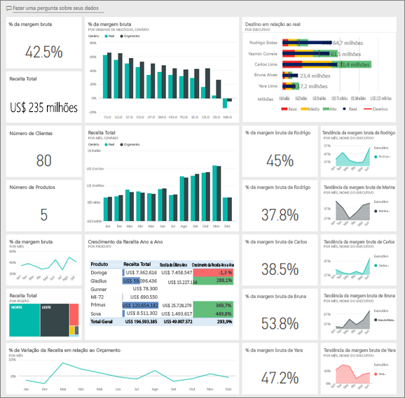
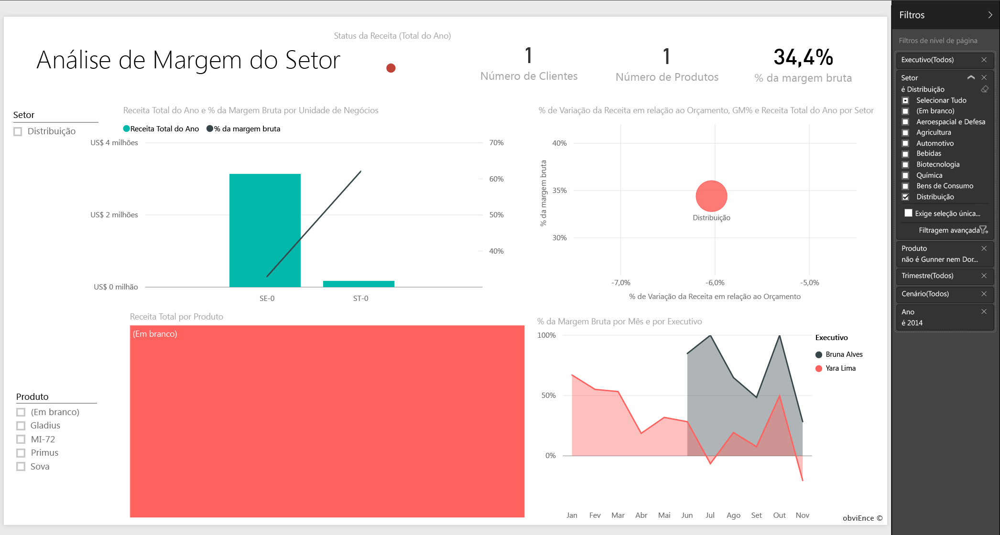

# Exemplo de Rentabilidade do Cliente para o Power BI: faça um tour
O pacote de conteúdo “Exemplo de lucratividade do cliente”" contém um painel, o relatório e o conjunto de dados para uma empresa que fabrica materiais de marketing. Esse painel foi criado por um diretor financeiro para ver as métricas chave sobre seu 5 gerentes de unidade comercial (também conhecidos como executivos), produtos, clientes e margens brutas (GM). Ele pode ver rapidamente quais fatores têm impacto sobre a lucratividade.

Este exemplo faz parte de uma série de exemplos que ilustra como o Power BI pode ser usado com dados, relatórios e painéis orientados aos negócios. Os exemplos são dados reais de obviEnce ([www.obvience.com](http://www.obvience.com/)) que foram mantidos anônimos.

Também é possível [baixar apenas o conjunto de dados (pasta de trabalho do Excel)](http://go.microsoft.com/fwlink/?LinkId=529781) para este exemplo.  

## O que é nosso painel está dizendo?
### Blocos de painel de toda a empresa
Esses blocos dão ao nosso diretor financeiro métricas de empresa de alto nível importante para ela.  Quando ela vir algo interessante, pode selecionar um bloco para examinar os dados.

1. A margem bruta da nossa empresa é de 42,5%.
2. Temos 80 clientes.
3. Vendemos 5 produtos diferentes.
4. Tivemos nossa menor % de variação de receita para o orçamento de Fevereiro, seguida por nossa maior alta em março.
5. A maioria da nossa receita é proveniente das regiões leste e norte. A margem bruta nunca excedeu o orçamento, com ER-0 e MA-0 exigindo mais investigações.
6. A receita total para o ano é quase o orçamento.

### Blocos do painel específico do gerente
Esses blocos fornecem uma pontuação da equipe. O diretor financeiro precisa manter o controle de seus gerentes e essas peças apresentam uma visão geral de alto nível do lucro – usando GM %. Se a tendência de % GM é inesperada para qualquer gerenciador, poderá investigar mais.

O percentual de GM de Annelie é o mais baixo, mas podemos ver um aumento gradual desde março. Valery, por outro lado, teve queda na % de GM significante. E Andrew teve um ano volátil. Clique em qualquer um dos blocos específicos de gerente para abrir o relatório subjacente. O relatório tem três páginas e é aberto na página “Análise de Margem do Setor”.

## Explore outras páginas no relatório
Nosso relatório tem três páginas:

* “Scorecard da Equipe” enfoca o desempenho dos cinco gerentes e seus “livros de negócios”.
* “Análise de Margem do Setor” fornece uma maneira para analisar nossa rentabilidade comparado ao que está acontecendo em todo nosso setor.
* “Scorecard Executivo” fornece uma exibição de cada um dos nossos gerentes formatados para exibição na Cortana.

### Página de pontuação da equipe

Vejamos os dois membros da equipe em detalhes e quais informações podem ser obtidas. Na segmentação à esquerda, selecione nome de Andrw para filtrar a página do relatório para exibir apenas os dados sobre ele.

* Para um KPI rápido, examinar de Andrew **receita Status** -ele está verde. Ele está sendo bem executado.
* O gráfico de área "% de Receita Var para orçamento por mês” mostra a exceção para uma queda em fevereiro, Andrew está indo muito bem no geral. Sua região dominante é leste e ele manipula 49 clientes e 5 (de 7) produtos. A GM% não é o maior ou menor.
* A “% ReceitaTY e Receita Var para o Orçamento por Mês”, mostra um histórico de lucro até mesmo estático. Mas ao filtrar clicando no quadrado para **Central** na região treemap, você descobrirá que Andrew temi apenas receita em março e apenas em Indiana. Isso é intencional ou é algo que precisamos examinar?

Agora a diante com Valery. Na segmentação, selecione nome de Valery para filtrar a página do relatório para exibir apenas os dados sobre ela.  

* Observe o KPI vermelho para **o Status de ReceitaTY**. Isso definitivamente precisa de mais investigação.
* A variação de receita também pinta uma imagem preocupante – ela não atende suas margens de receita.
* Valery tem apenas 9 clientes, manipula somente 2 produtos e funciona quase exclusivamente com os clientes da região norte. Essa especialização poderia explicar ampla flutuações na sua métrica.
* Selecionando o quadrado **norte** no treemap mostra que a margem bruta de Valery na região norte é consistente com sua margem geral.
* Selecionar outros quadrados de **Região** apresenta uma história interessante: suas variações de % GM de 23% a 79% e seus números de receita, em todas as regiões, exceto norte, são extremamente sazonais.

Continue a ler para descobrir por que área de Valery não apresenta um bom desempenho. Examine as regiões, unidades de negócios e a próxima página do relatório – "Análise de margem do setor".

### Análise de margem do setor
Esta página de relatório fornece uma fatia diferente dos dados. Examina a margem bruta para todo o setor, dividido por segmento. O diretor financeiro usa essa página para comparar as métricas de unidade da empresa e comercial para métricas do setor para ajudar a explicar tendências e lucratividade. Você deve estar imaginando por que o gráfico de área "Margem bruta por mês e nome de execução” está nesta página, já que é específico de uma equipe. Tê-la aqui, nos permite filtrar a página pelo gerente da unidade de negócios.  

Como a lucratividade varia por setor? Como os produtos e clientes dividem por setor? Selecione um ou mais setores na parte superior esquerda. (iniciar no setor CPG) Para limpar o filtro, selecione o ícone de borracha.

No gráfico de bolhas, o CFO procura as bolhas maiores como são aqueles que têm o maior impacto na receita. Filtrar a página por gerente clicando em seus nomes no gráfico de área torna fácil ver cada impacto de gerente por segmento do setor.

* A área de Andrew de influência abrange vários setores diferentes com diferentes amplamente % GM (a maioria do lado positivo) e % Var. 
* O gráfico do Annelie é semelhante, exceto que ela se concentra em apenas alguns segmentos de mercado com um foco no segmento Federal e um foco no produto Gladius. 
* Carlos tem um foco claro no segmento de serviços, com bom lucro. Ele aumentou bastante a % de variação para o segmento de alta tecnologia e um novo segmento para ele, Industrial, executado muito bem em relação ao orçamento. 
* Tina trabalha com alguns segmentos e tem % GM mais alta, mas o tamanho pequeno em grande parte das suas bolhas mostra que seu impacto sobre o resultado da empresa é mínimo. 
* Valery, que é responsável por apenas um produto, trabalha apenas com 5 segmentos de mercado. Sua influência do setor é sazonal, mas sempre produz uma grande bolha, indicando um impacto significativo sobre o resultado da empresa. O setor explicar seu desempenho negativo?

### Scorecard executivo
Esta página é formatada como um Cartão de Respostas para a Cortana. Para obter mais informações, consulte [criar Cartões de Respostas para a Cortana](service-cortana-answer-cards.md)

## Investigue os dados fazendo perguntas em P e R
Para nossa análise, seria útil determinar qual setor gera a maior parte da receita para Valery. Vamos usar P e R.

1. Selecione **Power BI** na barra de navegação superior para retornar ao painel.
2. Selecione a caixa de pergunta de P e R na parte superior do painel.
   
    
3. Digite **receita total pelo setor de Valery**. Observe como a visualização atualiza conforme você digita a pergunta.
   
    
   
   A distribuição é a maior área de receita para Valery.

### Aprofunde-se adicionando filtros
Vamos dar uma olhada na *distribuição* do setor.  

1. Retorne ao painel e selecione o gráfico de área com tendência de Andrew de margem bruta. Isso abre o relatório para a página de "Análise de margem do setor".
2. Sem selecionar nenhuma visualização na página do relatório, expanda o painel de filtro à direita. O Painel de filtros deve exibir apenas filtros de Nível de página.  
   
   
3. Localize o filtro para **Setor** e selecione a seta para expandir a lista. Vamos adicionar um filtro de página para o Setor de distribuição. Primeiro, limpe todas as seleções, desmarcando a caixa de seleção **Selecionar tudo**. Em seguida, selecione **Distribuição.**  
   
   
4. O gráfico de área "Margem bruta por mês e o nome do executivo" informa que apenas Valery e Tina têm clientes neste setor e Valery só trabalhou com o setor de junho a novembro.   
5. Selecione **Tina** e **Valery** na legenda do gráfico da área “Margem bruta por mês e executivo”. Observe a parte de Tina "Receita Total por produto" é muito pequeno se comparada a Valery. 
6. Para ver a receita real, retorne ao dashboard e use a P e R para perguntar a **receita total da distribuição por cenário e executivo**.  
   
   

Podemos explorar de forma semelhante a outros setores e até mesmo adicionar clientes a nossos visuais para compreender as causas para o desempenho de Valery.

Este é um ambiente seguro para experimentar. Você pode optar por não salvar as alterações. Mas se você salvá-las, sempre é possível acessar **Obter Dados** para ter uma nova cópia deste exemplo.

## Próximas etapas: conectar-se aos seus dados
Esperamos que este tour tenha mostrado como os painéis do Power BI, perguntas e respostas, e os relatórios podem fornecer ideias sobre dados do cliente. Agora é sua vez, conecte-se aos seus próprios dados. Com o Power BI, é possível se conectar a uma grande variedade de fontes de dados. Saiba mais sobre como [começar a usar o Power BI](service-get-started.md)

[Voltar para exemplos no Power BI](sample-datasets.md)  

