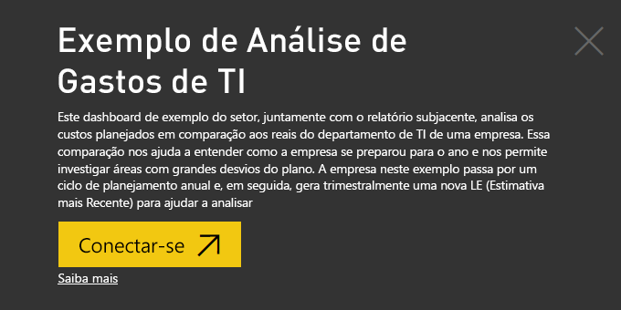
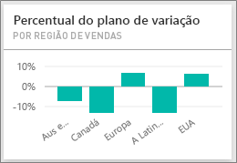
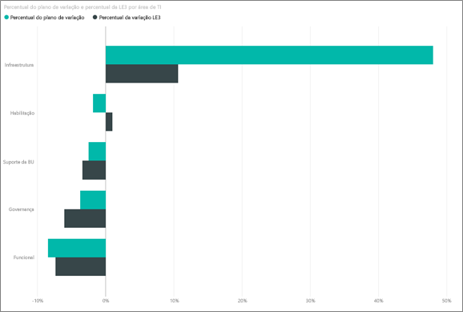
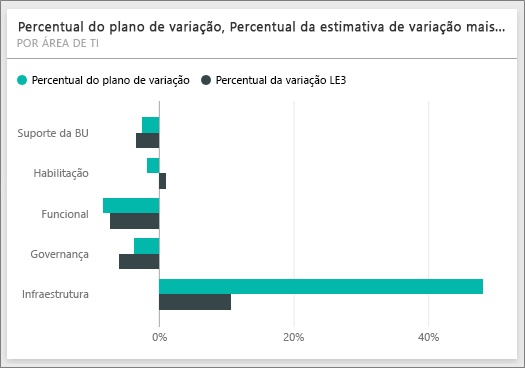
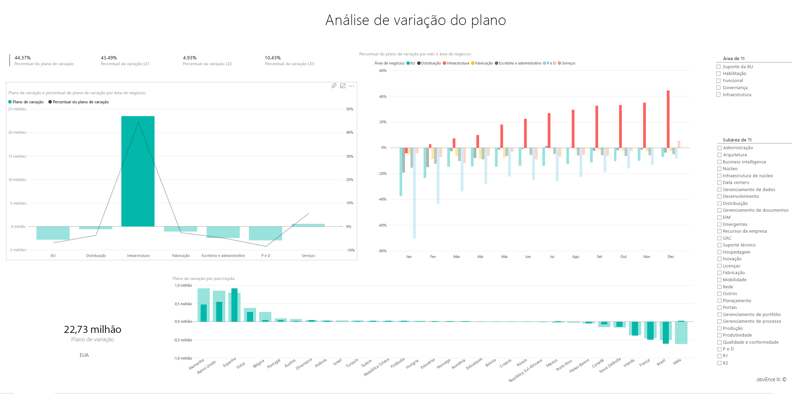

# Exemplo de Análise de Gastos de TI para o Power BI: faça um tour

## Visão geral do exemplo de Análise de Gastos de TI
O [pacote de conteúdo](service-organizational-content-pack-introduction.md) da Análise de Gastos de TI (dashboard, relatório e conjunto de dados) analisa os custos planejados vs. reais de um departamento de TI. Essa comparação nos ajuda a entender como a empresa se preparou para o ano e investigar áreas com grandes desvios do plano. A empresa neste exemplo passa por um ciclo de planejamento anual e, em seguida, gera trimestralmente uma nova LE (Estimativa mais Recente) para ajudar a analisar as alterações nos gastos de TI no ano fiscal.

Este exemplo faz parte de uma série de exemplos que ilustra como o Power BI pode ser usado com dados, relatórios e painéis orientados aos negócios. São dados reais de obviEnce (<http://obvience.com/>) que foram mantidos anônimos.

## Pré-requisitos

 Antes de usar o exemplo, primeiro você deve baixá-lo como um [pacote de conteúdo](https://docs.microsoft.com/power-bi/sample-it-spend#get-the-content-pack-for-this-sample), [arquivo .pbix](http://download.microsoft.com/download/E/9/8/E98CEB6D-CEBB-41CF-BA2B-1A1D61B27D87/IT-Spend-Analysis-Sample-PBIX.pbix) ou [pasta de trabalho do Excel](http://go.microsoft.com/fwlink/?LinkId=529783).

### Obter o pacote de conteúdo para este exemplo

1. Abra o serviço do Power BI (app.powerbi.com) e faça logon.
2. No canto inferior esquerdo, selecione **Obter dados**.
   
    
3. Na página Obter Dados que aparece, selecione o ícone **Exemplos**.
   
   
4. Selecione o **Exemplo de Análise de Gastos de TI** e escolha **Conectar**.  
  
   
   
5. O Power BI importa o pacote de conteúdo e adiciona um novo dashboard, um relatório e um conjunto de dados ao seu espaço de trabalho atual. O novo conteúdo é marcado com um asterisco amarelo. 
   
   
  
### Obter o arquivo. pbix para este exemplo

Como alternativa, você pode baixar o exemplo como um arquivo .pbix, que é projetado para uso com o Power BI Desktop. 

 * [Exemplo de Análise de Gastos de TI](http://download.microsoft.com/download/E/9/8/E98CEB6D-CEBB-41CF-BA2B-1A1D61B27D87/IT%20Spend%20Analysis%20Sample%20PBIX.pbix)

### Obter a pasta de trabalho do Excel para este exemplo
Também é possível [baixar apenas o conjunto de dados (pasta de trabalho do Excel)](http://go.microsoft.com/fwlink/?LinkId=529783) para este exemplo A pasta de trabalho contém planilhas do Power View que você pode exibir e modificar. Para ver os dados brutos, selecione **Power Pivot > Gerenciar**.

## O painel do Exemplo de Análise de Gastos de TI
Os dois blocos de números no painel, **% do plano de variação** e **% da estimativa mais recente da variação do 3º trimestre**, nos fornecem uma visão geral de nosso desempenho em relação ao plano e à estimativa mais recente do trim. (LE3 = Estimativa mais recente do 3º trimestre). Em geral, estamos cerca de 6% fora do plano. Vamos explorar a causa dessa variação – quando, onde e qual categoria?

## Página “Análise das tendências de gastos de TI acumulados no ano”
A seleção do bloco do painel **% do plano de variação por Região de vendas** leva você à página “Análise das tendências de gastos de TI” do relatório de Exemplo de Análise de Gastos de TI. Vemos rapidamente que temos uma variação positiva nos EUA e na Europa e uma variação negativa no Canadá, América Latina e Austrália. Os EUA tinham um variação +LE de cerca de 6% e a Austrália tem uma variação -LE de cerca de 7%.

Mas apenas examinar este gráfico e tirar conclusões pode ser enganoso. Precisamos examinar as quantias reais em dólar para ver as coisas de forma objetiva.

1. Selecione **Austrália e Nova Zelândia** no gráfico % do Plano de Variação por Região de Vendas e observe o gráfico Plano de Variação por Área de TI.

   
2. Agora selecione **EUA**. Você captou a ideia – A Austrália é uma parte realmente pequena de nossos gastos gerais em comparação com os EUA.

    Já restringimos para os EUA, agora qual o próximo passo? Vamos explorar qual categoria nos EUA está causando a variação.

## Fazer perguntas sobre os dados
1. Selecione **Exemplo de Análise de Gastos de TI** na barra de navegação superior para retornar aos Dashboards.
2. Na caixa de perguntas, digite “mostrar gráfico de barras de % do plano de variação e % de le3 por áreas de TI”.

   

   Na primeira área de TI, **Infraestrutura**, o percentual mudou drasticamente entre o plano de variação inicial e a estimativa mais recente do plano de variação.

## Página “Gastos acumulados no ano por Elementos de custo”
Volte para o painel e examine o bloco do painel **% do plano de variação, % de LE3 da variação** .

A infraestrutura salta com uma grande variação positiva em relação ao plano.

1. Clique neste bloco para ir para a página “Gastos acumulados no ano por Elementos de custo” do relatório de Exemplo de Análise de Gastos de TI.
2. Clique na barra **Infraestrutura** no canto inferior esquerdo do gráfico “% do plano de variação e % da LE3 da variação por Área de TI” e observe a variação ao plano em “% do plano de variação por Região de vendas” à esquerda.

    
3. Clique no nome de cada Grupo de Elementos de Custo na segmentação de dados para localizar o elemento de custo com uma grande variação.
4. Com **Outros** selecionado, clique em **Infraestrutura** na Área de TI e clique nas subáreas na segmentação de dados da Subárea de TI para localizar a subárea com a maior variação.  

   Vemos uma enorme variação em **Rede**.

   Aparentemente, a empresa decidiu oferecer aos seus funcionários serviços telefônicos como um benefício, mas essa mudança não estava planejada.

## Página “Análise de Variação do Plano”
Ainda no relatório, clique na guia “Análise de Variação do Plano” na parte inferior do relatório, vá para a página 3 do relatório.

No gráfico de combinação “Plano de variação e % do plano de variação por Área de negócios” à esquerda, clique na coluna Infraestrutura para realçar os valores de infraestrutura no restante da página.

Observe no gráfico “% do plano de variação por Mês e Área de negócios” que a infraestrutura começou a ter uma variação positiva por volta de fevereiro e, em seguida, continuou crescendo. Além disso, observe como a variação ao valor de plano da infraestrutura varia por país, comparado ao valor para todas as áreas de negócios. Use as segmentações de dados “Área de TI” e “Subáreas de TI” à direita para filtrar os valores no restante da página em vez de realçá-los. Clique em diferentes Áreas de TI à direita para explorar os dados de outra maneira. Você pode também clicar nas Subáreas de TI e ver a variação nesse nível.

## Editar o relatório
Clique em **Editar Relatório** no canto superior esquerdo de canto e explore-o na Exibição de Edição.

* Veja como as páginas são criadas – os campos de cada gráfico e os filtros nas páginas
* Adicionar páginas e gráficos com base nos mesmos dados
* Alterar o tipo de visualização para cada gráfico
* Fixá-los no dashboard

Este é um ambiente seguro para experimentar. Você pode optar por não salvar as alterações. Mas se você salvá-las, sempre é possível acessar Obter Dados para ter uma nova cópia deste exemplo.

## Próximas etapas: conectar-se aos seus dados
Esperamos que este tour tenha mostrado como os painéis, P e R e relatórios do Power BI podem fornecer informações sobre os dados de gastos de TI. Agora é sua vez, conecte-se aos seus próprios dados. Com o Power BI, é possível se conectar a uma grande variedade de fontes de dados. Saiba mais sobre como [começar a usar o Power BI](service-get-started.md)
