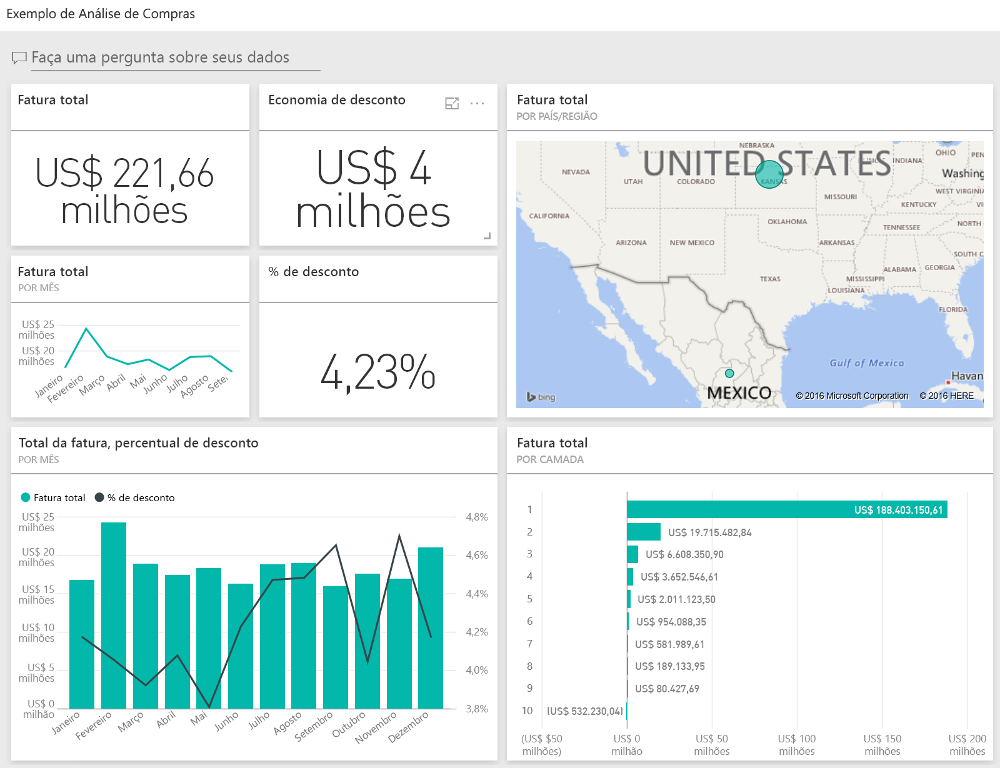
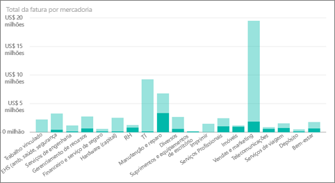
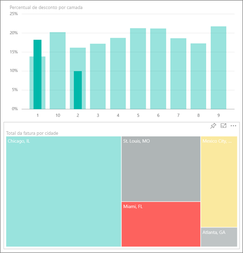
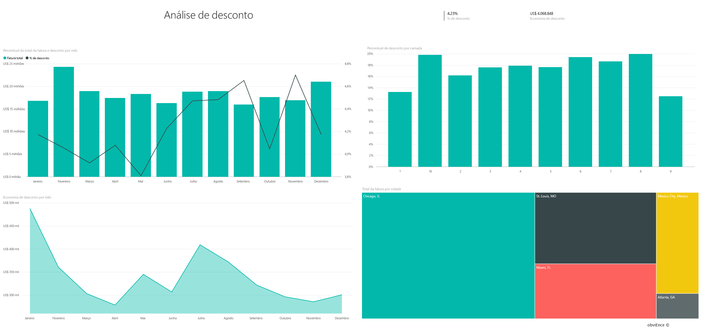
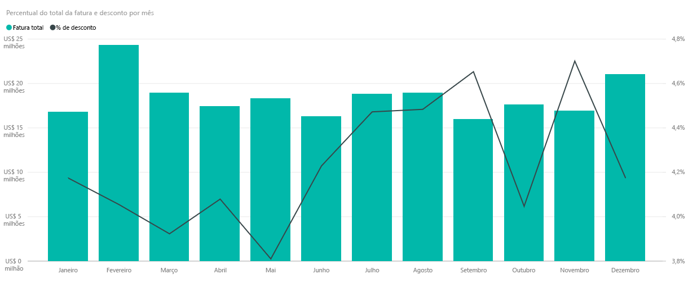
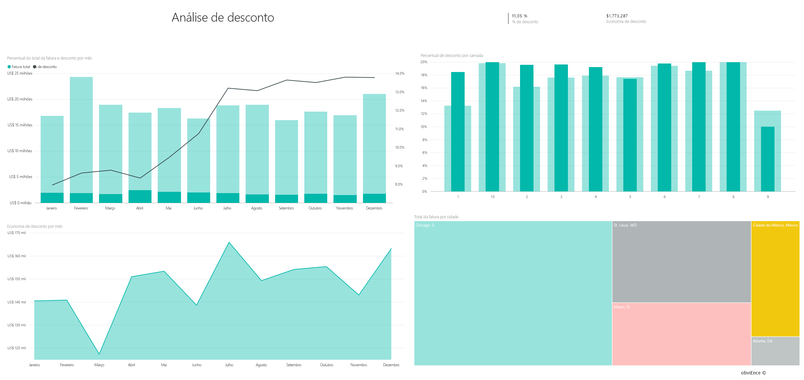

# Exemplo de Análise de Varejo para o Power BI: faça um tour
Este painel de exemplo do setor e relatório subjacente analisam as despesas da empresa fabricante com fornecedores por categoria e local. No exemplo, exploraremos essas áreas:

* Quem são os principais fornecedores
* Em quais categorias ocorrem a maioria das despesas
* Quais fornecedores fornecem o desconto mais alto e quando

Este exemplo faz parte de uma série de exemplos que ilustra como o Power BI pode ser usado com dados, relatórios e painéis orientados aos negócios. Os exemplos são dados reais de obviEnce ([www.obvience.com)](http://www.obvience.com/) que foram mantidos anônimos.

Quer me acompanhar? No [Serviço do Power BI](https://powerbi.com), vá para **Obter Dados > Exemplos > Exemplo de Análise de compras > Conectar** para obter sua própria cópia do exemplo.

Também é possível [baixar apenas o conjunto de dados (pasta de trabalho do Excel)](http://go.microsoft.com/fwlink/?LinkId=529784) para este exemplo

## Tendências de gastos
Primeiro, vamos analisar as tendências em gastos por categoria e local.  

1. Em seu espaço de trabalho, abra a guia **Dashboards** e selecione o dashboard de Análise de Compras.
2. Selecione o bloco do painel **Total da nota fiscal por país/região**. Abre a página "Visão Geral de Gasto" do relatório "Exemplo de análise de compras".
   
    

Observe algumas coisas:

* No gráfico de linhas **Total da fatura por mês e categoria** : a categoria **Direto** apresenta gastos bem consistentes, **Logística** apresenta um pico em dezembro e **Outros** demonstra um pico em fevereiro.
* No mapa **Total da fatura por país/região** : a maioria de nossos gastos está concentrada nos EUA.
* No gráfico de colunas **Total da fatura por subcategoria**: **Hardware** e **Serviços e produtos indiretos** são as categorias que apresentam os maiores gastos.
* No gráfico de barras Total da fatura por camada: a maioria de nossos negócios é feita com nossos fornecedores da Camada 1 (os 10 primeiros). Isso ajuda a gerenciar melhor os relacionamentos com o fornecedor.

## Gastos no México
Vamos explorar as áreas de gastos no México.

1. No gráfico de pizza, selecione a bolha do **México** no mapa. Observe que, no gráfico de colunas “Total da fatura por subcategoria”, a maior parte dos gastos está concentrada na subcategoria **Serviços e produtos indiretos**.
   
   
2. Faça uma busca detalhada na coluna **Serviços e produtos indiretos**:
   
   * Selecione a seta de busca detalhada  no canto superior direito do gráfico.
   * Selecione a coluna **Serviços e produtos indiretos**.
     
      Por uma grande margem de diferença, os maiores gastos nesta categoria geral são os de Vendas e marketing.
   * Selecione **México** no mapa novamente.
     
      Os maiores gastos nessa categoria no México são os de Manutenção e reparo.
     
      
3. Selecione a seta para cima no canto superior esquerdo do gráfico para fazer drill up.
4. Selecione a seta novamente para desativar os detalhes.  
5. Selecione **Power BI** na barra de navegação superior para retornar ao seu espaço de trabalho.

## Avaliar cidades diferentes
Podemos usar o realce para avaliar cidades diferentes.

1. Selecione o bloco do painel **Total da nota fiscal, % de desconto por mês**. O relatório é aberto para a página de "Análise de desconto".
2. Selecione as cidades diferentes no mapa de árvore **Total da fatura por cidade** para ver uma comparação delas. Quase todas as faturas de Miami são provenientes de fornecedores da Camada 1.
   
   

## Descontos de fornecedor
Também vamos explorar os descontos disponíveis de fornecedores e os períodos de tempo quando chegarmos a maioria dos descontos. 

Especificamente, estas perguntas:

* Os descontos são diferentes ou iguais a cada mês?
* Algumas cidades obtêm mais descontos do que outras?

### Desconto por mês
Observando o gráfico de combinação **Total da fatura e % de desconto por mês** , podemos ver que **Fevereiro** é o mês mais movimentado e que **Setembro** , o menos movimentado. Agora examine a porcentagem de desconto durante esses meses.
Observe que quando o volume aumenta, o desconto é reduzido e quando o volume está baixo, o desconto aumenta. Quanto mais precisarmos de desconto, a negociação é pior.

### Desconto por cidade
Outra área para explorar é desconto por cidade. Selecione cada cidade no mapa de árvore e veja como os outros gráficos são alterados. 

* St. Louis, MO tinha um grande aumento no total da nota fiscal em fevereiro e uma grande diminuição de economia de desconto em abril.
* Cidade do México no México tem a maior porcentagem de desconto (% 11,05) e Atlanta, GA tem a menor (% 0,08).

### Editar o relatório
Selecione **Editar relatório** no canto superior esquerdo e explore no Modo de Exibição de Edição.

* Veja como as páginas são criadas
* Adicionar páginas e gráficos com base nos mesmos dados
* Alterar o tipo de visualização de um gráfico – por exemplo, alterar o mapa de árvore para um gráfico de rosca
* Fixá-los no dashboard

Este é um ambiente seguro para experimentar. Você pode optar por não salvar as alterações. Se você salvá-las, sempre é possível acessar **Obter Dados** para obter uma nova cópia desse exemplo.

## Próximas etapas: conectar-se aos seus dados
Esperamos que esse tour tenha mostrado como os painéis e relatórios do Power BI podem fornecer informações sobre os dados de compras. Agora é sua vez &#151; conecte-se aos seus próprios dados. Com o Power BI, é possível se conectar a uma grande variedade de fontes de dados. Saiba mais sobre como [começar a usar o Power BI](service-get-started.md)

