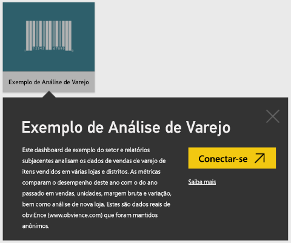
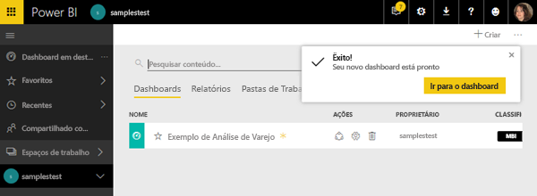
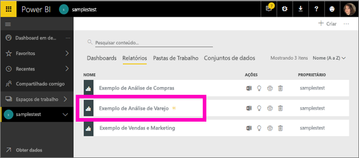
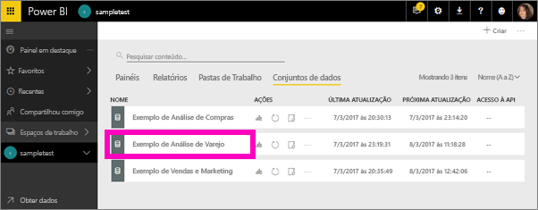
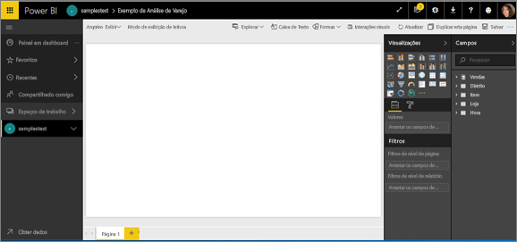

# Os exemplos do Power BI, um tutorial
<!-- Shared newnav Include -->
[!INCLUDE [newnavbydefault](./includes/newnavbydefault.md)]

Recomendamos que você comece com o artigo [Samples datasets for Power BI](sample-datasets.md) (Exemplo de conjuntos de dados para Power BI). Neste artigo, você aprenderá sobre os exemplos; como obtê-los, em que local salvá-los, como usá-los e algumas das histórias de cada um deles. Então, quando você tiver uma compreensão dos fundamentos, volte para este Tutorial.   

## Sobre este tutorial
Este tutorial ensina como importar os pacotes de conteúdo de exemplo, adicioná-los ao serviço do Power BI e abrir o conteúdo. Um *pacote de conteúdo* é um tipo de exemplo em que o conjunto de dados é fornecido em um pacote com um dashboard e um relatório. Os pacotes de conteúdo de exemplo estão disponíveis no Power BI por meio de **Obter Dados**.

> [!NOTE]
> Este tutorial se aplica ao serviço do Power BI, e não ao Power BI Desktop.
> 
> 

O pacote de conteúdo de exemplo de *Análise de Varejo* usado neste tutorial consiste em um painel, um relatório e um conjunto de dados.
Para se familiarizar com este pacote de conteúdo específico e com seu cenário, talvez você queira [fazer um tour pelo exemplo de Análise de Varejo](sample-retail-analysis.md) antes de começar.

## Obter dados (neste caso, obter um pacote de conteúdo de exemplo)
1. Abra e entre no serviço do Power BI (app.powerbi.com).
2. Selecione um espaço de trabalho e crie um novo dashboard.  
   
    
3. Nomeie-o como **Exemplo de análise de varejo**.
   
   
4. Selecione **Obter Dados** na parte inferior do painel de navegação esquerdo. Se **Obter Dados** não for exibido, expanda o painel de navegação selecionando .
   
   
5. Selecione **Exemplos**.  
   
   
6. Selecione o **Exemplo de Análise de Varejo** e escolha *Conectar*.   
   
   

## O que foi importado exatamente?
Com os pacotes de conteúdo de exemplo, quando você seleciona **Conectar**, o Power BI, na verdade, está trazendo uma cópia desse pacote de conteúdo e armazenando-a para você na nuvem. Porque a pessoa que criou o pacote de conteúdo incluiu um conjunto de dados, um relatório e um dashboard – isso é o que você obtém quando clica em **Conectar**.

1. O Power BI cria o novo dashboard e o lista na guia **Dashboards**. O asterisco amarelo permite que você saiba se ele é novo.
   
   
2. Abra a guia **Relatórios**.  Aqui você verá um novo relatório chamado *Exemplo de Análise de Varejo*.
   
   
   
   E confira a guia **Conjuntos de dados**.  Há um novo conjunto de dados também.
   
   

## Explore o novo conteúdo
Agora, explore o dashboard, o conjunto de dados e o relatório por conta própria. Há várias formas diferentes de navegar em seus dashboards, relatórios e conjuntos de dados, e apenas uma dessas várias formas está descrita abaixo.  

> [!TIP]
> Quer uma ajuda primeiro?  Experimente o [Tour pelo Exemplo de Análise de Varejo](sample-retail-analysis.md) para obter uma explicação passo a passo deste exemplo.
> 
> 

1. Volte para a guia **Dashboards** e selecione o dashboard *Exemplo de Análise de Varejo* para abri-lo.    
   
   
2. O dashboard será aberto.  Ele tem uma variedade de blocos de visualização.
   
   
3. Selecione um dos blocos para abrir o relatório subjacente.  Neste exemplo, vamos selecionar o gráfico de área (contornado em rosa na imagem anterior). O relatório é aberto na página que contém esse gráfico de área.
   
    
   
   > [!NOTE]
   > Se o bloco tivesse sido criado usando [P e R do Power BI](service-q-and-a.md), a página de P e R teria sido aberta.
   > 
   > 
4. De volta à guia **Conjuntos de dados**, você tem várias opções para explorar seu conjunto de dados.  Você não conseguirá abri-lo e ver todas as linhas e colunas (como no Power BI Desktop ou Excel).  Quando uma pessoa compartilha um pacote de conteúdo com os colegas, ela normalmente deseja compartilhar as ideias, e não fornecer acesso direto aos dados para seus colegas. Mas isso não significa que você não pode explorar o conjunto de dados.  
   
   
   
   * Uma maneira de explorar o conjunto de dados é criar suas próprias visualizações e relatórios do zero.  Selecione o ícone de gráfico  para abrir o conjunto de dados no modo de edição de relatório.
     
       
   * Outra maneira de explorar o conjunto de dados é executar os [Insights Rápidos](service-insights.md). Selecione as reticências (...) e escolha **Obter insights**. Quando os insights estiverem prontos, selecione **Exibir insights**.
     
       

## Próximas etapas
[Conceitos básicos do Power BI](service-basic-concepts.md)

[Exemplos para o serviço do Power BI](sample-datasets.md)

[Fontes de dados do Power BI](service-get-data.md)

Mais perguntas? [Experimente a Comunidade do Power BI](http://community.powerbi.com/)

