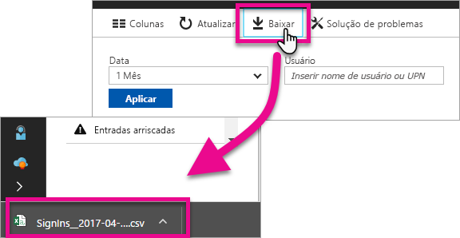

# Encontrar usuários do Power BI que entraram
Se for um administrador de locatários e quiser ver quem entrou no Power BI, você poderá usar os relatórios de acesso e uso do Azure Active Directory para ter essa visibilidade.

<iframe width="640" height="360" src="https://www.youtube.com/embed/1AVgh9w9VM8?showinfo=0" frameborder="0" allowfullscreen></iframe>

Você pode acessar o relatório de atividade no [novo](https://docs.microsoft.com/azure/active-directory/active-directory-reporting-activity-sign-ins) portal e no portal [clássico](https://docs.microsoft.com/azure/active-directory/active-directory-view-access-usage-reports) do Azure AD (Azure Active Directory). Enquanto o vídeo acima usa o portal clássico como exemplo, este artigo destacará o novo portal.

> [!NOTE]
> Este relatório de atividade inclui usuários do Power BI (Gratuito) e do Pro, mas não identifica qual licença eles têm.
> 
> 

## Requisitos
Este são os requisitos para exibir o relatório de atividade de entrada.

* Usuários com função de Administrador Global, Admin de Segurança ou Leitor de Segurança podem acessar os dados.
* Qualquer usuário (que não seja administrador) pode acessar seus próprios dados de entrada.
* Seu locatário deve ter uma licença do Azure AD Premium associada a ele para ver todo o relatório de atividade de entrada.

## Usando o portal do Azure para exibir entradas
Você pode usar o portal do Azure AD para exibir a atividade de entrada.

1. Navegue até o **portal do Azure** e selecione **Azure Active Directory**.
2. Em **Atividade**, selecione **Entradas**.
   
    
3. Filtre o aplicativo segundo **Microsoft Power BI** ou **Power BI Gateway** e selecione **Aplicar**.
   
    O **Microsoft Power BI** mostra a atividade de entrada relacionada ao serviço, enquanto o **Power BI Gateway** mostra entradas específicas para o gateway de dados local.
   
    

## Exportar os dados
Você tem duas opções para exportar os dados de entrada. Isso pode ser feito baixando um arquivo .csv ou usando o PowerShell.

### Baixar o arquivo .csv
Na tela Atividade, você pode selecionar **Baixar** na barra de ferramentas. Isso baixará um arquivo .csv com os dados filtrados no momento.

### PowerShell
Você pode usar o PowerShell para exportar os dados de entrada. Um [exemplo](https://docs.microsoft.com/azure/active-directory/active-directory-reporting-api-sign-in-activity-samples#powershell-script) está disponível na documentação do Azure AD.

> [!NOTE]
> Para que o exemplo do PowerShell funcione, siga os [pré-requisitos para acessar a API de relatório do Azure AD](https://docs.microsoft.com/en-us/azure/active-directory/active-directory-reporting-api-prerequisites).
> 
> 

## Retenção de dados
Dados relacionados às entradas podem permanecer disponíveis por até 30 dias. Para obter mais informações, consulte [Políticas de retenção de relatórios do Azure Active Directory](https://docs.microsoft.com/azure/active-directory/active-directory-reporting-retention).

## Próximas etapas
[Relatórios de atividade de entrada no portal do Azure Active Directory (novo portal)](https://docs.microsoft.com/azure/active-directory/active-directory-reporting-activity-sign-ins)  
[Exibir relatórios de acesso e uso (Portal clássico)](https://docs.microsoft.com/azure/active-directory/active-directory-view-access-usage-reports#view-or-download-a-report)  
[Script do PowerShell de exemplo de entrada](https://docs.microsoft.com/azure/active-directory/active-directory-reporting-api-sign-in-activity-samples#powershell-script)  
[Políticas de retenção de relatórios do Azure Active Directory](https://docs.microsoft.com/azure/active-directory/active-directory-reporting-retention)  
[Usando a auditoria em sua organização](service-admin-auditing.md)  
[Ativação da Avaliação Pro Estendida](service-extended-pro-trial.md)

Mais perguntas? [Experimente perguntar à Comunidade do Power BI](https://community.powerbi.com/)

