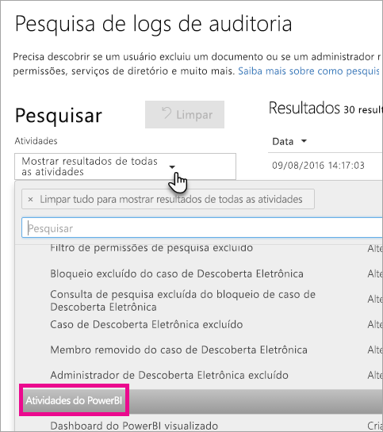
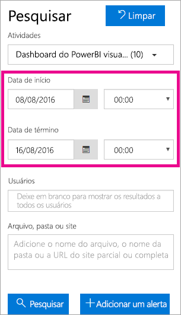
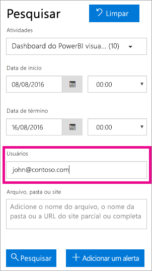

# <a name="using-auditing-within-your-organization"></a>Usando a auditoria dentro da sua organização

<iframe width="560" height="315" src="https://www.youtube.com/embed/zj4kA39jV_4?showinfo=0" frameborder="0" allowfullscreen></iframe>

Saiba como você pode usar a auditoria com o Power BI para monitorar e investigar as ações executadas. Você pode usar a Central de Segurança e Conformidade ou usar o PowerShell.

Saber quem está executando uma ação em qual item em seu locatário do Power BI pode ser essencial para ajudar a organização a atender seus requisitos, como gerenciamento de registros e conformidade regulamentar.

Você pode filtrar os dados de auditoria por intervalo de datas, usuário, dashboard, tipo de relatório, conjunto de dados e tipo de atividade. Você também pode baixar as atividades em um arquivo csv (valores separados por vírgula) para analisar offline.

> [!NOTE]
> O recurso de auditoria no Power BI está em modo de visualização e está disponível em todas as regiões de dados.

## <a name="requirements"></a>Requisitos
Você deve atender a esses requisitos para acessar logs de auditoria:

- Para acessar a seção de auditoria do Centro de Conformidade e Segurança do Office 365, você deve ter uma licença do Exchange Online (incluída nas assinaturas do Office 365 Enterprise E3 e E5).
- Você deve ser um administrador global ou ter uma função de administrador do Exchange que fornece acesso ao log de auditoria. 

  As funções de administrador do Exchange são controladas por meio do centro de administração do Exchange. Para obter mais informações, veja [Permissões no Exchange Online](https://technet.microsoft.com/library/jj200692(v=exchg.150).aspx).

- Se você tiver acesso ao log de auditoria, mas não for um administrador global ou administrador de serviço do Power BI, você não terá acesso ao portal de administração do Power BI. Nesse caso, você deve obter um link direto para o Centro de Segurança e Conformidade do Office 365.

## <a name="enabling-auditing-functionality-in-the-power-bi-admin-portal"></a>Habilitando a funcionalidade de auditoria no portal de administração do Power BI

Você precisará habilitar a auditoria para sua organização para trabalhar com os relatórios. Você pode fazer isso nas configurações do locatário do portal de administração.

1. Selecione o **ícone de engrenagem** no canto superior direito.

2. Selecione **Portal de Administração**.
   
   

3. Selecione **Configurações de locatário**.
   
   

4. Ative **Criar logs de auditoria para auditoria de atividade interna e propósitos de conformidade**.

5. Selecione **Aplicar**.

O Power BI iniciará o log de várias atividades que os usuários executam no Power BI. Os logs demoram até 48 horas para aparecer no Centro de Conformidade e Segurança do O365. Para obter mais informações sobre quais atividades são registradas, consulte [Lista de atividades auditadas pelo Power BI](#list-of-activities-audited-by-power-bi).

> [!NOTE]
> Para habilitar a auditoria para o Power BI em seu locatário, você precisa de pelo menos uma licença de caixa de correio do Exchange em seu locatário.

## <a name="accessing-your-audit-logs"></a>Acesso a logs de auditoria

Para auditar os logs do Power BI, visite o Centro de Conformidade e Segurança do O365.

1. Selecione o **ícone de engrenagem** no canto superior direito.

2. Selecione **Portal de Administração**.
   
   

3. Selecione **Logs de Auditoria**.
 
4. Selecione **Ir para o Centro de Administração do O365**.
   
   

Como alternativa, você pode navegar até [Office 365 | Segurança e Conformidade](https://protection.office.com/#/unifiedauditlog).

> [!NOTE]
> Para fornecer acesso ao log de auditoria a contas que não são de administrador, você precisará atribuir permissões no Centro de Administração do Exchange Online. Por exemplo, você pode atribuir um usuário a um grupo de função existente, como o gerenciamento de organização, ou você pode criar um novo grupo de função com a função de Logs de Auditoria. Para obter mais informações, veja [Permissões no Exchange Online](https://technet.microsoft.com/library/jj200692\(v=exchg.150\).aspx).

## <a name="search-only-power-bi-activities"></a>Pesquisar somente as atividades do Power BI

Você pode restringir os resultados para apenas as atividades do Power BI, fazendo o seguinte.

1. Na página **Pesquisa de log de auditoria**, selecione o menu suspenso **Atividades** em **Pesquisa**.

2. Selecione **Atividades do Power BI**.
   
   

3. Selecione qualquer lugar fora da caixa de seleção para fechá-la.

As pesquisas agora serão filtradas para apenas as atividades do Power BI.

## <a name="search-the-audit-logs-by-date"></a>Pesquisar os logs de auditoria por data

Você pode pesquisar os logs do intervalo de datas usando o campo "Data de início" e "Data de término". Os últimos sete dias são selecionados por padrão. A data e hora são apresentadas no formato UTC (Tempo Universal Coordenado). O intervalo de datas máximo que você pode especificar é 90 dias. Um erro será exibido se o intervalo de datas selecionado for maior que 90 dias.

> [!NOTE]
> Se você estiver usando o intervalo de datas máximo de 90 dias, selecione a hora atual para a data de início. Caso contrário, você receberá uma mensagem de erro informando que a data de início é anterior à data de término. Se você ativou a auditoria nos últimos 90 dias, o intervalo de datas máximo não pode iniciar antes da data que a auditoria foi ativada.



## <a name="search-the-audit-logs-by-users"></a>Pesquisar os logs de auditoria por usuários

Você pode procurar por entradas de log de auditoria de atividades executadas por usuários específicos. Para fazer isso, insira um ou mais nomes de usuário no campo "Usuários".  Isso seria o nome de usuário com que eles entram no Power BI. Parece um endereço de email.
Deixe esta caixa em branco para retornar as entradas para todos os usuários (e contas de serviço) em sua organização.



## <a name="viewing-search-results"></a>Exibição dos resultados da pesquisa

Depois que você pressionar o botão de pesquisa, os resultados da pesquisa são carregados e, após alguns instantes, são exibidos em Resultados. Quando a pesquisa é concluída, o número de resultados encontrados é exibido. 

> [!NOTE]
> Um máximo de 1000 eventos será exibido; se mais de 1000 eventos atendem aos critérios de pesquisa, os 1000 eventos mais recentes são exibidos.

Os resultados contêm as seguintes informações sobre cada evento retornado pela pesquisa.

| **Coluna** | **Definição** |
| --- | --- |
| Date |A data e a hora (no formato UTC) quando o evento ocorreu. |
| Endereço IP |O endereço IP do dispositivo usado quando a atividade foi registrada. O endereço IP é exibido no formato de endereço IPv4 ou IPv6. |
| Usuário |O usuário (ou a conta de serviço) que executou a ação que acionou o evento. |
| Atividade |A atividade executada pelo usuário. Esse valor corresponde às atividades que você selecionou na lista suspensa Atividades. Para um evento do log de auditoria de administrador do Exchange, o valor desta coluna é um cmdlet do Exchange. |
| Item |O objeto foi criado ou modificado como resultado da atividade correspondente. Por exemplo, o arquivo que foi exibido ou modificado ou a conta de usuário que foi atualizada. Nem todas as atividades têm um valor nesta coluna. |
| Detalhe |Detalhes adicionais sobre uma atividade. Novamente, nem todas as atividades terão um valor. |

> [!NOTE]
> Selecione um cabeçalho de coluna em Resultados para classificar os resultados. Você pode classificar os resultados de A a Z ou de Z a A. Clique no cabeçalho de Data para classificar os resultados do mais antigo ao mais recente ou do mais recente ao mais antigo.

## <a name="view-the-details-for-an-event"></a>Exibir os detalhes de um evento

Você pode exibir mais detalhes sobre um evento selecionando o registro do evento na lista de resultados da pesquisa. É exibida uma página de detalhes que contém as propriedades detalhadas do registro de evento. As propriedades exibidas dependem do serviço do Office 365 em que o evento ocorre. Para exibir detalhes adicionais, selecione **Mais informações**.

A tabela a seguir fornece detalhes sobre o que você pode ver.

| **Parâmetro ou Evento** | **Descrição** | **Detalhes adicionais** |
| --- | --- | --- |
| Relatório do Power BI baixado |Essa atividade é registrada sempre que um relatório é baixado |Nome do relatório, nome do conjunto de dados |
| Criar relatório |Essa atividade é registrada sempre que um novo relatório é criado. |Nome do relatório, nome do conjunto de dados |
| Editar Relatório |Essa atividade é registrada sempre que um relatório é editado. |Nome do relatório, nome do conjunto de dados |
| Criar conjunto de dados |Essa atividade é registrada sempre que um conjunto de dados é criado. |Nome do conjunto de dados, DataConnectivityMode |
| Excluir conjunto de dados |Essa atividade é registrada sempre que um conjunto de dados é excluído. |Nome do conjunto de dados, DataConnectivityMode |
| Criar aplicativo do Power BI |Essa atividade é registrada sempre que um aplicativo do Power BI é criado |Nome do aplicativo, Permissões, Nome do Espaço de Trabalho |
| Instalar o aplicativo Power BI |Essa atividade é registrada sempre que um aplicativo do Power BI é instalado |Nome do aplicativo |
| Atualizar aplicativo do Power BI |Essa atividade é registrada sempre que um aplicativo do Power BI é atualizado |Nome do aplicativo, Permissões, Nome do Espaço de Trabalho |
| Avaliação estendida do Power BI iniciada |Essa atividade é registrada sempre que um usuário aceita a avaliação Pro estendida, que será executada até 31 de maio de 2018 | |
| Conjunto de dados do Power BI analisado |Essa atividade é registrada sempre que um conjunto de dados do Power BI é analisado no Excel. | |
| Gateway do Power BI criado |Essa atividade é registrada sempre que um novo gateway é criado. |Nome do Gateway, Tipo de Gateway |
| Gateway do Power BI excluído |Essa atividade é registrada sempre que um gateway é excluído. |Nome do Gateway, Tipo de Gateway |
| Fonte de dados adicionada ao gateway do Power BI |Essa atividade é registrada sempre que uma fonte de dados é adicionada ao gateway |Nome do Gateway, Tipo de Gateway, Nome da Fonte de Dados, Tipo da Fonte de Dados |
| Fonte de dados removida do gateway do Power BI |Essa atividade é registrada sempre que uma fonte de dados é removida de um gateway |Nome do Gateway, Tipo de Gateway, Nome da Fonte de Dados, Tipo da Fonte de Dados |
| Administradores de gateway do Power BI alterados |Essa atividade é registrada sempre que os administradores de um gateway são alterados (adicionados/removidos) |Nome do Gateway, Usuários Adicionados, Usuários Removidos |
| Usuários da fonte de dados de gateway do Power BI alterados |Essa atividade é registrada sempre que os usuários de um gateway são alterados (adicionados/removidos) |Nome do Gateway, Usuários Adicionados, Usuários Removidos |
| SetScheduledRefresh |Essa atividade é registrada sempre que uma nova atualização está agendada para um conjunto de dados |Nome do Conjunto de Dados, Atualizar Frequência (em minutos) |

## <a name="using-powershell-to-search"></a>Usando o PowerShell para pesquisar

Você pode usar o PowerShell para acessar os logs de auditoria com base em seu logon. Isso é feito acessando o Exchange Online. Aqui está um exemplo de um comando para efetuar pull de entradas de log de auditoria do Power BI.

> [!NOTE]
> Para usar o comando New-PSSession, sua conta precisa ter uma licença do Exchange Online atribuída a ele e você precisa ter acesso ao log de auditoria do seu locatário.

```
Set-ExecutionPolicy RemoteSigned

$UserCredential = Get-Credential

$Session = New-PSSession -ConfigurationName Microsoft.Exchange -ConnectionUri https://outlook.office365.com/powershell-liveid/ -Credential $UserCredential -Authentication Basic -AllowRedirection

Import-PSSession $Session
Search-UnifiedAuditLog -StartDate 9/11/2016 -EndDate 9/15/2016 -RecordType PowerBI -ResultSize 1000 | Format-Table | More
```

Para obter mais informações sobre como se conectar ao Exchange Online, consulte [Conectar ao Exchange Online PowerShell](https://technet.microsoft.com/library/jj984289\(v=exchg.160\).aspx).

Para obter mais informações sobre parâmetros e o uso do comando Search-UnifiedAuditLog, veja [Search-UnifiedAuditLog](https://technet.microsoft.com/library/mt238501\(v=exchg.160\).aspx).

Para ver um exemplo de uso do PowerShell para pesquisar o log de auditoria e, em seguida, atribuir licenças do Power BI Pro com base em entradas, consulte [Using Power BI audit log and PowerShell to assign Power BI Pro licenses](https://powerbi.microsoft.com/blog/using-power-bi-audit-log-and-powershell-to-assign-power-bi-pro-licenses/) (Usando o log de auditoria do Power BI e o PowerShell para atribuir licenças do Power BI Pro).

## <a name="export-the-power-bi-audit-log"></a>Exportar o log de auditoria do Power BI

Você pode exportar o log de auditoria do Power BI para um arquivo csv.

1. Selecione **Exportar resultados**.

2. Selecione **Salvar resultados carregados** ou **Baixar todos os resultados**.
   
   

## <a name="record-and-user-types"></a>Tipos de usuário e de registro

Entradas de log de auditoria terão um RecordType e UserType como parte dos detalhes de cada entrada. Todas as entradas do Power BI terão um RecordType de 20.

Para obter uma lista completa, consulte [Propriedades detalhadas no log de auditoria do Office 365](https://support.office.com/article/Detailed-properties-in-the-Office-365-audit-log-ce004100-9e7f-443e-942b-9b04098fcfc3)

## <a name="list-of-activities-audited-by-power-bi"></a>Lista de atividades auditadas pelo Power BI

| Atividade | Descrição | Detalhes adicionais |
| --- | --- | --- |
| CreateDashboard |Essa atividade é registrada toda vez que um novo dashboard é criado. |– Nome do dashboard. |
| EditDashboard |Essa atividade é registrada toda vez que um novo dashboard é renomeado. |– Nome do dashboard. |
| DeleteDashboard |Essa atividade é registrada toda vez que um dashboard é excluído. |– Nome do dashboard. |
| PrintDashboard |Esse evento é registrado sempre que um dashboard é impresso. |– Nome do dashboard.<br/>– Nome do conjunto de dados |
| ShareDashboard |Essa atividade é registrada toda vez que um dashboard é compartilhado. |– Nome do dashboard.<br/>– Email do destinatário.<br/>– Nome do conjunto de dados.<br>– Compartilhar novamente as permissões. |
| ViewDashboard |Essa atividade é registrada toda vez que um dashboard é exibido. |– Nome do dashboard. |
| ExportTile |Esse evento é registrado sempre que dados são exportados de um bloco de dashboard. |– Nome do bloco.<br/>– Nome do conjunto de dados. |
| DeleteReport |Essa atividade é registrada toda vez que um relatório é excluído. |– Nome do relatório. |
| ExportReport |Esse evento é registrado sempre que dados são exportados de um bloco de relatório. |– Nome do relatório.<br/>– Nome do conjunto de dados. |
| PrintReport |Esse evento é registrado sempre que um relatório é impresso. |– Nome do relatório.<br/>– Nome do conjunto de dados. |
| PublishToWebReport |Esse evento é registrado sempre que um relatório é publicado na Web. |– Nome do Relatório.<br/>– Nome do conjunto de dados. |
| ViewReport |Essa atividade é registrada toda vez que um relatório é exibido. |– Nome do relatório. |
| ExploreDataset |Esse evento é registrado sempre que você explora um conjunto de dados selecionando-o. |– Nome do conjunto de dados |
| DeleteDataset |Esse evento é registrado sempre que um conjunto de dados é excluído. |– Nome do conjunto de dados. |
| CreateOrgApp |Essa atividade é registrada toda vez que um pacote de conteúdo organizacional é criado. |– Nome do Pacote de Conteúdo Organizacional.<br/>– Nomes de dashboard.<br/>– Nomes do relatório.<br/>– Nomes do conjunto de dados. |
| CreateGroup |Essa atividade é acionada sempre que um grupo é criado. |– Nome do grupo. |
| AddGroupMembers |Essa atividade é registrada toda vez que um membro é adicionado a um espaço de trabalho de grupo do Power BI. |– Nome do grupo.<br/>– Endereços de email. |
| UpdatedAdminFeatureSwitch |Esse evento é registrado sempre que um comutador de recurso de administração é alterado. |– Nome do comutador.<br/>– Novo estado do comutador. |
| OptInForProTrial |Esse evento é registrado quando um usuário decide experimentar o Power BI Pro no serviço. |- endereço de email |

## <a name="next-steps"></a>Próximas etapas

[Portal de administração do Power BI](service-admin-portal.md)  
[Power BI Premium – o que é?](service-premium.md)  
[Compra do Power BI Pro](service-admin-purchasing-power-bi-pro.md)  
[Permissões no Exchange Online](https://technet.microsoft.com/library/jj200692\(v=exchg.150\).aspx)  
[Conectar-se ao Exchange Online PowerShell](https://technet.microsoft.com/library/jj984289\(v=exchg.160\).aspx)  
[Search-UnifiedAuditLog](https://technet.microsoft.com/library/mt238501\(v=exchg.160\).aspx)  
[Propriedades detalhadas no log de auditoria do Office 365](https://support.office.com/article/Detailed-properties-in-the-Office-365-audit-log-ce004100-9e7f-443e-942b-9b04098fcfc3)  

Mais perguntas? [Experimente perguntar à Comunidade do Power BI](http://community.powerbi.com/)