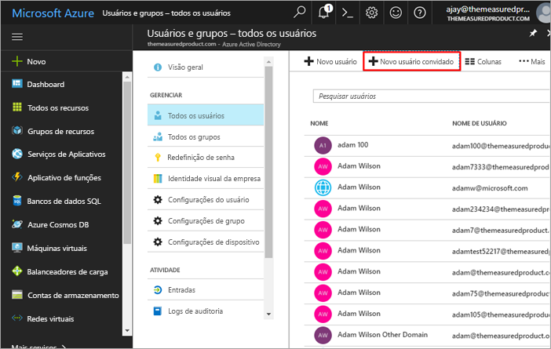
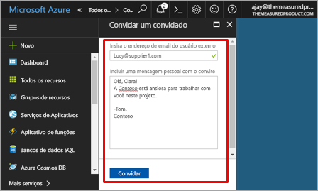
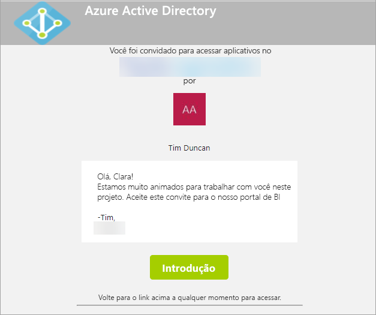
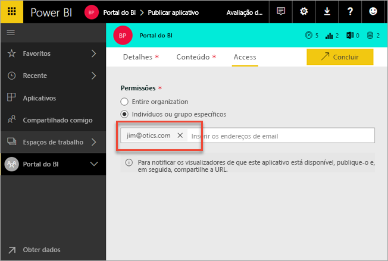
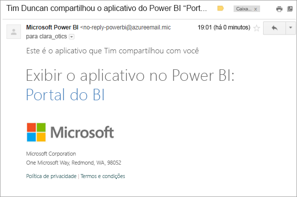
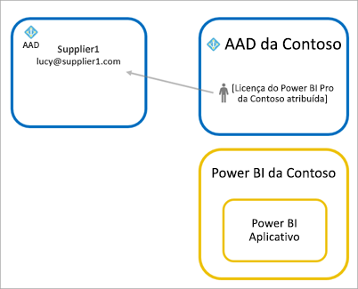

# Distribuir o conteúdo do Power BI para usuários convidados externo com o Azure AD B2B

O Power BI integra-se ao Azure AD B2B (Azure Active Directory Business-to-Business) para permitir distribuição segura do conteúdo do Power BI aos usuários convidados fora da organização, enquanto ainda mantém controle sobre os dados internos.

> [!VIDEO https://www.youtube.com/embed/xxQWEQ1NnlY]

> [!NOTE]
> Você precisa **Habilitar** o recurso [Configurações de exportação e compartilhamento](service-admin-portal.md#export-and-sharing-settings) nas configurações de Locatário do portal do administrador do Power BI antes de convidar usuários.

> [!NOTE]
> Este recurso não está disponível atualmente com os aplicativos móveis do Power BI. Em um dispositivo móvel, é possível exibir o conteúdo do Power BI compartilhado usando B2B do Azure AD em um navegador. 

## Que você pode convidar?

Você pode convidar usuários que usam qualquer endereço de email, incluindo contas pessoais como gmail.com, outlook.com ou hotmail.com. Elas são chamadas de "IDs Sociais" no Azure B2B. Para obter mais informações, consulte [Azure B2B](https://docs.microsoft.com/azure/active-directory/active-directory-b2b-what-is-azure-ad-b2b).

## Convidar usuários convidados

Há duas maneiras de convidar usuários convidados ao seu locatário do Power BI: convites planejados ou convites ad-hoc. Convites são necessários apenas na primeira vez que um usuário externo é convidado para sua organização.

### Convites planejados

Um convite planejado é executado dentro do Portal do Microsoft Azure no Azure AD ou usando o PowerShell. Essa é a opção a ser usada caso você saiba quais usuários devem ser convidados. 

**A criação de usuários convidados no portal do Azure AD requer que você seja um administrador locatário.**

1. Navegue até o [Portal do Azure](https://portal.azure.com) e selecione **Azure Active Directory**.

2. Navegue em **Usuários e grupos** > **Todos os usuários** > **Novo usuário convidado**.

    

3. Insira **endereço de email** e **mensagem pessoal**.

    

4. Selecione **Convidar**.

Para convidar mais de um usuário convidado, use o PowerShell. Para obter mais informações, consulte [Amostras do código de colaboração e do PowerShell no Azure Active Directory B2B](https://docs.microsoft.com/azure/active-directory/b2b/code-samples).

O usuário convidado precisa selecionar **Introdução** no convite que recebeu por email. O usuário convidado é adicionado ao locatário.

### Convites ad hoc

Para fazer um convite em qualquer momento, adicione o usuário externo ao dashboard ou relatório por meio da interface do usuário de compartilhamento, ou em seu aplicativo, por meio da página de acesso.

Aqui está um exemplo de como convidar um usuário externo para usar um aplicativo.

O usuário convidado receberá um email indicando que o aplicativo foi compartilhado com ele.

O usuário convidado deverá entrar com o endereço de email da organização. Será necessário aceitar o convite depois de entrar. Depois de entrar, o usuário convidado é redirecionado para o conteúdo do aplicativo. Para retornar ao aplicativo, marque o link ou salve o email.

## Licenças

O usuário convidado precisará ter o licenciamento correto em vigor para exibir o aplicativo compartilhado. Para isso, há três opções.

### Usar o Power BI Premium

A atribuição do espaço de trabalho do aplicativo à capacidade do Power BI Premium permitirá que o usuário convidado use o aplicativo sem necessidade de uma licença do Power BI Pro. O Power BI Premium também permite que aplicativos aproveitem outros recursos, como taxas mais altas de atualização, capacidade dedicada e tamanhos grandes de modelos.

### Atribuir licença do Power BI Pro ao usuário convidado

A atribuição de uma licença do Power BI Pro ao usuário convidado, dentro do locatário, permite que o usuário convidado veja o conteúdo.

> [!NOTE]
> Uma licença do Power BI Pro do seu locatário só se aplica a usuários convidados quando eles acessam o conteúdo em seu locatário.

### O usuário convidado traz a própria licença do Power BI Pro

O usuário convidado já tem uma licença do Power BI Pro atribuída em seu locatário.

## Considerações e limitações

* Ao convidar usuários que estão usando contas de email pessoal, como gmail.com, outlook.com ou hotmail.com, use este [vídeo inserido](https://docs.microsoft.com/azure/active-directory/active-directory-b2b-redemption-experience) de exemplo, que explica como um usuário faria para se inscrever.
* Convidados de B2B externos são limitados somente para consumo de conteúdo. Convidados de B2B externos podem exibir aplicativos, dashboards, relatórios, exportar dados e criar assinaturas de email para dashboards e relatórios. Eles não podem acessar os espaços de trabalho ou publicar seu próprio conteúdo.
* Este recurso não está disponível atualmente com os aplicativos móveis do Power BI. Em um dispositivo móvel, é possível exibir o conteúdo do Power BI compartilhado usando B2B do Azure AD em um navegador.
* Este recurso não está disponível atualmente com a web part de relatório do Power BI para o SharePoint Online.

## Próximas etapas

Para obter mais informações, incluindo sobre como funciona a segurança de linha, confira o [white paper](https://aka.ms/powerbi-b2b-whitepaper).

Para obter informações sobre o Azure Active Directory B2B, consulte [O que é a colaboração Azure AD B2B?](https://docs.microsoft.com/azure/active-directory/active-directory-b2b-what-is-azure-ad-b2b)
