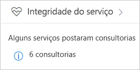

# Controlar a integridade do serviço do Power BI no Office 365

O Centro de administração do Office 365 fornece ferramentas importantes para administradores do Power BI, incluindo informações atuais e históricas sobre a integridade do serviço. Para acessar essas informações, você precisa ter uma das seguintes funções: Administrador de Serviço do Power BI ou Administrador Global do Office 365. Para obter mais informações sobre as funções, confira [Funções de administrador relacionadas ao Power BI](service-admin-administering-power-bi-in-your-organization.md#administrator-roles-related-to-power-bi).

1. Conecte-se ao [Centro de administração do Office 365](https://portal.office.com/adminportal).

2. Selecione o bloco **Integridade do serviço**.

    

3. Na lista atual, selecione **Avisos N** ou **Incidentes N** e examine os resultados. Na imagem abaixo, você vê um dos três avisos ativos.

    

4. Para ver mais informações, selecione **Mostrar detalhes** em um item. Na imagem abaixo, você vê detalhes adicionais, incluindo atualizações de status recentes.

    

    Role para baixo para ver mais informações e feche o painel quando tiver terminado.

5. Para ver informações de histórico em todos os serviços, no canto superior direito da lista principal, selecione **Exibir histórico**. Em seguida, selecione **Últimos 7 dias** ou **Últimos 30 dias**. Para retornar à integridade do serviço atual, selecione **Exibir status atual**.