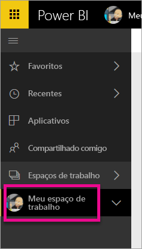
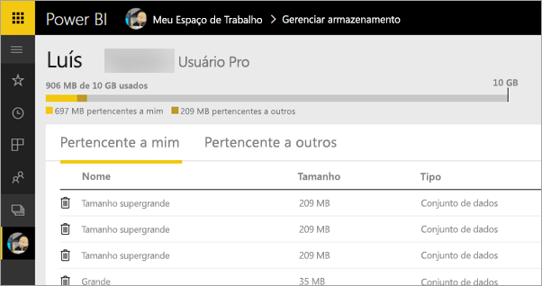
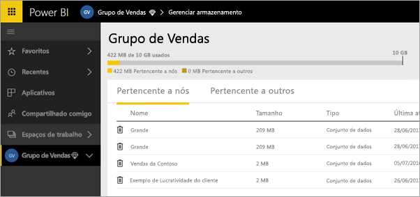
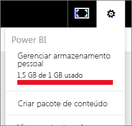

# Gerenciar o armazenamento de dados
Saiba como você pode gerenciar seu armazenamento de dados ou seu espaço de trabalho do aplicativo individual para garantir que você pode continuar publicando relatórios e conjuntos de dados.

Os usuários e os espaços de trabalho do aplicativo têm suas próprias capacidades de dados

* Os usuários Gratuito e Pro têm um armazenamento de dados máximo de 10 GB.
* Os usuários Pro podem criar espaços de trabalho do aplicativo, com um armazenamento de dados máximo de 10 GB cada um.

No nível do locatário, o uso total não pode exceder 10 GB por usuário Pro em todos os usuários Pro e espaços de trabalho do aplicativo no locatário.

Leia sobre outros recursos do [modelo de preços do Power BI](https://powerbi.microsoft.com/pricing).

No armazenamento de dados estão incluídos seus próprios conjuntos de dados e relatórios do Excel e aqueles que alguém compartilhou com você. Os conjuntos de dados são qualquer uma das fontes de dados que você carregou ou com as quais está conectado, inclusive os arquivos do Power BI Desktop e as pastas de trabalho do Excel que você está usando. O exemplo a seguir também está incluído em sua capacidade de dados.

* Intervalos do Excel fixados no painel.
* Visualizações locais do Reporting Services fixadas em um painel do Power BI.
* Imagens carregadas.

O tamanho de um dashboard que você compartilhar varia dependendo do que é fixado a ele. Por exemplo, se você fixar itens de dois relatórios que fazem parte de dois conjuntos de dados diferentes, o tamanho incluirá os dois conjuntos de dados.

<a name="manage"/>

## Gerenciar itens pertencentes a você
Veja a quantidade de armazenamento de dados que você está usando em sua conta do Power BI e gerencie sua conta.

1. Para gerenciar seu próprio armazenamento, acesse **Meu Espaço de Trabalho** no painel de navegação à esquerda.
   
    
2. Selecione o ícone de engrenagem  no canto superior direito \> **Gerenciar armazenamento pessoal**.
   
    A barra superior mostra o limite de armazenamento que você usou.
   
    
   
    Os conjuntos de dados e os relatórios são separados em duas guias:
   
    **Pertencentes a mim:** são relatórios e conjuntos de dados que você carregou na sua conta do Power BI, inclusive conjuntos de dados de serviço, como Salesforce e Dynamics CRM.  
    **Pertencentes a terceiros:** outras pessoas que compartilharam esses relatórios e conjuntos de dados com você.
3. Para excluir um conjunto de dados ou um relatório, selecione o ícone de lixeira .

Tenha em mente que você ou outra pessoa pode ter relatórios e painéis com base em um conjunto de dados. Se você excluir o conjunto de dados, os relatórios e painéis de controle não funcionarão mais.

## Gerenciar o espaço de trabalho do aplicativo
1. Selecione a seta ao lado de **Espaços de Trabalho** \> selecione o nome do espaço de trabalho do aplicativo.
   
    
2. Selecione o ícone de engrenagem  no canto superior direito \> **Gerenciar armazenamento de grupo**.
   
    A barra superior mostra o limite de armazenamento de grupo que você usou.
   
    
   
    Os conjuntos de dados e os relatórios são separados em duas guias:
   
    **Pertencentes a nós:** são relatórios e conjuntos de dados que você ou outra pessoa carregou na conta do Power BI do grupo, inclusive conjuntos de dados de serviço, como Salesforce e Dynamics CRM.
    **Pertencentes a terceiros:** outras pessoas que compartilharam esses relatórios e conjuntos de dados com seu grupo.
3. Para excluir um conjunto de dados ou um relatório, selecione o ícone de lixeira .
   
   > [!NOTE]
   > Qualquer membro, com permissões de edição, de um espaço de trabalho do aplicativo tem permissões para excluir conjuntos de dados e relatórios do espaço de trabalho do aplicativo.
   > 
   > 

Tenha em mente que você ou outra pessoa do grupo pode ter relatórios e painéis com base em um conjunto de dados. Se você excluir o conjunto de dados, os relatórios e painéis de controle não funcionarão mais.

## Limites de conjunto de dados
Há um limite de 1 GB por conjunto de dados que é importado para o Power BI. Se você optou por manter a experiência do Excel, em vez de importar os dados, você será limitado até 250 MB para o conjunto de dados.

## O que acontece quando você atinge um limite
Quando você atinge o limite da capacidade de dados do que você pode fazer, você verá avisos dentro do serviço. 

Quando você seleciona o ícone de engrenagem , você verá uma barra vermelha indicando que você está acima do limite da capacidade de dados.

Você também verá isso indicado em **Gerenciar armazenamento pessoal**.

 

 Quando você tenta executar uma ação que atingirá um dos limites, você verá um aviso indicando que você está acima do limite. Você poderá [gerenciar](#manage) seu armazenamento para reduzir a quantidade de armazenamento e ultrapassar o limite.

 

 Mais perguntas? [Experimente perguntar à Comunidade do Power BI](http://community.powerbi.com/)

