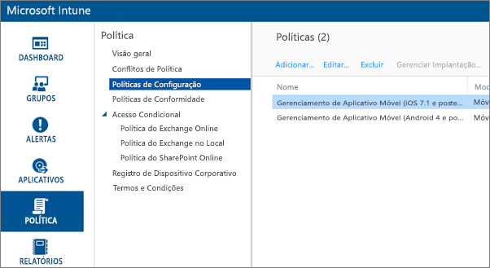
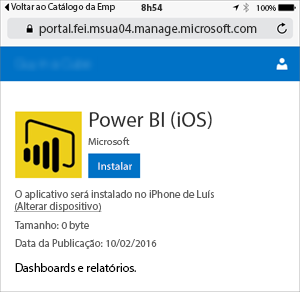

# Configurar aplicativos móveis com o Microsoft Intune
O Microsoft Intune permite que as organizações gerenciem dispositivos e aplicativos. Os aplicativos móveis do Power BI, para iOS e Android, se integram com o Intune para permitir que você gerencie o aplicativo em seus dispositivos e controle a segurança. Por meio de políticas de configuração, você pode controlar itens, como exigir um PIN de acesso, controlar como os dados são manipulados pelo aplicativo e até mesmo criptografar dados de aplicativo quando ele não estiver em uso.

<iframe width="560" height="315" src="https://www.youtube.com/embed/9HF-qsdQvHw?list=PLv2BtOtLblH1nPVPU2etFzTNmpz49dwXm" frameborder="0" allowfullscreen></iframe>

## Configuração geral de gerenciamento de dispositivo móvel
Este artigo não serve como guia de configuração completo para o Microsoft Intune. Se você estiver fazendo a integração com o Intune somente agora, há algumas coisas que talvez você queira se certificar de ter configurado. [Saiba mais](https://technet.microsoft.com/library/jj676587.aspx)

O Microsoft Intune pode coexistir com o MDM (Gerenciamento de Dispositivo Móvel) no Office 365. [Saiba mais](https://blogs.technet.microsoft.com/configmgrdogs/2016/01/04/microsoft-intune-co-existence-with-mdm-for-office-365/)

Este artigo pressupõe que o Intune está configurado corretamente e que você tem dispositivos registrados com o Intune. Se estiver coexistindo com o MDM, o dispositivo será exibido como registrado no MDM, mas estará disponível para gerenciar no Intune.

> [!NOTE]
> Depois que a organização tiver configurado o Microsoft Intune MAM, se você usar o aplicativo móvel do Power BI em um dispositivo iOS ou Android, a atualização de dados em segundo plano será desligada. Na próxima vez que você entrar no aplicativo, o Power BI atualiza os dados do serviço do Power BI na Web.
> 
> 

## Etapa 1: obter a URL do aplicativo
Antes de criar o aplicativo no Intune, precisamos obter as URLs para os aplicativos. Para iOS, elas serão obtidas pelo iTunes. Para o Android, você pode obtê-las no página móvel do Power BI.

Salve a URL, pois você precisará dela durante a criação do aplicativo.

### iOS
Para obter a URL do aplicativo para iOS, precisaremos obtê-la no iTunes.

1. Abra o iTunes.
2. Pesquise o *Power BI*.
3. Você deve ver o **Microsoft Power BI** relacionado nos **Aplicativos iPhone** e **Aplicativos iPad**. Você pode usar qualquer um, visto que receberá a mesma URL.
4. Selecione o menu suspenso **Obter** e depois **Copiar link**.
   
    

Ela deve ser semelhante à seguinte.

    https://itunes.apple.com/us/app/microsoft-power-bi/id929738808?mt=8

### Android
É possível obter a URL para o Google Play na [página móvel do Power BI](https://powerbi.microsoft.com/mobile/). Clicar no ícone **Baixar do Google Play** levará você para a página do aplicativo. Você pode copiar a URL da barra de endereços do navegador. Ela deve ser semelhante à seguinte.

    https://play.google.com/store/apps/details?id=com.microsoft.powerbim

## Etapa 2: criar uma política de gerenciamento de aplicativos móveis
A política de gerenciamento de aplicativos móveis permite que você imponha itens, como um PIN de acesso. Você pode criar um no portal do Intune. 

Você pode criar o aplicativo ou a política primeiro. Não importa a ordem que eles são adicionados. É necessário apenas que ambos existam para a etapa de implantação.

1. Selecione **Política** > **Políticas de Configuração**
   
    
2. Selecione **Adicionar...**.
3. Em **Software** , você pode selecionar o Gerenciamento de aplicativos móveis para Android ou iOS. Para começar rapidamente, você pode selecionar **Criar uma política com as configurações recomendadas**, ou você pode criar uma política personalizada.
4. Edite a política para configurar as restrições desejadas no aplicativo.

## Etapa 3: criar o aplicativo
O aplicativo é uma referência, ou pacote, que é salvo no Intune para implantação. Precisaremos criar um aplicativo e fazer referência à URL do aplicativo que obtivemos do Google Play ou iTunes.

Você pode criar o aplicativo ou a política primeiro. Não importa a ordem que eles são adicionados. É necessário apenas que ambos existam para a etapa de implantação.

1. Acesse o portal Intune e selecione **Aplicativos** no menu à esquerda.
2. Selecione **Adicionar aplicativo**. Isso inicializará o aplicativo **Adicionar Software** .

### iOS
1. Selecione o **aplicativo iOS gerenciado da App Store** na lista suspensa.
2. Insira a URL do aplicativo obtida na [Etapa 1](#step-1-get-the-url-for-the-application) e selecione **Avançar**.
   
    
3. Forneça um **Editor**, um **Nome** e uma **Descrição**. Como alternativa, você pode fornecer um **Ícone**. A **Categoria** se refere ao aplicativo do Portal da Empresa. Ao terminar, selecione **Avançar**.
4. Você pode decidir se deseja publicar o aplicativo como **Qualquer** (padrão), **iPad** ou **iPhone**. Por padrão, ele mostrará **Qualquer** e funcionará para ambos os tipos de dispositivo. O aplicativo Power BI utiliza a mesma URL para o iPhone e o iPad. Selecione **Avançar**.
5. Selecione **Carregar**.

> [!NOTE]
> Você só poderá vê-lo na lista de aplicativos depois de atualizar a página. Você pode clicar em **Visão geral** e voltar para **Aplicativos** para recarregar a página.
> 
> 

### Android
1. Selecione **Link Externo** na lista suspensa.
2. Insira a URL do aplicativo obtida na [Etapa 1](#step-1-get-the-url-for-the-application) e selecione **Avançar**.
   
    
3. Forneça um **Editor**, um **Nome** e uma **Descrição**. Como alternativa, você pode fornecer um **Ícone**. A **Categoria** se refere ao aplicativo do Portal da Empresa. Ao terminar, selecione **Avançar**.
4. Selecione **Carregar**.

> [!NOTE]
> Você só poderá vê-lo na lista de aplicativos depois de atualizar a página. Você pode clicar em **Visão geral** e voltar para **Aplicativos** para recarregar a página.
> 
> 

## Etapa 4: implantar o aplicativo
Depois de ter adicionado o aplicativo, você precisará implantá-lo para que ele esteja disponível aos usuários finais. Esta é a etapa em que você associará a política criada com o aplicativo.

### iOS
1. Na tela de aplicativos, selecione o aplicativo que você criou. Selecione o link **Gerenciar implantação…** .
   
    
2. Na tela **Selecionar Grupos** , você pode escolher em quais grupos deseja implantar esse aplicativo. Selecione **Avançar**.
3. Na tela **Ação de Implantação** , você pode escolher como deseja implantar esse aplicativo. Ao selecionar **Instalação Disponível**ou **Instalação Obrigatória**, o aplicativo será disponibilizado no Portal da Empresa para que os usuários instalem sob demanda. Ao terminar de fazer sua escolha, selecione **Avançar**.
   
    
4. Na tela **Gerenciamento de Aplicativo Móvel**, é possível selecionar a política de Gerenciamento de Aplicativo Móvel criada na [Etapa 2](#step-2-create-a-mobile-application-management-policy). O padrão será a política que você criou, se for a única política iOS disponível. Selecione **Avançar**.
   
    
5. Na tela **Perfil VPN** , você pode selecionar uma política, se tiver uma para sua organização. O padrão é **Nenhum**. Selecione **Avançar**.
6. Na tela **Configuração de Aplicativo Móvel** , você pode selecionar uma **Política de Configuração do Aplicativo** , se tiver criado uma. O padrão é **Nenhum**. Isso não é necessário. Selecione **Concluir**.

Depois que você implantou o aplicativo, ele deverá mostrar **Sim** para a opção Implantado, na página de aplicativos.

### Android
1. Na tela de aplicativos, selecione o aplicativo que você criou. Selecione o link **Gerenciar implantação…** .
   
    
2. Na tela **Selecionar Grupos** , você pode escolher em quais grupos deseja implantar esse aplicativo. Selecione **Avançar**.
3. Na tela **Ação de Implantação** , você pode escolher como deseja implantar esse aplicativo. Ao selecionar **Instalação Disponível**ou **Instalação Obrigatória**, o aplicativo será disponibilizado no Portal da Empresa para que os usuários instalem sob demanda. Ao terminar de fazer sua escolha, selecione **Avançar**.
   
    
4. Na tela **Gerenciamento de Aplicativo Móvel**, é possível selecionar a política de Gerenciamento de Aplicativo Móvel criada na [Etapa 2](#step-2-create-a-mobile-application-management-policy). O padrão será a política que você criou, se for a única política Android disponível. Selecione **Concluir**.
   
    

Depois que você implantou o aplicativo, ele deverá mostrar **Sim** para a opção Implantado, na página de aplicativos.

## Etapa 5: instalar o aplicativo em um dispositivo
Você instalará o aplicativo por meio do aplicativo Portal da Empresa. Se você ainda não instalou o Portal da Empresa, você pode obtê-lo por meio da loja de aplicativos nas plataformas Android ou iOS. Você entrará no Portal da Empresa com o logon corporativo.

1. Abra o aplicativo Portal da Empresa.
2. Se você não vir o aplicativo Power BI relacionado como um aplicativo em destaque, selecione **Aplicativos da Empresa**.
   
    
3. Selecione o aplicativo Power BI que você implantou.
   
    
4. Selecione **Instalar**.
   
    
5. Se estiver no iOS, ele enviará o aplicativo por push para você. Selecione **Instalar** na caixa de diálogo de envio por push.
   
    

Após a instalação, você verá que ele é **gerenciado por sua empresa**. Se você habilitar o acesso com um PIN, na política, você verá o seguinte.

## Próximas etapas
[Configurar e implantar políticas de gerenciamento de aplicativos móveis no console do Microsoft Intune](https://technet.microsoft.com/library/dn878026.aspx)  
[Aplicativos do Power BI para dispositivos móveis](mobile-apps-for-mobile-devices.md)  

Mais perguntas? [Experimente perguntar à Comunidade do Power BI](http://community.powerbi.com/)

