# Portal de administração do Power BI

O portal de administração permite o gerenciamento de locatário do Power BI em sua organização. Inclui itens como métricas de uso, o acesso ao centro de administração do Office 365 e configurações.

O Gerenciamento de locatário do Power BI para sua empresa é feito por meio do portal de administração do Power BI. O portal de administração é acessível a todos os usuários que são administradores globais no Office 365 ou que receberam a função de administrador de serviços do Power BI. Para obter mais informações sobre a função de administrador de serviços do Power BI, consulte [Noções básicas sobre a função de administrador do Power BI](service-admin-role.md).

Todos os usuários verão **Portal de administração** no ícone de engrenagem. Se não forem administradores, eles verão apenas a seção **Configurações Premium** e verão somente as capacidades que têm direitos para gerenciar.

## Como obter o portal de administração

Sua conta deve ser marcada como **Administrador Global** no Office 365 ou no Azure Active Directory ou ter recebido a função de administrador de serviços do Power BI, para obter acesso ao portal de administração do Power BI. Para obter mais informações sobre a função de administrador de serviços do Power BI, consulte [Noções básicas sobre a função de administrador do Power BI](service-admin-role.md). Para acessar o portal de administração do Power BI, faça o seguinte:

1. Selecione a engrenagem de configurações na parte superior direita do serviço do Power BI.
2. Selecione **Portal de Administração**.

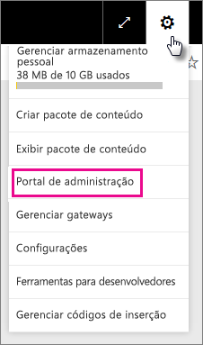

No portal, há cinco guias. Elas estão descritas abaixo.

* [Métricas de uso](#usage-metrics)
* [Usuários](#users)
* [Logs de auditoria](#audit-logs)
* [Configurações de locatário](#tenant-settings)
* [Configurações Premium](#premium-settings)
* [Códigos de inserção](#embed-codes)

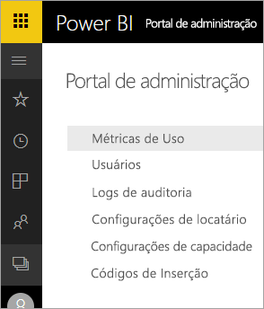

## Métricas de uso
A primeira guia, no portal de administração, é **Métricas de uso**. O relatório de métricas de uso permite monitorar o uso no Power BI para sua organização. Ele também fornece a capacidade de ver quais usuários e grupos são mais ativos no Power BI para sua organização.

> [!NOTE]
> Na primeira vez que acessar o dashboard ou depois de visitar novamente após um longo período de não exibição do dashboard, você provavelmente encontrará uma tela de carregamento enquanto carregamos o dashboard.

Quando o painel for carregado, você encontrará suas seções de blocos. A primeira seção inclui dados de uso para usuários individuais e a segunda seção tem informações semelhantes para grupos em sua organização.

Aqui está uma análise do que você vê em cada bloco:

* Contagem distinta de todos os painéis, relatórios e conjuntos de dados no espaço de trabalho do usuário
  
    

* Painel mais consumido pelo número de usuários que podem acessá-lo. Por exemplo, se você tem um painel que compartilhou com 3 usuários e também o adiciona a um pacote de conteúdo com dois usuários conectados a ele, sua contagem é 6 (1 + 3 + 2)
  
    

* Os conteúdo mais populares aos quais os usuários estão conectados. Isso pode ser qualquer coisa que os usuários podem acessar através do processo Obter Dados, portanto, pacotes de conteúdo SaaS, pacotes de conteúdo organizacional, arquivos ou bancos de dados de conteúdo.
  
    

* Uma exibição de seus principais usuários sobre quantos painéis eles têm, incluindo painéis criados por eles mesmos e painéis compartilhados com eles.
  
    

* Uma exibição de seus principais usuários com base em quantos relatórios eles têm
  
    

A segunda seção mostra o mesmo tipo de informação, mas com base em grupos. Isso permitirá que você veja quais grupos em sua organização são mais ativos e quais tipos de informações eles estão usando.

Com essas informações, você poderá obter informações reais de como as pessoas estão usando o Power BI em toda a organização e ser capaz de reconhecer esses usuários e grupos, que são muito ativos na sua organização.

## Usuários

A segunda guia, no portal de administração, **Gerenciar usuários**. Gerenciamento de usuário, para o Power BI, é feito no centro de administração do Office 365, esta seção permite que você chegue rapidamente à área para gerenciar usuários, administradores e grupos no Office 365.

Quando você clicar em **Ir para o Centro de Administração do O365**, vá diretamente para a página de aterrissagem do centro de administração do Office 365 para gerenciar os usuários do seu locatário.

## Logs de auditoria

A terceira guia, no portal de administração, é **Logs de auditoria**. Os logs estão localizados no Centro de Conformidade e Segurança do Office 365. Esta seção permite acessar rapidamente essa área no Office 365. 

Para obter mais informações sobre logs de auditoria, consulte [Auditoria do Power BI em sua organização](service-admin-auditing.md)

## Configurações de locatário

A terceira guia, no portal de administração, é **Configurações de locatário**. As configurações de locatário oferecem mais controle sobre quais recursos são disponibilizados para sua organização. Se você tiver dúvidas relacionadas a dados confidenciais, alguns dos nossos recursos poderão não ser adequados para sua organização, ou talvez você queira apenas que um determinado recurso esteja disponível para um grupo específico. Se esse for o caso, você pode desativá-lo em seu locatário.

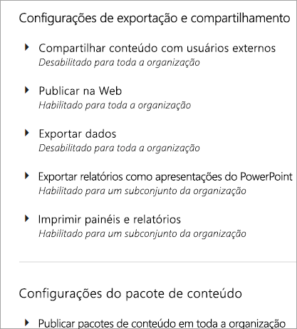

> [!NOTE]
> Pode levar até 10 minutos para que a configuração entre em vigor para todos em seu locatário.

As configurações podem ter três estados com base nas configurações que você forneceu.

### Desabilitado para toda a organização

Você pode desabilitar um recurso e fazer isso de forma que os usuários não poderão usá-lo.

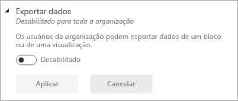

### Habilitado para toda a organização

Você pode habilitar um recurso para toda a organização, o que permitirá que todos os usuários tenham acesso a esse recurso.

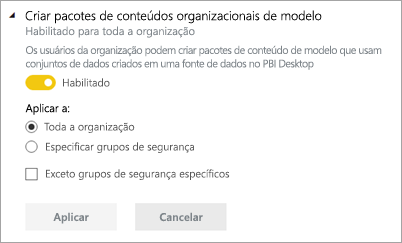

### Habilitado para um subconjunto da organização

Você também pode habilitar um recurso para uma parte de sua organização. Isso pode ocorrer de algumas formas diferentes. Você pode habilitá-lo para toda a organização, exceto para um grupo específico de usuários.

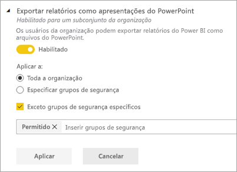

Você também pode habilitar o recurso apenas para um grupo específico de usuários e também desabilitá-lo para um grupo de usuários. Isso garantiria que determinados usuários não tivessem acesso ao recurso, mesmo se estivessem no grupo permitido.

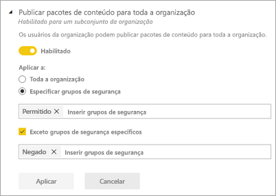

## Configurações de exportação e compartilhamento

### Compartilhar conteúdo com usuários externos

Os usuários da organização podem compartilhar dashboards com usuários fora da organização.

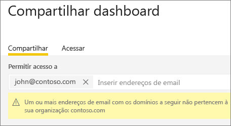

### Publicar na Web

Os usuários na organização podem publicar relatórios na Web. [Saiba mais](service-publish-to-web.md)

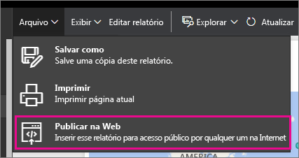

Os usuários verão diferentes opções na interface do usuário conforme a configuração de Publicar na Web.

|Recurso |Habilitado para toda a organização |Desabilitado para toda a organização |Especificar grupos de segurança   |
|---------|---------|---------|---------|
|**Publicar na Web** no menu **Arquivo** do relatório.|Habilitado para todos|Não visível para todos|Visível somente para usuários ou grupos autorizados.|
|**Gerenciar códigos de inserção** em **Configurações**|Habilitado para todos|Habilitado para todos|Habilitado para todos  Opção * **Excluir** somente para usuários ou grupos autorizados. * **Obter códigos** habilitados para todos.|
|**Códigos de inserção** no portal de administração|O status refletirá o seguinte: * Ativo * Sem suporte * Bloqueado|O status exibirá **Desabilitado**|O status refletirá o seguinte: * Ativo * Sem suporte * Bloqueado  Se um usuário não estiver autorizado conforme a configuração do locatário, o status exibirá **violado**.|
|Relatórios publicados existentes|Tudo habilitado|Tudo desabilitado|Os relatórios continuam a ser renderizados para todos.|

### Exportar dados

Os usuários na organização podem exportar dados de um bloco ou visualização. [Saiba mais](power-bi-visualization-export-data.md)

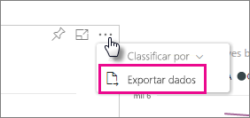

> [!NOTE]
> Desabilitar a opção **Exportar dados** também impedirá os usuários de usar o recurso **Analisar no Excel**, bem como de usar a conexão dinâmica do serviço do Power BI.

### Exportar relatórios como apresentações do PowerPoint

Os usuários na organização podem exportar relatórios do Power BI como arquivos do PowerPoint. [Saiba mais](service-publish-to-powerpoint.md)

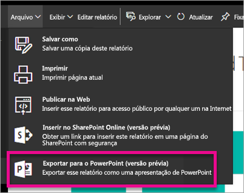

### Imprimir dashboards e relatórios

Os usuários na organização podem imprimir dashboards e relatórios. [Saiba mais](service-print.md)

## Configurações do pacote de conteúdo

### Publicar pacotes de conteúdo em toda a organização

Os usuários na organização podem publicar pacotes de conteúdo em toda a organização.

### Criar pacotes de conteúdos organizacionais de modelo

Os usuários na organização podem criar pacotes de conteúdo de modelo que usam conjuntos de dados criados em uma fonte de dados no Power BI Desktop.

## Configurações de integração

### Faça perguntas sobre dados usando a Cortana
Os usuários na organização podem fazer perguntas sobre seus dados usando a Cortana.

> [!NOTE]
> Essa configuração se aplica a toda a organização e não pode ser limitada a grupos específicos.

### Usar a opção Analisar no Excel com conjuntos de dados locais
Os usuários na organização podem usar o Excel para exibir e interagir com conjuntos de dados locais do Power BI. [Saiba mais](service-analyze-in-excel.md)

> [!NOTE]
> Ao desabilitar a opção **Exportar dados**, os usuários também serão impedidos de usar o recurso **Analisar no Excel**.

### Usuário do ArcGIS Maps para o Power BI (Versão prévia)

Os usuários na organização podem usar a visualização dos Mapas do ArcGIS para o Power BI (Versão prévia) fornecida pelo Esri. [Saiba mais](power-bi-visualization-arcgis.md)

## Configurações de elementos visuais do R

### Interagir e compartilhar elementos visuais do R

Os usuários na organização podem interagir e compartilhar elementos visuais criados com scripts do R. [Saiba mais](service-r-visuals.md)

> [!NOTE]
> Essa configuração se aplica a toda a organização e não pode ser limitada a grupos específicos.

## Configurações de auditoria

### Criar registos de auditoria para fins de auditoria de atividade interna e de conformidade

Os usuários na organização podem usar a auditoria para monitorar as ações executadas no Power BI por outros usuários na organização. [Saiba mais](service-admin-auditing.md)

Essa configuração deve ser habilitada para que as entradas de log de auditoria sejam registradas.

> [!NOTE]
> Essa configuração se aplica a toda a organização e não pode ser limitada a grupos específicos.

## Configurações do dashboard

### Classificação de dados para dashboards

Os usuários na organização podem marcar dashboards com classificações indicando os níveis de segurança do dashboard. [Saiba mais](service-data-classification.md)

> [!NOTE]
> Essa configuração se aplica a toda a organização e não pode ser limitada a grupos específicos.

## Configurações do desenvolvedor

### Inserir conteúdo em aplicativos

Usuários da organização podem inserir relatórios e dashboards do Power BI em aplicativos de SaaS (software como serviço). Desabilitar essa configuração impedirá que os usuários usem as APIs REST para inserir conteúdo do Power BI em seus aplicativos.

## Configurações Premium

A guia de Configurações Premium permite que você gerencie qualquer capacidade Premium do Power BI que tiver sido comprada para sua organização. Todos os usuários em sua organização verão a guia de Configurações Premium, mas eles só verão conteúdo dentro dela se forem atribuídos como **Administradores de capacidade** ou se forem um usuário com permissões de atribuição. Se um usuário não tiver nenhuma permissão, ele verá a seguinte mensagem de erro.

Para obter mais informações sobre como gerenciar as configurações Premium, consulte [Gerenciar o Power BI Premium](service-admin-premium-manage.md).

## Códigos de inserção

Como administrador, você pode exibir os códigos de inserção que são gerados para seu locatário. Você possui as ações de exibir o relatório e excluir o código de inserção para revogá-lo.

## Próximas etapas

[Noções básicas sobre a função de administrador do Power BI](service-admin-role.md)  
[Auditoria do Power BI em sua organização](service-admin-auditing.md)  
[Gerenciar o Power BI Premium](service-admin-premium-manage.md)  
[Administração do Power BI em sua organização](service-admin-administering-power-bi-in-your-organization.md)  

Mais perguntas? [Experimente perguntar à Comunidade do Power BI](http://community.powerbi.com/)