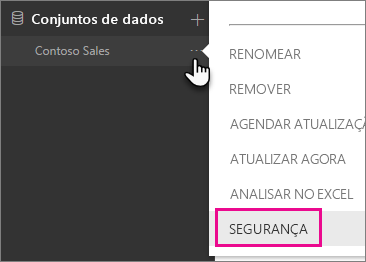
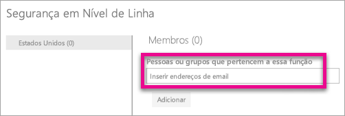
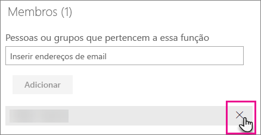
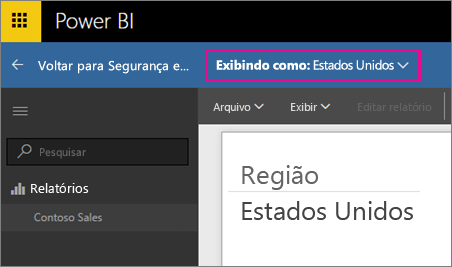
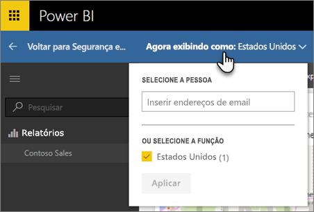

# RLS (segurança em nível de linha) com o Power BI
A RLS (segurança em nível de linha) com o Power BI pode ser usada para restringir o acesso a dados para determinados usuários. Os filtros restringem os dados no nível da linha. É possível definir filtros nas funções.

É possível configurar a RLS de modelos de dados importados para o Power BI com o Power BI Desktop. Você também pode configurar RLS em conjuntos de dados que estão usando DirectQuery, como o SQL Server. Anteriormente, você conseguia apenas implementar a RLS nos modelos do Analysis Services local fora do Power BI. Para as conexões dinâmicas do Analysis Services, configure a Segurança em nível de linha no modelo local. A opção de segurança não será exibida para conjuntos de dados com conexão dinâmica.

[!INCLUDE [include-short-name](./includes/rls-desktop-define-roles.md)]

Por padrão, a filtragem de segurança em nível de linha usa filtros unidirecionais, independentemente se as relações forem definidas para unidirecional ou bidirecional. Habilite manualmente o filtro cruzado bidirecional com a segurança em nível de linha selecionando a relação e marcando a caixa de seleção **Aplicar filtro de segurança em ambas as direções**. Marque essa caixa ao implementar a [segurança dinâmica em nível de linha](https://docs.microsoft.com/sql/analysis-services/supplemental-lesson-implement-dynamic-security-by-using-row-filters), na qual você pode fornecer segurança em nível de linha com base no nome de usuário ou na ID de logon. 

Para obter mais informações, consulte [Filtragem cruzada bidirecional usando o DirectQuery no Power BI Desktop](desktop-bidirectional-filtering.md) e o artigo técnico [Protegendo o modelo semântico de BI de tabela](http://download.microsoft.com/download/D/2/0/D20E1C5F-72EA-4505-9F26-FEF9550EFD44/Securing%20the%20Tabular%20BI%20Semantic%20Model.docx).

[!INCLUDE [include-short-name](./includes/rls-desktop-view-as-roles.md)]

## Gerenciar a segurança no modelo
Para gerenciar a segurança no modelo de dados, é necessário fazer o seguinte.

1. Selecione as **reticências (...)** para um conjunto de dados.
2. Selecione **Segurança**.
   
   

Você será levado à página da RLS para adicionar membros a uma função criada no Power BI Desktop. Somente os proprietários do conjunto de dados verão a opção Segurança disponível. Se o conjunto de dados está em um Grupo, somente os Administradores do grupo encontrarão a opção de segurança. 

Você só pode criar ou modificar funções no Power BI Desktop.

## Trabalhando com membros
### Adicionar membros
É possível adicionar um membro à função digitando o endereço de email, o nome do usuário, o grupo de segurança ou a lista de distribuição que você deseja adicionar. Esse membro deve estar em sua organização. Não é possível adicionar Grupos criados no Power BI.

Você também pode ver quantos membros fazem parte da função pelo número entre parênteses ao lado do nome da função ou ao lado de Membros.

### Remover membros
É possível remover membros selecionando o X ao lado do nome. 

## Validando a função no serviço do Power BI
Você pode validar que a função definida está funcionando corretamente ao testar a função. 

1. Selecione as **reticências (...)** ao lado da função.
2. Selecione **Testar dados como função**

Então, você verá os relatórios que estão disponíveis para essa função. Os painéis de controle não são apresentados nessa exibição. Na barra azul acima, você verá o que está sendo aplicado.

Você pode testar outras funções ou uma combinação de funções, selecionando **Exibindo agora como**.

Você pode optar por exibir dados como uma pessoa específica ou pode selecionar uma combinação de funções disponíveis para validar que estão funcionando. 

Para retornar à exibição normal, selecione **Voltar à Segurança de Nível de Linha**.

[!INCLUDE [include-short-name](./includes/rls-usernames.md)]

## Usando RLS com espaços de trabalho do aplicativo no Power BI
Se você publicar seu relatório do Power BI Desktop em um espaço de trabalho do aplicativo no serviço do Power BI, as funções serão aplicadas aos membros somente leitura. Será necessário indicar que os membros só podem exibir o conteúdo do Power BI nas configurações de espaço de trabalho do aplicativo.

> [!WARNING]
> Se você tiver configurado o espaço de trabalho do aplicativo para que os membros tenham permissões de edição, as funções RLS não serão aplicadas a eles. Os usuários poderão ver todos os dados.
> 
> 

[!INCLUDE [include-short-name](./includes/rls-limitations.md)]

[!INCLUDE [include-short-name](./includes/rls-faq.md)]

## Próximas etapas
[RLS (segurança em nível de linha) com o Power BI Desktop](desktop-rls.md)  

Mais perguntas? [Experimente perguntar à Comunidade do Power BI](http://community.powerbi.com/)

