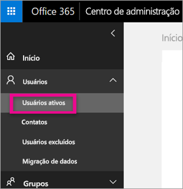

# <a name="understanding-the-power-bi-admin-role"></a>Noções básicas sobre a função de administrador do Power BI
Saiba como você pode usar a função de administrador do Power BI em sua organização.

<iframe width="640" height="360" src="https://www.youtube.com/embed/PQRbdJgEm3k?showinfo=0" frameborder="0" allowfullscreen></iframe>

A função de administrador de serviços do Power BI pode ser atribuída aos usuários que devem ter acesso ao Portal de Administração do Power BI, sem conceder também um outro acesso administrativo do Office 365. Por exemplo, a função de Administrador Global. O objetivo visa os profissionais responsáveis pela administração do Power BI na organização.

Os administradores de usuários do Office 365 podem atribuir usuários como administradores do Power BI no Centro de administração do Office 365 ou por meio de script do PowerShell. Quando um usuário for atribuído, ele poderá acessar o [Portal de administração do Power BI](service-admin-portal.md). Lá, ele terá acesso às métricas de uso de todo o locatário e poderá controlar todo o uso que o locatário faz dos recursos do Power BI.


## <a name="using-the-office-365-admin-center-to-assign-a-role"></a>Usando o Centro de administração do Office 365 para atribuir uma função
Para atribuir usuários à função de administrador do Power BI no Centro de administração do Office 365, você pode fazer o seguinte.

1. Navegue até o Centro de administração do Office 365 e selecione **Usuários** > **Usuários Ativos**.
   
    
2. Selecione o usuário ao qual deseja atribuir a função.
3. Selecione **Editar** para funções.
   
    
4. Selecione **Administrador personalizado** > **Administrador de serviços do Power BI**
   
    
5. Selecione **Salvar**.

Deverá aparecer **Administrador de serviços do Power BI** listado para a função desse usuário. Ele agora terá acesso ao [Portal de administração do Power BI](service-admin-portal.md).


## <a name="using-powershell-to-assign-a-role"></a>Usando o PowerShell para atribuir uma função
Para executar o comando do PowerShell, você deverá ter o módulo PowerShell do Azure Active Directory instalado.

### <a name="download-azure-ad-powershell-module"></a>Baixar o módulo PowerShell do Azure AD
[Baixar o PowerShell do Azure Active Directory Versão 2](https://github.com/Azure/azure-docs-powershell-azuread/blob/master/Azure%20AD%20Cmdlets/AzureAD/index.md)

[Baixar o PowerShell do Azure Active Directory Versão 1.1.166.0 GA](http://connect.microsoft.com/site1164/Downloads/DownloadDetails.aspx?DownloadID=59185)

### <a name="command-to-add-role-to-member"></a>Comando para adicionar função a membro
**Comando do PowerShell do Azure AD v2**

Você precisará obter a **ObjectId** da função **Administrador de serviços do Power BI**. Você pode executar [Get-AzureADDirectoryRole](https://docs.microsoft.com/powershell/azuread/v2/get-azureaddirectoryrole) para obter a **ObjectId**

```
PS C:\Windows\system32> Get-AzureADDirectoryRole

ObjectId                             DisplayName                        Description
--------                             -----------                        -----------
00f79122-c45d-436d-8d4a-2c0c6ca246bf Power BI Service Administrator     Full access in the Power BI Service.
250d1222-4bc0-4b4b-8466-5d5765d14af9 Helpdesk Administrator             Helpdesk Administrator has access to perform..
3ddec257-efdc-423d-9d24-b7cf29e0c86b Directory Synchronization Accounts Directory Synchronization Accounts
50daa576-896c-4bf3-a84e-1d9d1875c7a7 Company Administrator              Company Administrator role has full access t..
6a452384-6eb9-4793-8782-f4e7313b4dfd Device Administrators              Device Administrators
9900b7db-35d9-4e56-a8e3-c5026cac3a11 AdHoc License Administrator        Allows access manage AdHoc license.
a3631cce-16ce-47a3-bbe1-79b9774a0570 Directory Readers                  Allows access to various read only tasks in ..
f727e2f3-0829-41a7-8c5c-5af83c37f57b Email Verified User Creator        Allows creation of new email verified users.
```

Nesse caso, a objectid da função é 00f79122-c45d-436d-8d4a-2c0c6ca246bf.

Você também precisará saber a **ObjectID** dos usuários. Ele pode ser descoberto executando [Get-AzureADUser](https://docs.microsoft.com/powershell/azuread/v2/get-azureaduser).

```
PS C:\Windows\system32> Get-AzureADUser -SearchString 'tim@contoso.com'

ObjectId                             DisplayName UserPrincipalName      UserType
--------                             ----------- -----------------      --------
6a2bfca2-98ba-413a-be61-6e4bbb8b8a4c Tim         tim@contoso.com        Member
```

Para adicionar o membro à função, execute [Add-AzureADDirectoryRoleMember](https://docs.microsoft.com/powershell/azuread/v2/add-azureaddirectoryrolemember).

| Parâmetro | Descrição |
| --- | --- |
| ObjectId |A ObjectId da função. |
| RefObjectId |A ObjectId dos membros. |

```
Add-AzureADDirectoryRoleMember -ObjectId 00f79122-c45d-436d-8d4a-2c0c6ca246bf -RefObjectId 6a2bfca2-98ba-413a-be61-6e4bbb8b8a4c
```

**Comando do PowerShell do Azure AD v1**

Para adicionar um membro a uma função usando os cmdlets do Azure AD v1, você deve executar o comando [Add-MsolRoleMember](https://docs.microsoft.com/powershell/msonline/v1/add-msolrolemember).

```
Add-MsolRoleMember -RoleMemberEmailAddress "tim@contoso.com" -RoleName "Power BI Service Administrator"
```

## <a name="limitations-and-considerations"></a>Limitações e considerações
A função do administrador de serviço do Power BI não fornece acesso ao seguinte.

* Capacidade de modificar usuários e licenças no Centro de administração do Office 365
* Acesso aos logs de auditoria. Para obter mais informações, consulte [Usando a auditoria na organização](service-admin-auditing.md).

## <a name="next-steps"></a>Próximas etapas
[Portal de administração do Power BI](service-admin-portal.md)  
[Add-AzureADDirectoryRoleMember](https://docs.microsoft.com/powershell/azuread/v2/add-azureaddirectoryrolemember)  
[Add-MsolRoleMember](https://docs.microsoft.com/powershell/msonline/v1/add-msolrolemember)  
[Auditoria do Power BI em sua organização](service-admin-auditing.md)  
[Administração do Power BI em sua organização](service-admin-administering-power-bi-in-your-organization.md)  

Mais perguntas? [Experimente perguntar à Comunidade do Power BI](http://community.powerbi.com/)

