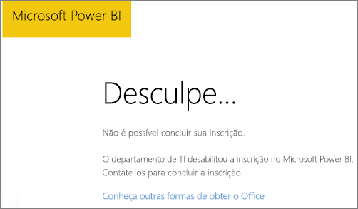
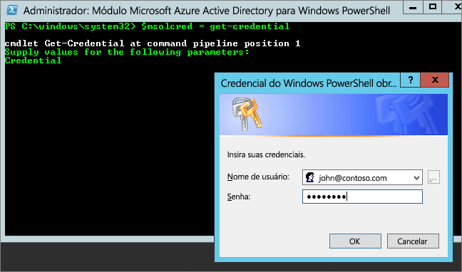

# Não é possível adicionar o Power BI a uma assinatura de parceiro do Office 365
O Office 365 permite que as empresas o revendam acompanhado e integrado com suas próprias soluções, fornecendo aos clientes finais um único ponto de contato para compra, cobrança e suporte.

Se estiver interessado em adquirir o Power BI, juntamente com sua assinatura do Office 365, recomendamos que entre em contato com seu parceiro para fazer isso. Se seu parceiro não oferecer o Power BI, há opções diferentes que você pode considerar.

1. É possível comprar o serviço de outro canal, diretamente da Microsoft ou de outro parceiro. Essa opção não está disponível para todos os clientes, dependendo de sua relação com o parceiro. É possível verificar isso acessando o **Portal de Administração do Office 365** > **Cobrança** > **Assinaturas**. Se você vir **Assinaturas**, é possível adquirir o serviço da Microsoft diretamente, ou você também pode entrar em contato com um parceiro que esteja oferecendo o Power BI.
   
    
2. Se você não vir a opção **Assinaturas** listada em **Cobrança**, não é possível comprar da Microsoft diretamente ou de outro parceiro. 
   
   

Se você não conseguir comprar o Power BI diretamente, você ainda terá algumas opções, dependendo do tipo de assinatura do Power BI em que você esteja interessado.

[Power BI (gratuito)](#power-bi-free)

[Power BI Pro e Premium](#power-bi-pro-and-premium)

## Power BI (gratuito)
Se você estiver satisfeito com a oferta gratuita para o Power BI, é possível se inscrever para obter o serviço gratuito. Por padrão, inscrições individuais, também conhecidas como assinaturas ad hoc, estão desabilitadas. Ao tentar se inscrever no Power BI, você verá uma mensagem indicando que o departamento de TI desativou a inscrição para o Microsoft Power BI.

    Your IT department has turned off signup for Microsoft Power BI.

Para habilitar assinaturas ad hoc, entre em contato com seu parceiro solicitando a ativação delas. Se você é um Administrador de seu locatário e sabe como usar comandos do PowerShell no Azure Active Directory, é possível habilitar assinaturas ad hoc por conta própria. [Saiba mais](https://technet.microsoft.com/library/jj151815.aspx)

1. Você precisa entrar primeiro no Azure Active Directory usando sua credencial do Office 365. Na primeira linha, serão solicitadas suas credenciais. Na segunda linha, você será conectado ao Azure Active Directory.
   
        $msolcred = get-credential
        connect-msolservice -credential $msolcred
   
    
2. Quando estiver conectado, você poderá emitir o comando a seguir para habilitar inscrições gratuitas.
   
        Set-MsolCompanySettings -AllowAdHocSubscriptions $true

## Power BI Pro e Premium
Se quiser comprar uma assinatura do Power BI Pro ou do Power BI Premium, você precisará trabalhar com seu parceiro para considerar quais opções estão disponíveis.

* Seu parceiro concorda em adicionar o Power BI ao portfólio dele para que você possa fazer compras com ele.
* Seu parceiro consegue fazer sua transição para um modelo de onde você poderá comprar o Power BI diretamente da Microsoft ou de outro parceiro que ofereça o Power BI.

## Próximas etapas
[Gerenciar o Azure AD usando o Windows PowerShell](https://technet.microsoft.com/library/jj151815.aspx)  
[Power BI Premium – o que é?](service-premium.md)

Mais perguntas? [Experimente perguntar à Comunidade do Power BI](http://community.powerbi.com/)

