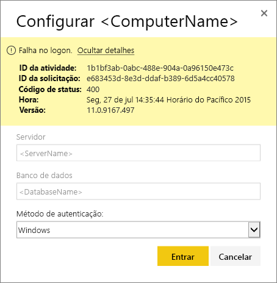
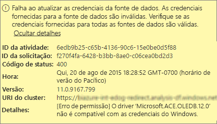
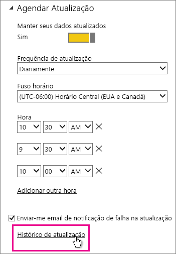
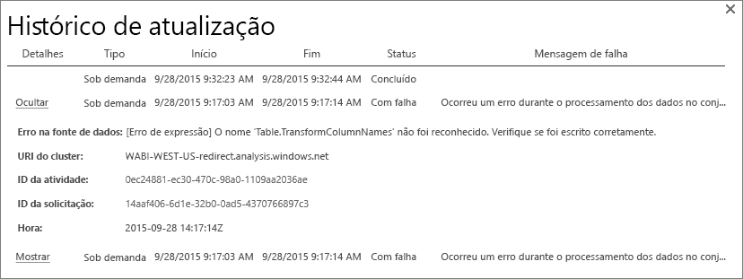
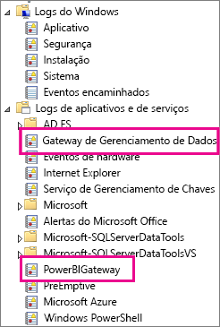
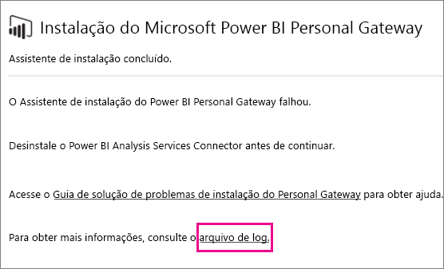
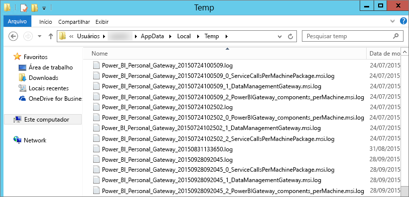

# Solucionando problemas do Power BI Gateway - Personal
O exemplo a seguir mostra alguns problemas comuns que você poderá ter ao usar o Power BI Gateway - Personal.

> [!NOTE]
> A versão atual do gateway para uso pessoal é **Gateway de dados local (pessoal)**. Atualize sua instalação para usar essa versão.
> 
> 

## Atualize para a versão mais recente
Muitos problemas podem surgir quando a versão de gateway estiver desatualizada.  É uma boa prática geral ter certeza que você está na última versão.  Se não tiver atualizado o gateway por um mês ou mais, considere a possibilidade de instalar a última versão do gateway e tentar reproduzir o problema.

## Instalação
**O gateway pessoal é de 64 bits** – se o computador for de 32 bits, você não poderá instalar o gateway pessoal. O sistema operacional precisa ser de 64 bits. Você precisará instalar uma versão de 64 bits do Windows ou instalar o gateway pessoal em um computador de 64 bits.

**Falha na instalação do gateway pessoal como serviço, mesmo que você seja um administrador local do computador** – A instalação poderá falhar se o usuário estiver no grupo do Administrador local do computador, mas a política de grupo não permitir que esse nome de usuário faça logon como serviço.  No momento, assegure que a política de grupo permita que um usuário faça logon como um serviço. Estamos trabalhando para encontrar uma correção para esse problema. [Saiba mais](https://technet.microsoft.com/library/cc739424.aspx)

**Tempo limite da operação atingido** – Isso é comum se o computador (computador físico ou VM) no qual o gateway pessoal está sendo instalado tiver um processador de núcleo único. Feche todos os aplicativos, desligue todos os processos não essenciais e tente instalar novamente.

**O Gateway de Gerenciamento de Dados ou o Analysis Services Connector não pode ser instalado no mesmo computador que o gateway pessoal** – Se já tiver um Analysis Services Connector ou Gateway de Gerenciamento de Dados instalado, você deve primeiro desinstalar o Connector ou o gateway e, em seguida, tentar instalar o gateway pessoal.

> [!NOTE]
> Se tiver algum problema durante a instalação, os logs de instalação poderão fornecer informações para ajudá-lo a resolver o problema. Veja [Logs de instalação](#SetupLogs) para obter mais informações.
> 
> 

 **Configuração de proxy** Você poderá ter problemas com a configuração do gateway pessoal se o seu ambiente precisar usar um proxy. Para saber mais sobre como configurar informações de proxy, consulte [Definindo as configurações de proxy para Gateways do Power BI](service-gateway-proxy.md)

## Agendar atualização
**Erro: as credenciais armazenadas na nuvem estão ausentes.**

Você pode obter esse erro nas configurações de \<conjunto de dados\> se tiver uma atualização agendada e desinstalado e reinstalando o gateway pessoal. Ao desinstalar um gateway pessoal, as credenciais de fonte de dados de um conjunto de dados que foram configuradas para atualização serão removidas do serviço do Power BI.

**Solução:** no Power BI, vá para as configurações de atualização de um conjunto de dados. Em Gerenciar Fontes de Dados, para qualquer fonte de dados com um erro, clique em Editar credenciais e entre novamente na fonte de dados.

**Erro: as credenciais fornecidas para o conjunto de dados são inválidas. Atualize as credenciais por meio de uma atualização ou no diálogo Configurações de Fonte de Dados para continuar.**

**Solução**: se você receber uma mensagem de credenciais, isso poderia significar:

* Verifique se os nomes de usuário e as senhas usados para entrar nas fontes de dados estão atualizados. No Power BI, vá para as configurações de atualização do conjunto de dados. Em Gerenciar Fontes de Dados, clique em Editar credenciais para atualizar as credenciais da fonte de dados.
* Os mashups entre uma fonte de nuvem e uma fonte local, em uma única consulta, não conseguirão ser atualizados no gateway pessoal se uma das fontes estiver usando o OAuth para autenticação. Um exemplo disso é um mashup entre o CRM Online e um SQL Server local. Isso irá falhar porque o CRM Online exige o OAuth.
  
  Esse é um problema conhecido e está sendo analisado. Para resolver o problema, tenha uma consulta separada para a fonte de nuvem e a fonte local e use uma consulta mesclagem ou acréscimo para combiná-las.

**Erro: fonte de dados sem suporte.**

**Solução:** se você receber uma mensagem informando que não há suporte para a fonte de dados nas configurações de Agendar Atualização, isso poderá significar que: 

* Atualmente, não há suporte para a atualização da fonte de dados no Power BI. 
* A pasta de trabalho do Excel não contém um modelo de dados, somente os dados de planilha. O Power BI atualmente dá suporte apenas à atualização se a pasta de trabalho do Excel carregada contiver um modelo de dados. Quando você importa dados usando o Power Query no Excel, lembre-se de escolher a opção de Carregar os dados para o modelo de dados. Isso garante que os dados sejam importados em um modelo de dados. 

**Erro: [não é possível combinar dados] &lt;A parte da consulta&gt;/&lt;…&gt;/&lt;…&gt; está acessando fontes de dados com níveis de privacidade que não podem ser usados em conjunto. Recompile esta combinação de dados.**

**Solução**: este erro ocorre devido a restrições no nível de privacidade e aos tipos de fontes de dados que estão sendo usados. [Saiba mais](refresh-enable-fast-combine.md)

**Erro: erro na fonte de dados: não é possível converter o valor "\[Tabela\]" para o tipo de tabela.**

**Solução**: este erro ocorre devido a restrições no nível de privacidade e aos tipos de fontes de dados que estão sendo usados. [Saiba mais](refresh-enable-fast-combine.md)

**Erro: não há espaço suficiente para esta linha.**

Isso ocorrerá se você tiver uma única linha com um tamanho maior que 4 MB. Você precisará determinar qual linha é proveniente da fonte de dados e tentar filtrá-la ou reduzir o tamanho desta linha.

## Fontes de dados
**Provedor de dados ausente** – O gateway pessoal BI tem apenas 64 bits. Ele exige a instalação de uma versão de 64 bits dos provedores de dados no mesmo computador em que o gateway pessoal está instalado. Por exemplo, se a fonte de dados no conjunto de dados for o Microsoft Access, será necessário instalar o provedor ACE de 64 bits no mesmo computador em que o gateway pessoal está instalado.  

>[!NOTE]
>Se você tiver o Excel de 32 bits, não será possível instalar um provedor ACE de 64 bits no mesmo computador.

**Não há suporte à autenticação do Windows para o banco de dados do Access** – No momento, o Power BI dá suporte apenas à autenticação anônima para o banco de dados do Access. Estamos trabalhando para habilitar a autenticação do Windows para o banco de dados do Access.

**Erro de início de sessão ao inserir as credenciais de uma fonte de dados** – Se você receber um erro semelhante a esse ao inserir as credenciais do Windows de uma fonte de dados, isso significa que talvez você ainda esteja usando uma versão mais antiga do gateway pessoal. [Instale a versão mais recente do Power BI Gateway - Personal](https://powerbi.microsoft.com/gateway/).

  

**Erro: erro de conexão ao selecionar a autenticação do Windows para uma fonte de dados usando o ACE OLEDB** - se você receber o seguinte erro ao inserir as credenciais da fonte de dados para uma fonte de dados usando o provedor ACE OLEDB:

O Power BI atualmente não dá suporte à autenticação do Windows para uma fonte de dados usando o provedor ACE OLEDB.

**Solução:** para solucionar esse erro, selecione a autenticação Anônima. Para o provedor ACE OLEDB herdado, as credenciais Anônimas são equivalentes às credenciais do Windows.

## Atualização de bloco
Se você estiver recebendo um erro com a atualização de blocos do painel, veja o artigo a seguir.

[Solução de problemas de erros de bloco](refresh-troubleshooting-tile-errors.md)

## Ferramentas para solução de problemas
### Histórico de atualização
O **Histórico de Atualização** pode ajudá-lo a ver quais erros ocorreram, além de fornecer dados úteis se precisar criar uma solicitação de suporte. Você pode exibir as atualizações programadas ou sob demanda. Aqui está como você pode acessar o **Histórico de atualização**.

1. No painel de navegação do Power BI, em **Conjuntos de Dados**, selecione um conjunto de dados &gt; Abrir Menu &gt; **Agendar Atualização**.
   
2. Em **Configurações de...** &gt; **Agendar Atualização**, selecione **Histórico de Atualização**.  
   
   
   

### Logs de eventos
Existem vários logs de eventos que podem fornecer informações. Os dois primeiros, **Gateway de gerenciamento de dados** e **PowerBIGateway**, estarão presentes se você for um administrador no computador.  Se você não for um administrador e estiver usando o Gateway pessoal, você verá as entradas de log dentro do log de **Aplicativo** .

O **Gateway do Gerenciamento de Dados** e os logs do **PowerBIGateway** estiverem presentes nos **logs de aplicativos e serviços**.

### Rastreamento do Fiddler
[Fiddler](http://www.telerik.com/fiddler) é uma ferramenta gratuita da Telerik que monitora o tráfego HTTP.  Você pode ver a parte de trás e frente com o serviço do Power BI do computador cliente. Isso pode mostrar erros e outras informações relacionadas.

### Logs de configuração
Em caso de falha na instalação do **Personal Gateway**, você verá um link para exibir o log de instalação. Isso poderia mostrar detalhes sobre a falha. Esses são os Logs de Instalação do Windows, também conhecidos como Logs do MSI. Eles podem ser bastante complexos e de difícil leitura. Normalmente, o erro resultante será mostrado na parte inferior, mas não é comum determinar a causa do erro. Ele pode ser resultado de erros em um log diferente ou de um erro mostrado acima no log.

Como alternativa, você pode ir para o **pasta Temp** (%temp%)) e procurar arquivos que começam com **Power\_BI\_**.

> [!NOTE]
> Ir para %temp% poderá levá-lo a uma subpasta de temp.  Os arquivos **Power\_BI\_** estarão na raiz do diretório temporário.  Talvez seja necessário subir um nível ou dois.
> 
> 

## Próximas etapas
[Definição das configurações de proxy para Gateways do Power BI](service-gateway-proxy.md)  
[Atualização de dados](refresh-data.md)  
[Gateway do Power BI – Pessoal](personal-gateway.md)  
[Solução de problemas de erros de bloco](refresh-troubleshooting-tile-errors.md)  
[Solução de problemas do gateway de dados local](service-gateway-onprem-tshoot.md)  
Mais perguntas? [Experimente a Comunidade do Power BI](http://community.powerbi.com/)

