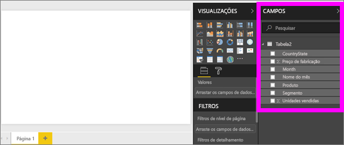
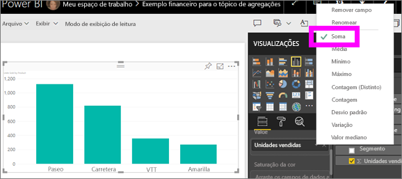
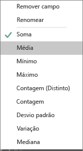
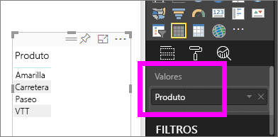

# Agregações em visualizações do Power BI
## O que é uma agregação?
Às vezes, você deseja combinar matematicamente valores nos dados. A operação matemática pode ser soma, média, máximo, contagem etc. Quando você combina valores nos dados, isso é chamado de *agregação*. O resultado dessa operação matemática é um *agregado*. 

Quando o serviço do Power BI e o Power BI Desktop criam visualizações, eles podem agregar os dados. Geralmente, a agregação é exatamente o que você precisa, mas outras vezes, talvez você deseje agregar os valores de maneira diferente.  Por exemplo, uma soma em vez de uma média. Há várias maneiras diferentes de gerenciar e alterar a agregação que está sendo usada em uma visualização.

Primeiro, vamos dar uma olhada em *tipos* de dados porque o tipo de dados determina como e se eles podem ser agregados.

## Tipos de dados
A maioria dos conjuntos de dados tem mais de um tipo de dados. No nível mais básico, os dados são numéricos ou não. Dados numéricos podem ser agregados usando uma soma, média, contagem, mínimo, variação e muito mais. Até mesmo dados textuais, geralmente chamados de dados *categóricos*, podem ser agregados. Se você tentar agregar campos categóricos (colocando-os em um bucket somente numérico como **Valores** ou **Dicas de ferramenta**), o Power BI contará as ocorrências ou as ocorrências distintas de cada categoria. Tipos especiais de dados, como datas, têm algumas de suas próprias opções de agregação: mais antigo, mais recente, primeiro e último. 

No exemplo abaixo:
- **Unidades Vendidas** e **Preço de Fabricação** são colunas que contêm dados numéricos
-  **Segmento**, **País**, **Produto**, **Mês** e **Nome do Mês** contêm dados categóricos

   

Ao criar uma visualização no Power BI, os campos numéricos serão agregados (o padrão é *soma*) em algum campo categórico.  Por exemplo, “Unidades Vendidas ***por Produto***”, “Unidades Vendidas ***por Mês***” e “Preço de Fabricação ***por Segmento***”. Alguns campos numéricos são chamados de **medidas**. É fácil identificar medidas no editor de relatório do Power BI – as medidas são mostradas com o símbolo ∑ na lista Campos. Para obter mais informações, veja [O editor de relatório... Faça um tour](service-the-report-editor-take-a-tour.md).

## Por que as agregações não funcionam do jeito que eu quero?
Trabalhar com agregações no serviço do Power BI pode ser confuso; talvez você tenha um campo numérico e o Power BI não permitirá que você altere a agregação. Ou talvez você tenha um campo, como um ano, e você não deseja agregá-lo, apenas contar o número de ocorrências.

Geralmente, a origem do problema é como o campo foi definido no conjunto de dados. Talvez o campo esteja definido como texto e isso explica por que ele não pode ser somado ou por que não é possível obter sua média. Infelizmente, [somente o proprietário do conjunto de dados pode alterar a maneira como um campo é categorizado](desktop-measures.md). Portanto, se você tiver permissões de proprietário no conjunto de dados, no Desktop ou no programa que foi usado para criar o conjunto de dados (por exemplo, Excel), poderá corrigir esse problema. Caso contrário, precisará entrar em contato com o proprietário do conjunto de dados para obter ajuda.  

Para ajudá-lo a evitar essa confusão, temos uma seção especial ao final deste artigo chamada **Considerações e solução de problemas**.  Caso você não encontre a resposta nessa seção, poste sua pergunta no [fórum da Comunidade do Power BI](http://community.powerbi.com) para obter uma resposta rápida diretamente da equipe do Power BI.

## Mudar a forma como um campo numérico é agregado
Digamos que você tenha um gráfico que soma as unidades vendidas para produtos diferentes, mas preferiria ter a média. 

1. Crie um gráfico que usa uma categoria e uma medida. Neste exemplo, estamos usando Unidades Vendidas por Produto.  Por padrão, o Power BI cria um gráfico que soma as unidades vendidas (medida no contêiner Valor) para cada produto (categoria no contêiner Eixo).

   

2. No painel Visualizações, clique com o botão direito do mouse na medida e selecione o tipo de agregação necessário. Nesse caso, estamos selecionando Média. Caso não veja a agregação de que precisa, consulte “Considerações e solução de problemas” abaixo.  
   
   
   
   > [!NOTE]
   > As opções disponíveis na lista suspensa variarão dependendo 1) do campo selecionado e 2) da maneira que o campo foi categorizado pelo proprietário do conjunto de dados.
   > 
3. A visualização agora usa agregados por média.

   

##    Maneiras de agregar os dados

Algumas das opções que podem estar disponíveis para um campo de agregação:

* **Não resumir**. Com essa opção escolhida, cada valor nesse campo é tratada separadamente e não resumida. Isso geralmente é usado se você tiver uma coluna de ID numérica que não deve ser somada.
* **Soma**. Isso adiciona todos os valores nesse campo para cima.
* **Média**. Usa uma média aritmética dos valores.
* **Mínimo**. Mostra o menor valor.
* **Máximo**. Mostra o maior valor.
* **Contagem (Não em branco).** Isso conta o número de valores no campo que não está em branco.
* **Contagem (Distinto).** Isso conta o número de valores diferentes no campo.
* **Desvio padrão.**
* **Variação**.
* **Mediana**.  Mostra o valor mediano (meio). Esse é o valor que tem o mesmo número de itens acima e abaixo.  Se houver duas medianas, o Power BI obterá suas médias.

Por exemplo, esses dados:

| País | Quantidade |
|:--- |:--- |
| EUA |100 |
| REINO UNIDO |150 |
| Canadá |100 |
| Alemanha |125 |
| França | |
| Japão |125 |
| Austrália |150 |

Daria os seguintes resultados:

* **Não resumir**: cada valor é exibido separadamente
* **Soma**: 750
* **Média**: 125
* **Máximo**: 150
* **Mínimo**: 100
* **Contagem (não em branco):** 6
* **Contagem (distinta):** 4
* **Desvio padrão:** 20.4124145...
* **Variação:** 416.666...
* **Mediana:** 125

## Criar uma agregação usando um campo de categoria (texto)
Você também pode agregar um campo não numérico. Por exemplo, se tiver um campo de nome do produto, poderá adicioná-lo como um valor e, em seguida, defini-lo como **Contagem**, **Contagem distinta**, **Primeiro** ou **Último**. 

1. Neste exemplo, arrastamos o campo **Produto** para o contêiner Valores. O contêiner Valores normalmente é usado para campos numéricos. O Power BI reconhece que isso é um campo de texto, define a agregação como **Não resumir** e apresenta uma tabela de coluna única.
   
   
2. Se alterarmos a agregação do padrão **Não resumir** para **Contagem (Distinta)**, o Power BI contará o número de diferentes produtos. Nesse caso, há 4.
   
   
3. Se alterarmos a agregação para **Contagem**, o Power BI contará o número total. Nesse caso, há 7 entradas para **Produto**. 
   
   

4. Arrastando o mesmo campo (nesse caso, **Produto**) para o contêiner Valores e deixando a agregação padrão **Não resumir**, o Power BI divide a contagem por produto.

   

## Considerações e solução de problemas
P: Por que não vejo uma opção **Não resumir**?

R: O campo selecionado provavelmente é uma medida calculada ou uma medida avançada criada no Excel ou no [Power BI Desktop](desktop-measures.md). Cada medida calculada tem sua própria fórmula embutida em código. Não é possível alterar a agregação usada.  Por exemplo, se ela for uma soma, só poderá ser uma soma. Na lista Campos, as *medidas calculadas* são mostradas com o símbolo de calculadora.

P: Meu campo **é** numérico. Por que as únicas opções exibidas são **Contagem** e **Contagem distinta**?

R1: A explicação provável é que o proprietário do conjunto de dados, acidental ou intencionalmente, *não* classificou o campo como um número. Por exemplo, se um conjunto de dados tiver um campo **ano**, o proprietário do conjunto de dados poderá categorizar como texto porque é mais provável que o campo **ano** será contado (ou seja, o número de pessoas nascidos em 1974) e não que ele será somado ou terá a média calculada. Se você for o proprietário, poderá abrir o conjunto de dados no Power BI Desktop e usar a guia **Modelagem** para alterar o tipo de dados.  

R2: Se o campo tem um ícone de calculadora, isso significa que ele é uma *medida calculada* e cada medida calculada tem sua própria fórmula embutida em código que só pode ser alterada por um proprietário de conjunto de dados. O cálculo que está sendo usado pode ser uma agregação simples como uma média ou soma, mas também algo mais complicado, como um “percentual de contribuição para a categoria pai” ou “total acumulado desde o início do ano”. O Power BI não vai somar nem obter a média dos resultados, mas em vez disso, apenas calculará novamente (usando a fórmula embutida em código) para cada ponto de dados.

R3: Outra possibilidade é que você soltou o campo em um *bucket* que permite somente valores categóricos.  Nesse caso, as únicas opções serão contagem e contagem distinta.

R4: E uma terceira possibilidade é que você está usando o campo para um eixo. Em um eixo de gráfico de barras, por exemplo, o Power BI mostra uma barra para cada valor distinto – ele não agrega os valores de campo. 

>[!NOTE]
>A exceção a essa regra são os gráficos de dispersão, que *exigem* valores agregados para os eixos X e Y.

P: Tenho um gráfico de dispersão e *não* quero que meu campo seja agregado.  Como faço isso?

R: Adicione o campo ao bucket **Detalhes** e não aos buckets dos eixos X ou Y.

P: Quando adiciono um campo numérico a uma visualização, a maioria deles usa soma como padrão, mas outros usam média ou contagem ou alguma outra agregação como padrão.  Por que a agregação padrão nem sempre é a mesma?

R: Os proprietários de conjuntos de dados têm a opção de definir o resumo padrão para cada campo. Se você for um proprietário de conjunto de dados, altere o resumo padrão na guia **Modelagem** do Power BI Desktop.

P: Sou o proprietário de um conjunto de dados e quero garantir que um campo nunca é agregado.

R: No Power BI Desktop, na guia **Modelagem**, defina **Tipo de dados** como **Texto**.

P: Não consigo ver **Não resumir** como uma opção na lista suspensa.

R: Tente remover o campo e adicioná-lo novamente.

Mais perguntas? [Experimente a Comunidade do Power BI](http://community.powerbi.com/)

