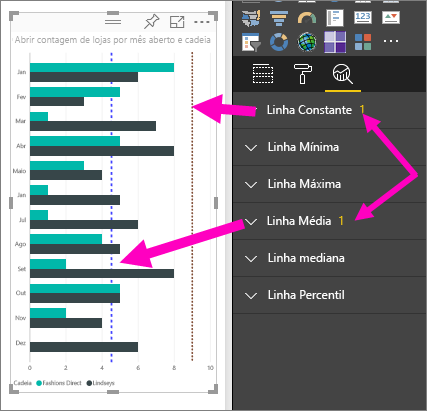

# Painel de análise no serviço do Power BI
Com o painel **Análise** no **serviço do Power BI**, você pode adicionar *linhas de referência* dinâmica às visualizações e destacar tendências ou ideias importantes.

> [!NOTE]
> O painel **Análise** só aparece quando você seleciona um visual na tela do relatório.
> 
> 

## Usando o painel Análise
Com o painel **Análise**, você pode criar os seguintes tipos de linhas de referência dinâmica (nem todas as linhas estão disponíveis para todos os tipos de visual):

* Linha constante do eixo X
* Linha constante do eixo Y
* Linha mínima
* Linha máxima
* Linha média
* Linha mediana
* Linha percentil

As seções a seguir mostram como você pode usar o painel **Análise** e as linhas de referência dinâmica em suas visualizações.

Para exibir as linhas de referência dinâmica disponíveis para um visual, siga estas etapas:

1. Escolha ou crie um visual e, então, selecione o ícone **Análise** no painel **Visualizações**.
2. Selecione a seta para baixo para o tipo de linha que você deseja criar para expandir suas opções. Nesse caso, selecionaremos a **Linha Média**.
   
   
3. Para criar uma nova linha, selecione **+ Adicionar**. Em seguida, você pode especificar um nome para a linha clicando duas vezes na caixa de texto e, em seguida, digitando seu nome.
   
   Você tem todos os tipos de opções para a linha, como selecionar a *cor*, *transparência*, *estilo* e *posição* (relativa aos elementos de dados do visual), e se deseja incluir o rótulo. E, principalmente, você pode selecionar em qual **Medida** no visual você deseja que sua linha seja baseada ao selecionar a lista suspensa **Medida**, que é preenchida automaticamente com os elementos de dados do visual. Nesse caso, selecionaremos *Contagem de lojas abertas* como a medida, colocaremos *Número médio de lojas abertas* como o rótulo e personalizaremos algumas das outras opções, conforme mostrado abaixo.
   
   
4. Se você deseja que um rótulo de dados seja exibido, mova o controle deslizante **Rótulo de dados**. Ao fazer isso, você obterá uma vasta gama de opções adicionais para o rótulo de dados.
5. Observe o número que aparece ao lado do item **Linha média** no painel **Análise**. Que indica quantas linhas dinâmicas você tem atualmente no visual e qual o tipo delas. Se adicionarmos uma **Linha constante** como uma meta de contagem de loja igual a 9, veja que o painel **Análise** agora mostra que também temos uma linha de referência **Linha constante** aplicada nesse visual.
   
   
   
   Se o visual que você selecionou não puder ter linhas de referência dinâmica aplicadas a ele (neste caso, um visual de **Mapa**), você verá o seguinte quando selecionar o painel **Análise**.
   
   

Há muitas ideias interessantes que você pode destacar ao criar linhas de referência dinâmica com o painel **Análise**.

Estamos planejando mais recursos e funcionalidades, incluindo a expansão dos elementos visuais que podem ter linhas de referência dinâmica aplicadas a eles. Portanto, verifique frequentemente para saber o que há de novo.

## Limitações
A capacidade de usar linhas de referência dinâmica baseia-se no tipo de visual que está sendo usado. A seguinte lista mostra quais linhas dinâmicas estão atualmente disponíveis para os visuais:

Uso total de linhas dinâmicas estão disponíveis nos seguintes elementos visuais:

* Gráfico da área
* Gráfico de linhas
* Gráfico de dispersão
* Gráfico de colunas agrupadas
* Gráfico de barras agrupadas

Os elementos visuais a seguir só podem usar uma *linha constante* do painel **Análise**:

* Área empilhada
* Barra empilhada
* Coluna empilhada
* Barra 100% empilhada
* Coluna 100% empilhada

Para os seguintes elementos visuais, uma *linha de tendência* atualmente é a única opção:

* Linha não empilhada
* Gráfico de colunas agrupadas

Por fim, elementos visuais não cartesianos atualmente não podem aplicar linhas dinâmicas do painel **Análise**, como:

* Matriz
* Gráfico de pizza
* Donut
* Table

## Próximas etapas
[Painel de análise no Power BI Desktop](desktop-analytics-pane.md)

Mais perguntas? [Experimente a Comunidade do Power BI](http://community.powerbi.com/)

