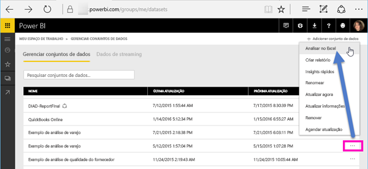
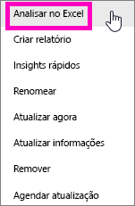
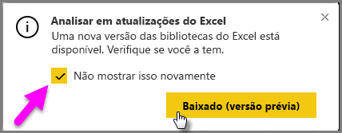
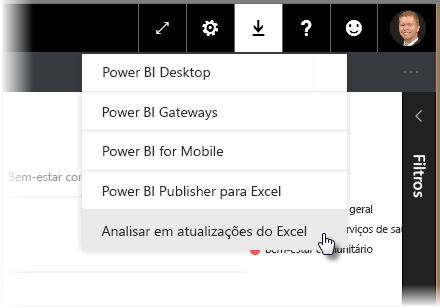
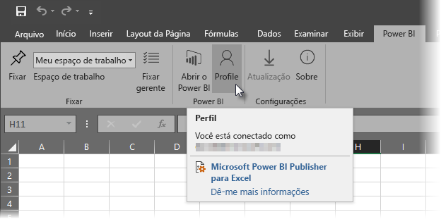
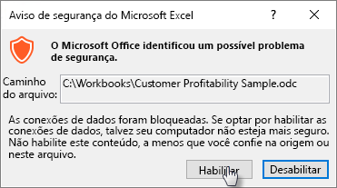
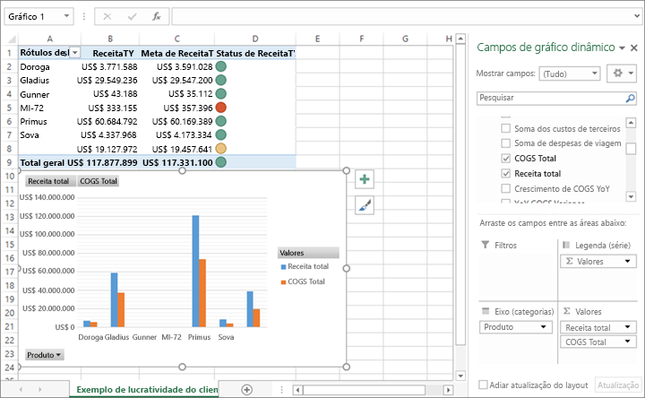

# Analisar no Excel
Existem ocasiões em que você talvez queira usar o Excel para exibir e interagir com um conjunto de dados do Power BI. Com o recurso **Analisar no Excel**, você pode fazer isso e acessar recursos de Tabela Dinâmica, gráfico e segmentação no Excel com base no conjunto de dados existente no Power BI.

## Requisitos
Há alguns requisitos para o uso do recurso **Analisar no Excel**:

* Há suporte para o recurso **Analisar no Excel** no Microsoft Excel 2010 SP1 e posterior.
* As Tabelas Dinâmicas do Excel não têm suporte para agregação do tipo "arrastar e soltar" dos campos numéricos. Seu conjunto de dados no Power BI *deve ter medidas predefinidas*.
* Algumas empresas podem ter regras de Política de Grupo que impedem a instalação das atualizações necessárias do recurso **Analisar no Excel** no Excel. Se você não conseguir instalar as atualizações, verifique com seu administrador.
* **Analisar no Excel** exige uma licença Pro. Para saber mais sobre as diferenças na funcionalidade entre licenças grátis e Pro, dê uma olhada em [Power BI Gratuito versus Pro](service-free-vs-pro.md). 

## Como funciona?
Quando você seleciona **Analisar no Excel** no menu de reticências (...) associado a um conjunto de dados ou relatório no **Power BI**, o Power BI cria um arquivo .ODC e o baixa do navegador para o computador.

Ao abrir o arquivo no Excel, será exibida uma lista de **Tabelas Dinâmicas** e **Campos** vazia com as tabelas, campos e medidas do conjunto de dados do Power BI. Você pode criar Tabelas Dinâmicas, gráficos e analisar esse conjunto de dados da mesma forma que trabalharia com um conjunto de dados local no Excel.

O arquivo.ODC tem uma cadeia de conexão MSOLAP, que se conecta ao seu conjunto de dados no Power BI. Ao analisar ou trabalhar com os dados, o Excel consulta o conjunto de dados no Power BI e retorna os resultados para o Excel. Se esse conjunto de dados se conectar a uma fonte de dados dinâmica usando o Direct Query, o Power BI consultará a fonte de dados e retornará o resultado para o Excel.

O recurso **Analisar no Excel** é muito útil em conjuntos de dados e relatórios que se conectam aos bancos de dados de *Tabela* ou *Multidimensional do Analysis Services* ou de arquivos do Power BI Desktop ou de pastas de trabalho do Excel com modelos de dados que contêm medidas de modelo criadas com o DAX (Data Analysis Expressions).

## Introdução ao recurso Analisar no Excel
No Power BI, selecione o menu de reticências ao lado de um relatório ou conjunto de dados (os três pontos ao lado do nome do relatório ou do conjunto de dados) e, no menu que será exibido, selecione **Analisar no Excel**.

### Instalar atualizações do Excel
Quando você usa **Analisar no Excel** pela primeira vez, é necessário instalar as atualizações nas bibliotecas do Excel. Será solicitado que você baixe e execute atualizações do Excel (isso inicia a instalação do pacote *SQL_AS_OLEDDB.msi* do Windows Installer). Este pacote instala o **Provedor Microsoft AS OLE DB para SQL Server 2016 RC0 (Visualização)**.

> [!NOTE]
> Certifique-se de marcar a opção **Não mostrar novamente** na caixa de diálogo **Instalar atualizações do Excel**. Você precisa instalar a atualização somente uma vez.
> 
> 

Se precisar instalar as atualizações do Excel para o recurso **Analisar no Excel** novamente, você poderá baixar a atualização por meio do ícone **Baixar** no Power BI, conforme mostrado na imagem a seguir.

### Entrar no Power BI
Embora você tenha entrado no Power BI em seu navegador, na primeira vez que abrir um novo arquivo .ODC no Excel, você pode ser solicitado a entrar no Power BI com sua conta do Power BI. Isso autentica a conexão do Excel no Power BI.

### Usuários com várias contas do Power BI
Alguns usuários têm várias contas do Power BI e podem estar em uma situação em que se conectam ao Power BI com uma conta, mas a conta que tem acesso ao conjunto de dados usado no recurso Analisar no Excel é uma conta diferente. Nessas situações, é possível obter um erro **Proibido** ou uma falha de entrada ao tentar acessar um conjunto de dados que está sendo usado em uma planilha em Analisar no Excel.

Você terá uma oportunidade para entrar novamente, quando você poderá entrar com a conta do Power BI que tem acesso ao conjunto de dados acessado pelo recurso Analisar no Excel. Também é possível selecionar **Perfil** na guia da faixa de opções **Power BI** no Excel, que identifica a conta à qual você está conectado no momento e que fornece um link que lhe permite sair (e, posteriormente, entrar com uma conta diferente).

### Habilitar conexões de dados
Para analisar os dados do Power BI no Excel, será solicitado que você verifique o nome do arquivo e o caminho para o arquivo .odc e, em seguida, selecione **Habilitar**.

> [!NOTE]
> Os administradores de locatários do Power BI podem usar o *Portal de administração do Power BI* para desabilitar o uso da opção **Analisar no Excel** com conjuntos de dados locais armazenados em bancos de dados do AS (Analysis Services). Quando essa opção estiver desabilitada, a opção **Analisar no Excel** será desabilitada nos bancos de dados do AS, mas continuará disponível para uso com outros conjuntos de dados.
> 
> 

## Analisar por completo
Agora que o Excel abriu e você tem uma Tabela Dinâmica vazia, você está pronto para fazer todos os tipos de análises com o conjunto de dados do Power BI. Assim como ocorre com outras pastas de trabalho locais, com o recurso Analisar no Excel, você pode criar Tabelas Dinâmicas, gráficos, adicionar dados de outras fontes e assim por diante. E, claro, você pode criar planilhas diferentes com todos os tipos de modos de exibição sobre seus dados.

> [!NOTE]
> É importante saber que usar **Analisar no Excel** expõe todos os dados detalhados para todos os usuários, com permissão para o conjunto de dados.
> 
> 

## Salvar
É possível salvar a pasta de trabalho conectada ao conjunto de dados do Power BI exatamente como qualquer outra pasta de trabalho. No entanto, não é possível publicar ou importar a pasta de trabalho novamente no Power BI, pois você só pode publicar ou importar pastas de trabalho no Power BI que têm dados em tabelas ou que têm um modelo de dados. Como a nova pasta de trabalho tem apenas uma conexão com o conjunto de dados no Power BI, publicá-la ou importá-la para o Power BI é como andar em círculos!

## Compartilhar
Quando a pasta de trabalho for salva, você pode compartilhá-la com outros usuários do Power BI em sua organização.

Quando um usuário com quem você compartilhou sua pasta de trabalho a abre, ele verá as Tabelas Dinâmicas e os dados da maneira que aparecem quando a pasta de trabalho foi salva pela última vez, que podem não ser a última versão dos dados. Para obter os últimos dados, os usuários devem usar o botão **Atualizar** na faixa de opções **Dados**. E como a pasta de trabalho está se conectando a um conjunto de dados no Power BI, os usuários que tentarem atualizar a pasta de trabalho devem entrar no Power BI e instalar as atualizações do Excel na primeira vez que tentarem fazer a atualização usando esse método.

Já que os usuários precisarão atualizar o conjunto de dados, não há suporte para atualização para conexões externas no Excel Online, é recomendável que os usuários abram a pasta de trabalho na versão da área de trabalho do Excel no computador.

## Solução de problemas
Pode haver ocasiões ao usar Analisar no Excel em que você obtém um resultado inesperado ou em que o recurso não funciona conforme esperado. [Esta página fornece soluções para problemas comuns ao usar Analisar no Excel](desktop-troubleshooting-analyze-in-excel.md)