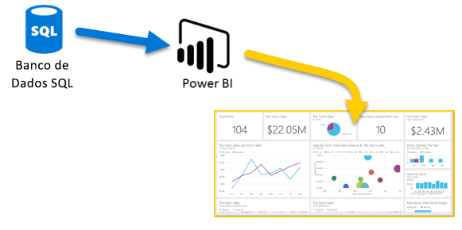
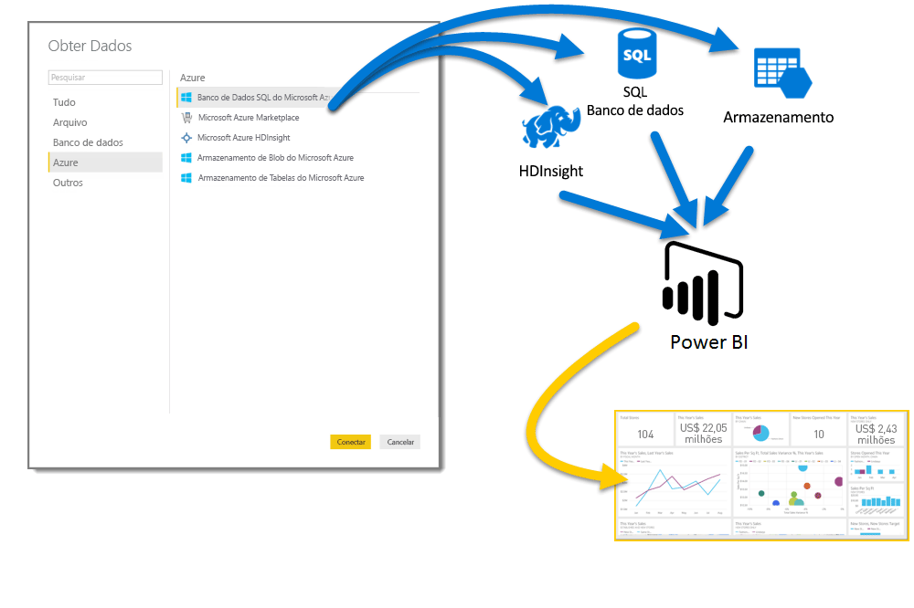
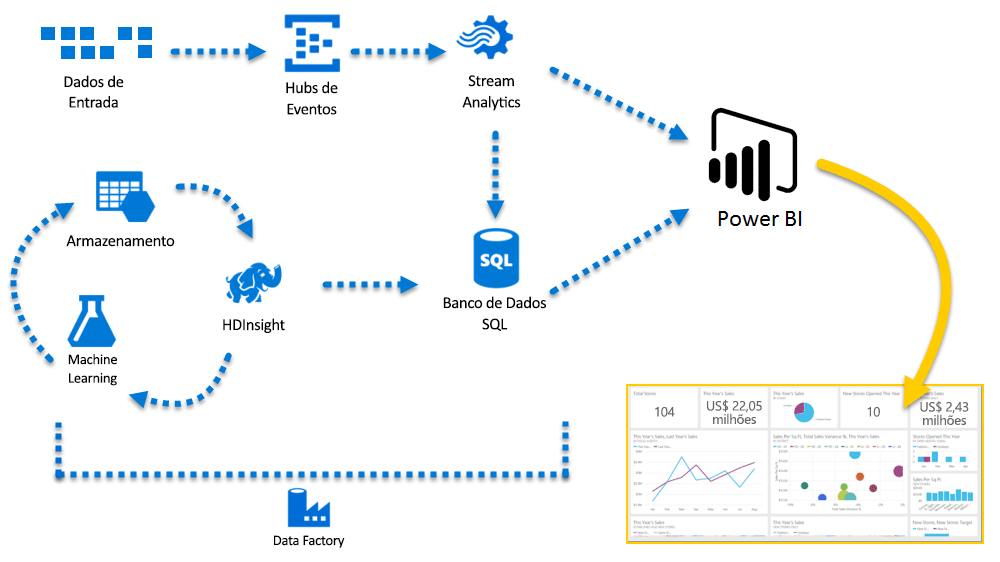

# Azure e Power BI
Com os serviços do **Azure** e o **Power BI**, você pode transformar seus esforços de processamento de dados em análises e relatórios que fornecem informações em tempo real sobre a sua empresa. Se o processamento de dados é baseado em nuvem ou local, simples ou complexo, de única fonte ou altamente escalonado, armazenado ou em tempo real, o Azure e o Power BI têm a conectividade interna e a integração para dar vida aos seus esforços de business intelligence.

O Power BI tem uma grande quantidade de conexões do Azure disponíveis, e as soluções de business intelligence que você pode criar com esses serviços são tão exclusivas quanto a sua empresa. Você pode conectar apenas uma ou várias fontes de dados do Azure e formatar e refinar seus dados para criar relatórios personalizados.

### Banco de Dados SQL do Azure e Power BI
Você pode iniciar uma conexão simples com um Banco de Dados SQL do Azure e criar relatórios para monitorar o progresso de sua empresa. Com o [Power BI Desktop](desktop-getting-started.md), é possível criar relatórios que identificam tendências e indicadores chave de desempenho que promovem a sua empresa.

Há muito mais informações para descobrir sobre o [Banco de Dados SQL do Azure](http://azure.microsoft.com/services/sql-database/).

### Transforme, formate e mescle seus dados na nuvem
Você tem dados mais complexos e todos os tipos de fontes? Sem problemas. Com o **Power BI Desktop** e os serviços do Azure, as conexões podem ser acessadas no diálogo **Obter Dados** com apenas um toque. Na mesma Consulta, você pode se conectar ao seu **Banco de Dados SQL do Azure**, sua fonte de dados do **Azure HDInsight** e seu **Armazenamento de Blob do Azure** (ou **Armazenamento de Tabela do Azure**) e selecionar apenas os subconjuntos dentro de cada um deles de que você precisa e refiná-los daí.

É possível criar relatórios diferentes para públicos-alvo diferentes usando as mesmas conexões de dados e até mesmo a mesma Consulta. Apenas crie uma nova página de relatório, refine suas visualizações para cada público-alvo e acompanhe-as para que sua empresa fique bem informada.

Para obter mais informações, veja os seguintes recursos:

* [Banco de dados SQL do Azure](http://azure.microsoft.com/services/sql-database/)
* [Azure HDInsight](http://azure.microsoft.com/services/hdinsight/)
* [Armazenamento do Azure](http://azure.microsoft.com/services/storage/) (Armazenamento de blob e Armazenamento de tabela)

### Aprofunde-se (e fique à frente) usando os Serviços do Azure e o Power BI
Você pode expandir conforme as suas necessidades com o Azure e o Power BI. Aproveite o processamento de dados de várias fontes, use grandes sistemas em tempo real, use o [Stream Analytics](http://azure.microsoft.com/services/stream-analytics/)e os [Hubs de Eventos](http://azure.microsoft.com/services/event-hubs/) e reúna seus diversos serviços de SaaS em relatórios de business intelligence que oferecem à sua empresa uma excelente vantagem.

### Conecte os dados de seu aplicativo usando as APIs do Power BI
Você também pode usar o Power BI para aprofundar seus conhecimentos sobre seus aplicativos existentes. Com a API do Power BI, os desenvolvedores de aplicativos podem enviar conjuntos de dados inteiros para o Power BI de forma programática. Precisa de atualizações contínuas? Com as APIs do Power BI, os desenvolvedores podem enviar atualizações de dados em tempo real para começar rapidamente e, em seguida, expandir para o uso do Azure Stream Analytics de acordo com os requisitos de escala.

Há várias informações sobre as APIs do Power BI no [Portal do Desenvolvedor do Power BI](http://dev.powerbi.com). Você também pode saber sobre o que outras pessoas estão fazendo de forma programática com o Power BI no [blog do desenvolvedor do Power BI](http://blogs.msdn.com/powerbidev). Também há uma página dedicada à [introdução ao desenvolvimento do Power BI](https://msdn.microsoft.com/library/dn889824.aspx).

### O que você pode fazer com o Azure e o Power BI?
Existem todos os tipos de cenários em que o **Azure** e o **Power BI** podem ser combinados - as possibilidades e oportunidades são tão exclusivas quanto a sua empresa. Para obter mais informações sobre os **serviços do Azure**, confira esta [página de visão geral](http://go.microsoft.com/fwlink/?LinkId=535031&clcid=0x409), que descreve os **Cenários de análise de dados com o Azure**, e saiba como transformar suas fontes de dados em inteligência que conduz sua empresa para o sucesso.

