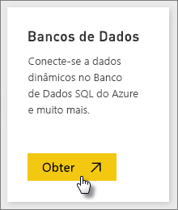
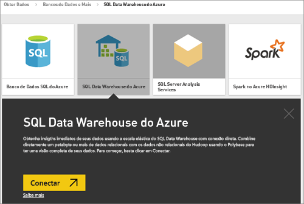
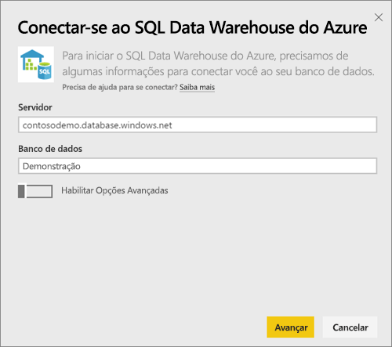
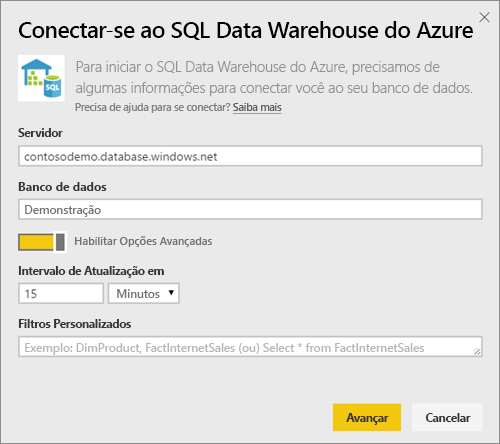
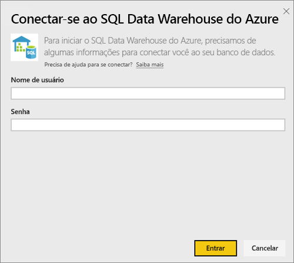
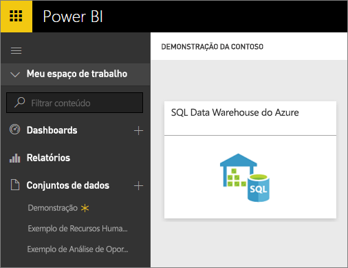
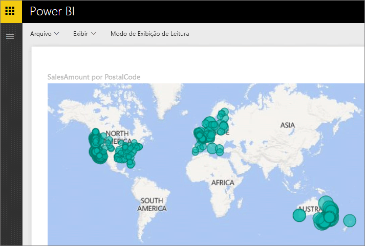
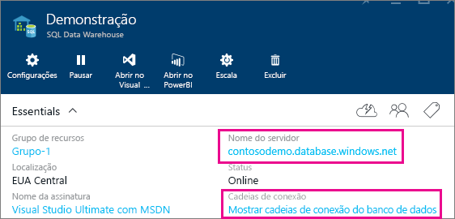

# SQL Data Warehouse do Azure com DirectQuery
O SQL Data Warehouse do Azure com o DirectQuery permite criar relatórios dinâmicos com base nos dados e nas métricas que você já tem no SQL Data Warehouse do Azure. Com o DirectQuery, as consultas são enviadas de volta para o SQL Data Warehouse do Azure em tempo real conforme você explora os dados. Isso, combinado com a escala do SQL Data Warehouse, permite aos usuários criar, em minutos, relatórios dinâmicos referentes a terabytes de dados. Além disso, a introdução do botão **Abrir no Power BI** permite que os usuários conectem diretamente o Power BI ao seu SQL Data Warehouse sem precisar especificar manualmente as informações.

Ao usar o conector do SQL Data Warehouse:

* Especifique o nome do servidor totalmente qualificado ao estabelecer a conexão (veja abaixo para obter mais detalhes)
* Assegure que as regras de firewall para o servidor estão configuradas para “Permitir acesso aos serviços do Azure”
* Toda ação, como selecionar uma coluna ou adicionar um filtro, consultará diretamente o data warehouse
* Os blocos são configurados para atualizar aproximadamente a cada 15 minutos e a atualização não precisa ser agendada.  Isso pode ser ajustado nas Configurações avançadas quando você se conectar.
* P e R não estão disponíveis para conjuntos de dados do DirectQuery
* alterações de esquema não são aplicadas automaticamente

Essas restrições e observações podem mudar conforme continuamos a aprimorar as experiências. As etapas para conectar são detalhadas abaixo.

## Usando o botão 'Abrir no Power BI'
A maneira mais fácil de mover entre o SQL Data Warehouse e o Power BI é com o botão **Abrir no Power BI** na Versão Prévia do Portal do Azure. Esse botão permite que você comece diretamente a criar novos painéis no Power BI.

1. Para começar, navegue até sua instância do SQL Data Warehouse na Versão Prévia do Portal do Azure. Observe que o SQL Data Warehouse tem apenas uma presença no portal de Visualização do Azure no momento.
2. Clique no botão **Abrir no Power BI**
   
    
3. Se não for possível conectá-lo diretamente ou se você não tiver uma conta do Power BI, você precisará entrar.
4. Você será direcionado para a página de conexão do SQL Data Warehouse, com as informações do seu SQL Data Warehouse pré-preenchidas. Insira suas credenciais e selecione conectar para criar uma conexão.

## Conectando-se por meio do Power BI
O SQL Data Warehouse também está listado na página Obter Dados do Power BI. 

1. Selecione **Obter Dados** na parte inferior do painel de navegação esquerdo.  
   
    
2. Em **Bancos de dados**, selecione **Obter**.
   
    
3. Selecione **SQL Data Warehouse** \> **Conectar**.
   
    
4. Insira as informações necessárias para se conectar. A seção **Localizando Parâmetros** a seguir mostra onde esses dados podem estar localizados em seu Portal do Azure.
   
    
   
    
   
    
   
   > [!NOTE]
   > O nome de usuário será um usuário definido na instância do SQL Data Warehouse do Azure.
   > 
   > 
5. Analise o conjunto de dados selecionando o novo bloco ou o conjunto de dados recém-criado, indicado pelo asterisco. Esse conjunto de dados terá o mesmo nome do banco de dados.
   
    
6. Você pode explorar todas as tabelas e colunas. Selecionar uma coluna resultará no envio de uma consulta de volta para a fonte, criando dinamicamente seu visual. Filtros também serão convertidos em consultas de volta para o data warehouse. Esses elementos visuais podem ser salvos em um novo relatório e fixados de volta em seu painel.
   
    

## Localizando Valores de Parâmetro
Seu nome do servidor totalmente qualificado e o nome do banco de dados podem ser encontrados na Versão Prévia do Portal do Azure. Observe que o SQL Data Warehouse tem apenas uma presença no portal de Visualização do Azure no momento.

> [!NOTE]
> Se o seu locatário do Power BI estiver na mesma região que o SQL Data Warehouse do Azure, não haverá nenhum encargo pela saída. Você pode descobrir onde seu locatário do Power BI está localizado usando [estas instruções](https://docs.microsoft.com/en-us/power-bi/service-admin-where-is-my-tenant-located).
>

## Próximas etapas
[Introdução ao Power BI](service-get-started.md)  
[Obter dados para o Power BI](service-get-data.md)  
[SQL Data Warehouse do Azure](https://azure.microsoft.com/en-us/documentation/services/sql-data-warehouse/)  

Mais perguntas? [Experimente a Comunidade do Power BI](http://community.powerbi.com/)